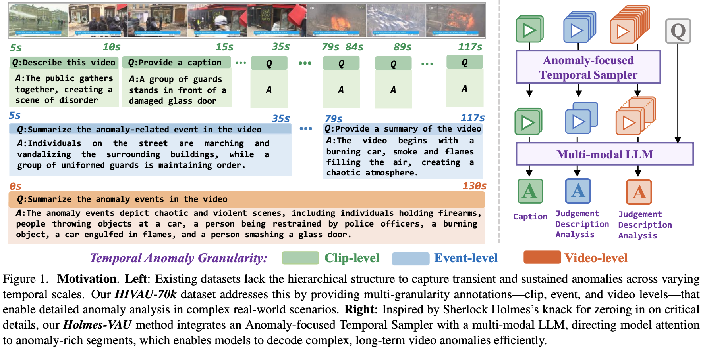
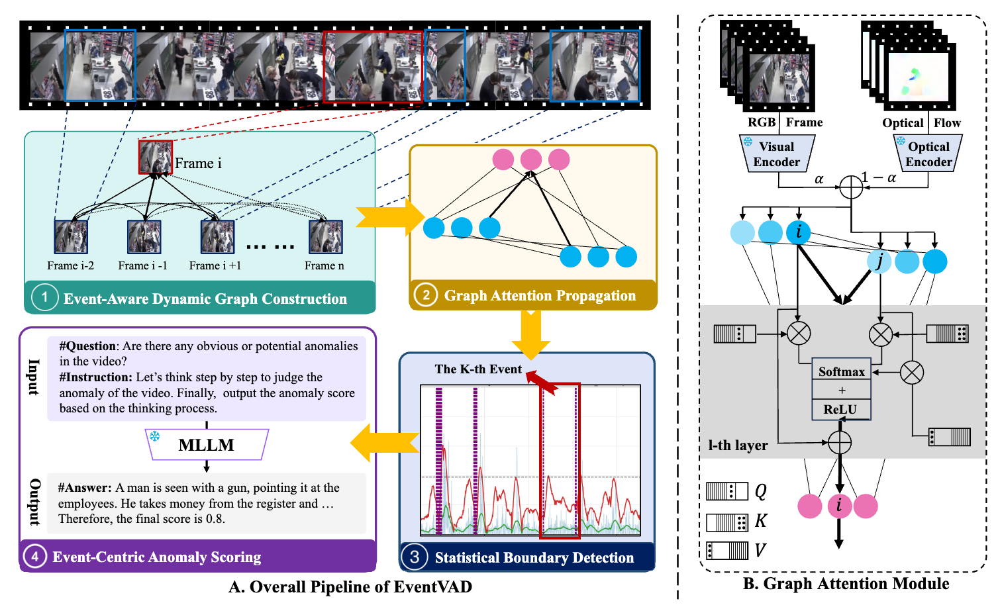
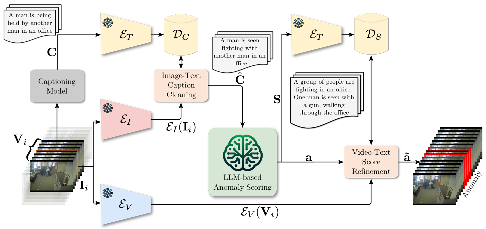

# Awesome LLM4VAD

A curated list of papers and resources on Large Language Models for Video Anomaly Detection (VAD).

## Contents

- [Overview](#overview)
- [Papers (2025)](#papers-2025)
- [Papers (2024)](#papers-2024)
- [Contributing](#contributing)
- [License and Credits](#license-and-credits)

---

## Overview

This list collects representative works that leverage LLMs or vision-language models for video anomaly detection, explanation, and understanding. Entries are grouped by year with links to paper and code, plus a preview figure when available.

上下文依赖（复杂性）：异常往往是长时序事件（打斗、事故），需要结合前后因果与场景关系才能正确判定。

歧义混淆（模糊性）：局部行为或场景容易与异常混淆（奔跑 vs 逃跑、聚集 vs 暴乱），必须通过更长时序和多模态线索来消解。

长尾分布（稀疏性）：异常在视频流中出现频率极低、时机不可控，单次观测易漏检，必须跨时累积证据与假设检验。

#### 其实“思考”并不是只在异常场景里才需要，而是在异常问题上，它的必要性被放大：

常态模式容易靠感知解决：正常行为/场景占据绝大多数，规律性强、数据量大，单靠感知模式匹配就能达到不错的效果。

异常本质上是“不确定”：异常往往稀疏、少样本，缺乏先验统计支撑。仅靠快速感知会出现偏差，需要跨时整合和假设检验来弥补。

异常涉及更大风险：一旦误判，可能带来严重后果（漏报安全事件、误报干扰系统），因此必须引入更慢、更稳健的决策机制。

异常往往打破常规：它们可能表现为复杂的上下文依赖、模糊的语义混淆、长尾的稀疏分布——这些都恰好是“思考”擅长处理的。

我们需要的是推理，而不仅是事后解释。

### Curiosity-driven Learning

Humans monitor learning progress in curiosity-driven exploration (Nature Communications 2021) [[paper](https://www.nature.com/articles/s41467-021-26196-w)]
发现人类在探索中会“盯着学习进度”本身：更偏好能带来更大知识增益/误差下降率的选择。行为与模型支持“以学习进步为回报”的好奇心机制

Curiosity-driven Exploration by Self-supervised Prediction (ICML 2017 (PMLR v70)) [[paper](https://proceedings.mlr.press/v70/pathak17a/pathak17a.pdf)]

Computational mechanisms of curiosity and goal-directed exploration (Neuroscience 2019) [[paper](https://elifesciences.org/articles/41703)]

---

## 📊 Benchmarks and Datasets

数据集：Driving Anomaly Detection Honda Research Institute
<https://usa.honda-ri.com/hdd#Videos>

NWPU-Campus
Ubnormal
TAD
X-Man
XD-Violence

shanghaitech-anomaly-detection [[project](https://svip-lab.github.io/dataset/campus_dataset.html)] — Campus surveillance anomaly set; classic weakly supervised benchmark.

[UCF-Crime](https://www.crcv.ucf.edu/research/real-world-anomaly-detection-in-surveillance-videos/) — Real-world surveillance anomaly dataset with long untrimmed videos.

Multi-Scenario Anomaly Detection (MSAD) Dataset (NeurIPS 2024)   — Large-scale, multi-scene anomaly benchmark.

https://video-holmes.github.io/Page.github.io/

<https://github.com/okankop/Driver-Anomaly-Detection>

https://www.cs.cmu.edu/~roadwork/ (ICCV 2025)

### Metrics & Evaluation

- Coming soon: common tasks, metrics, and evaluation protocols.

---

## Papers (2025)

ICCV 2025

FE-CLIP: Frequency Enhanced CLIP Model for Zero-Shot Anomaly Detection and Segmentation

Wave-MambaAD: Wavelet-driven State Space Model for Multi-class Unsupervised Anomaly Detection

MultiADS: Defect-aware Supervision for Multi-type Anomaly Detection and Segmentation in Zero-Shot Learning

ReMP-AD: Retrieval-enhanced Multi-modal Prompt Fusion for Few-Shot Industrial Visual Anomaly Detection

Aligning Effective Tokens with Video Anomaly in Large Language Models

Toward Long-Tailed Online Anomaly Detection through Class-Agnostic Concepts

Towards Real Unsupervised Anomaly Detection Via Confident Meta-Learning

Anomaly Detection of Integrated Circuits Package Substrates Using the Large Vision Model SAIC: Dataset Construction, Methodology, and Application

Beyond Walking: A Large-Scale Image-Text Benchmark for Text-based Person Anomaly Search

Mixture of Experts Guided by Gaussian Splatters Matters: A new Approach to Weakly-Supervised Video Anomaly Detection

Triad: Empowering LMM-based Anomaly Detection with Expert-guided Region-of-Interest Tokenizer and Manufacturing Process

Normal and Abnormal Pathology Knowledge-Augmented Vision-Language Model for Anomaly Detection in Pathology Images

HumanSAM: Classifying Human-centric Forgery Videos in Human Spatial, Appearance, and Motion Anomaly

SALAD -- Semantics-Aware Logical Anomaly Detection

Fine-grained Abnormality Prompt Learning for Zero-shot Anomaly Detection

FIND: Few-Shot Anomaly Inspection with Normal-Only Multi-Modal Data

Autoregressive Denoising Score Matching is a Good Video Anomaly Detector

DictAS: A Framework for Class-Generalizable Few-Shot Anomaly Segmentation via Dictionary Lookup

DecAD: Decoupling Anomalies in Latent Space for Multi-Class Unsupervised Anomaly Detection

Sequential keypoint density estimator: an overlooked baseline of skeleton-based video anomaly detection

RareCLIP: Rarity-aware Online Zero-shot Industrial Anomaly Detection

Debiasing Trace Guidance: Top-down Trace Distillation and Bottom-up Velocity Alignment for Unsupervised Anomaly Detection

分布外检测：
Beyond Pixel Uncertainty: Bounding the OoD Objects in Road Scenes

Equipping Vision Foundation Model with Mixture of Experts for Out-of-Distribution Detection

Adaptive Prompt Learning via Gaussian Outlier Synthesis for Out-of-distribution Detection

FA: Forced Prompt Learning of Vision-Language Models for Out-of-Distribution Detection

### VERA: Explainable Video Anomaly Detection via Verbalized Learning of Vision-Language Models (CVPR 2025)

Highlight: Verbalized learning makes VLM-based VAD explainable with natural-language rationales and clearer decision traces.

---

### Holmes-VAU: Towards Long-term Video Anomaly Understanding at Any Granularity (CVPR 2025)

Highlight: Targets long-horizon anomaly understanding with fine-to-coarse granularity, improving temporal coverage and robustness.

---

## Papers (2024)

### VadCLIP: Adapting Vision-Language Models for Weakly Supervised Video Anomaly Detection (AAAI 2024)

Highlight: Adapts CLIP-style vision–language alignment to weakly supervised VAD, reducing annotation demands.

---

### EventVAD: Training-Free Event-Aware Video Anomaly Detection （ACM MM 2025）

https://arxiv.org/abs/2504.13092

### Harnessing Large Language Models for Training-free Video Anomaly Detection (CVPR 2024)

Highlight: Leverages LLM priors for training-free anomaly detection via promptable semantic knowledge.

---

### Follow the Rules: Reasoning for Video Anomaly Detection with Large Language Models (ECCV 2024)

Highlight: Injects rule-based reasoning with LLMs to guide anomaly decisions and improve interpretability.

---

### Video Anomaly Detection and Explanation via Large Language Models (arXiv 2024)

Highlight: Couples VAD with LLM-generated explanations to provide interpretable, text-based rationales.

---

### HAWK: Learning to Understand Open-World Video Anomalies (NeurIPS 2024)

Highlight: Pursues open-world anomaly understanding with scalable concept coverage and out-of-distribution robustness.

---

## Related Awesome Lists

参考文章

ROADWork: A Dataset and Benchmark for Learning to Recognize, Observe, Analyze and Drive Through Work Zones
- **作者**：Anurag Ghosh, Shen Zheng, Robert Tamburo, 等
- **主要内容**：提出ROADWork数据集，专注于自动驾驶场景下的施工区域识别与导航，提升模型在长尾场景下的表现。
- **链接**：[https://www.cs.cmu.edu/~roadwork/](https://www.cs.cmu.edu/~roadwork/)

Passing the Driving Knowledge Test
- **作者**：Maolin Wei, Wanzhou Liu, Eshed Ohn-Bar
- **主要内容**：提出DriveQA数据集，评测LLM/MLLM在交通规则理解与推理能力。
- **链接**：[https://driveqaiccv.github.io](https://driveqaiccv.github.io)

https://github.com/Tangkfan/Awesome-Temporal-Video-Grounding

［ICML2025图合并长视频字幕］ Fine-Grained Captioning of Long Videos through Scene Graph Consolidation Objective • Problem： 现有 VIM 因有限的时间感受野 （limited temporal receptive fields），难以处理长视频字幕生成任务 • Existing Solutions & Drawbacks: • Memory/Recursive Frameworks： 需要在目标数据集上进行监督式 fine-tuning，泛化能力受限 。 LLM-based Consolidation： 直接利用LIM汇总各视频片段信息，存在高昂的推理开销和巨大的计算资源需求 • Proposed Solution： 提出一种基于图合并的zero-shot长视频字幕框架，无需 fine-tuning，兼具高性能和计算效率 核心思路是将非结构化的多源文本信息整合问题，转化为结构化的图节点合并问题