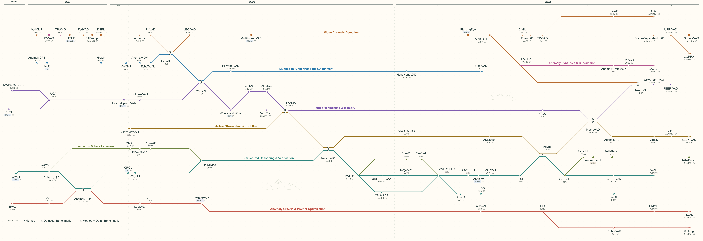

# Awesome Thinking with VAD

[English](README.md) | 简体中文

聚焦**视频异常理解**：异常发生了什么、为什么异常、证据在哪里，以及如何验证解释与视频相符。兼顾直接支撑这些目标的语言引导表征与异常检测方法。

  

## 最新更新

**2026-10-03** — 数据资源扩展至 **28 项**，补齐基础检测基准、TAR／TAR-Bench 与 Vad-Reasoning-Plus，并标注来源视频及开放状态。论文目录包含 **83 篇论文**，线路图连接 **80 篇**；近期补入 IJCV／TPAMI 工作与 TNNLS 综述。详情见[更新记录](CHANGELOG.md)。

其中 70 篇配有论文原图，详见[图片来源与待补记录](assets/papers/README.md)。

## 预印本

 ·  · [完整发表索引](literature/venues.md)

## 会议论文

会议名称进入最新年份的论文列表，也可按年份浏览；历史笔记见[发表索引](literature/venues.md)。

-  — Computer Vision and Pattern Recognition · [2025](llm4vad.md#year-2025-cvpr) · [2024](llm4vad.md#year-2024-cvpr) · [2023](llm4vad.md#year-2023-cvpr)
-  — International Conference on Computer Vision
-  — European Conference on Computer Vision · [2024](llm4vad.md#year-2024-eccv)
-  — Neural Information Processing Systems · [2025](llm4vad.md#year-2025-neurips) · [2024](llm4vad.md#year-2024-neurips)
-  — International Conference on Machine Learning · [2025](llm4vad.md#year-2025-icml)
-  — International Conference on Learning Representations
-  — AAAI Conference on Artificial Intelligence · [2025](llm4vad.md#year-2025-aaai) · [2024](llm4vad.md#year-2024-aaai)
-  — International Joint Conference on Artificial Intelligence
-  — ACM Multimedia · [2025](llm4vad.md#year-2025-acm-mm)
-  — Annual Meeting of the Association for Computational Linguistics

## 期刊论文

按期刊和年份浏览已核验论文，更多阅读材料见[期刊论文汇总](archive/journals/README.md)。

-  — IEEE Transactions on Pattern Analysis and Machine Intelligence · [2026](llm4vad.md#year-2026-tpami) · [2025](llm4vad.md#year-2025-tpami)
-  — IEEE Transactions on Image Processing · [2025](llm4vad.md#year-2025-tip) · [2024](llm4vad.md#year-2024-tip)
-  — IEEE Transactions on Neural Networks and Learning Systems · [2026](llm4vad.md#year-2026-tnnls)
-  — IEEE Transactions on Cybernetics
-  — IEEE Transactions on Information Forensics and Security
-  — International Journal of Computer Vision · [2026](llm4vad.md#year-2026-ijcv)

## 其他论文

WACV、NAACL Findings 及各会议 workshop 的相关论文统一归入此类。

- [WACV](literature/other-papers.md#wacv) — VADER、AnyAnomaly、ASK-HINT、MissionGNN 与可解释异常检测 · 2023–2026
- [Workshops](literature/other-papers.md#workshops) — PrismVAU、T-VAU、SmartHome-Bench、TEVAD 与评测研究 · 2023–2026
- [NAACL Findings](llm4vad.md#year-2025-naacl-findings) — Findings of NAACL · [2025](llm4vad.md#year-2025-naacl-findings)

## 数据集与评测

  

- **基础检测**：[UCSD Ped1／Ped2](literature/benchmarks.md#dataset-ucsd-ped1-ped2) · [Avenue](literature/benchmarks.md#dataset-cuhk-avenue) · [ShanghaiTech](literature/benchmarks.md#dataset-shanghaitech) · [UCF-Crime](literature/benchmarks.md#dataset-ucf-crime) · [XD-Violence](literature/benchmarks.md#dataset-xd-violence) · [TAD](literature/benchmarks.md#dataset-tad) · [UBnormal](literature/benchmarks.md#dataset-ubnormal) · [NWPU Campus](literature/benchmarks.md#dataset-nwpu-campus) · [MSAD](literature/benchmarks.md#dataset-msad)
- **语言与推理**：[UCA](literature/benchmarks.md#dataset-uca) · [HIVAU-70k](literature/benchmarks.md#dataset-hivau-70k) · [FineW3](literature/benchmarks.md#dataset-finew3) · [CueBench](literature/benchmarks.md#dataset-cuebench-data) · [Vad-Reasoning-Plus](literature/benchmarks.md#dataset-vad-reasoning-plus) · [TAR／TAR-Bench](literature/benchmarks.md#dataset-tar-data)
- [完整数据集卡片](literature/benchmarks.md) — 简介、标注示例与获取入口；[历史数据集笔记](archive/dataset.md)

各卡片保留必要的版本与获取说明，划分和相关工作可按需展开。

## 阅读与引用

- [方法比较](literature/comparison.md) — 输出、训练、运行设置与验证方式
- [作者、DOI 与 BibTeX](literature/citations.md) · [下载引用库](https://raw.githubusercontent.com/2-mo/Awesome-Thinking-with-VAD/main/literature/references.bib)
- [综述与研究记录](research/README.md)

论文条目附有来源链接；发表信息、版本关系与核验日期见[引用索引](literature/citations.md)。

## 推荐论文或纠错

可以直接[推荐论文](https://github.com/2-mo/Awesome-Thinking-with-VAD/issues/new?template=paper.yml)或[报告错误](https://github.com/2-mo/Awesome-Thinking-with-VAD/issues/new?template=correction.yml)，附上论文链接和简短推荐理由，或指出需要纠正的内容。

## 联系

- 邮箱：**mo1031@live.com**
- 微信：**tiumo-**（请备注 VAD）

仓库原创代码与文档采用 [MIT 许可证](LICENSE)。论文、数据集与原始图像分别遵循作者及出版方的条款，图像保留来源署名。
