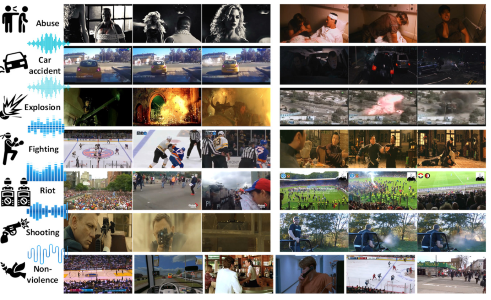
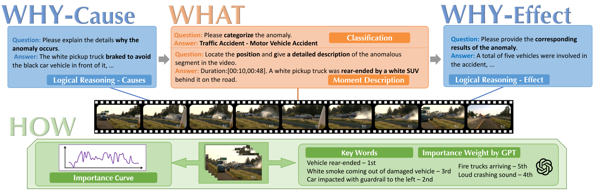
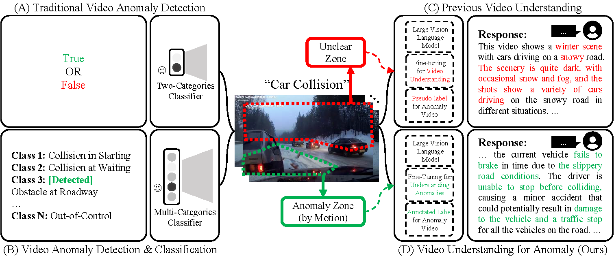
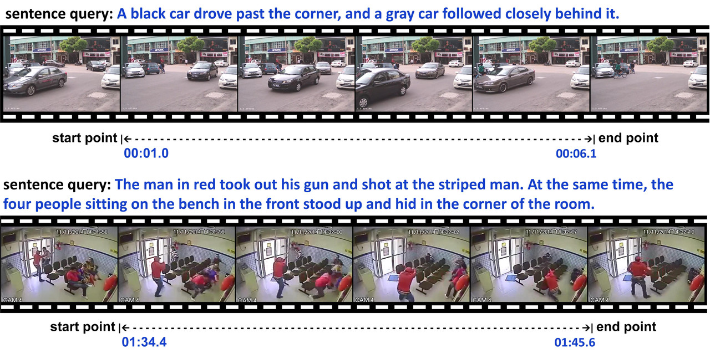
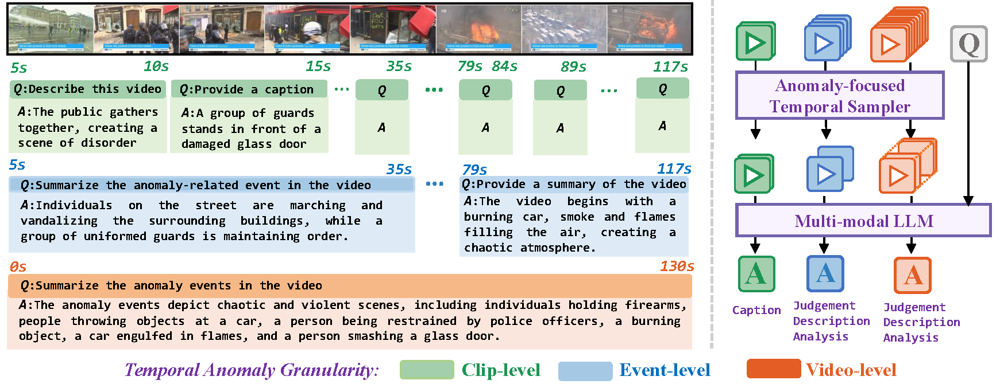
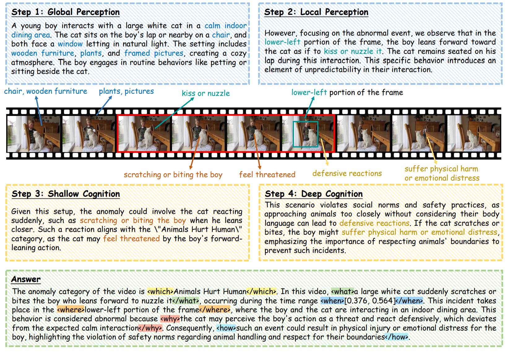
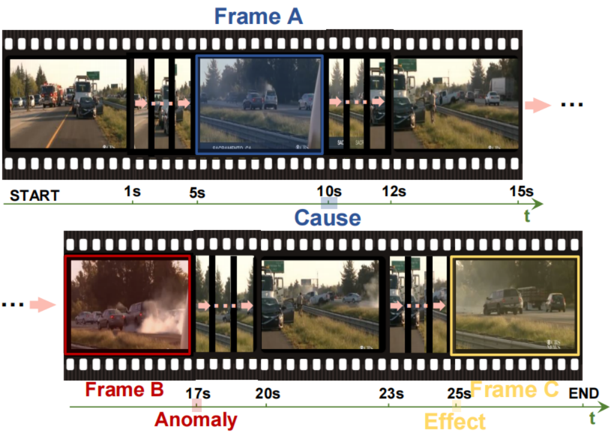
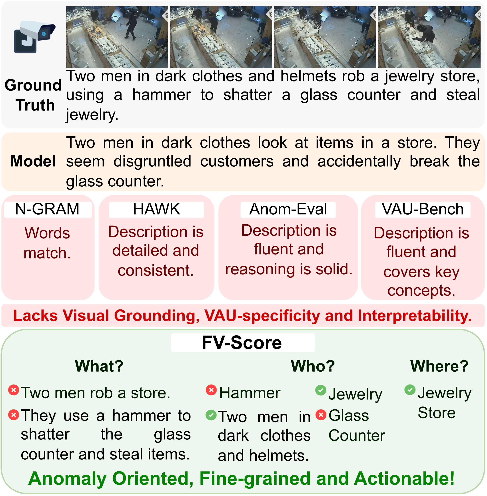

# 视频异常理解 · 数据集与评测

[论文年表](../llm4vad.md) · [方法比较](comparison.md) · [阅读路线](reading-guide.md)

28 个数据集与评测资源，按任务浏览。点击徽章进入论文或作者发布页。

[异常检测](<#detection-data>) · [理解与推理](<#understanding-data>) · [异常检索](<#retrieval-data>)

快速跳转

- **异常检测**：[UCSD Ped1 / Ped2](<#dataset-ucsd-ped1-ped2>) · [CUHK Avenue](<#dataset-cuhk-avenue>) · [ShanghaiTech Campus](<#dataset-shanghaitech>) · [UCF-Crime](<#dataset-ucf-crime>) · [XD-Violence](<#dataset-xd-violence>) · [TAD (Traffic Anomaly Dataset)](<#dataset-tad>) · [UBnormal](<#dataset-ubnormal>) · [NWPU Campus](<#dataset-nwpu-campus>) · [MSAD](<#dataset-msad>)
- **理解与推理**：[CUVA](<#dataset-cuva-dataset>) · [HAWK](<#dataset-hawk-dataset>) · [MM-AU](<#dataset-mm-au>) · [UCA](<#dataset-uca>) · [A2Seek](<#dataset-a2seek-data>) · [HIVAU-70k](<#dataset-hivau-70k>) · [Vad-Reasoning](<#dataset-vad-reasoning>) · [VANE-Bench](<#dataset-vane-bench-data>) · [CueBench](<#dataset-cuebench-data>) · [ECVA](<#dataset-ecva>) · [FineW3](<#dataset-finew3>) · [Pistachio](<#dataset-pistachio-data>) · [TAR / TAR-Bench](<#dataset-tar-data>) · [TAU-Bench](<#dataset-tau-bench-data>) · [Vad-Reasoning-Plus](<#dataset-vad-reasoning-plus>) · [VAGU](<#dataset-vagu-data>) · [VALU](<#dataset-valu-data>)
- **异常检索**：[UCFCrime-AR](<#dataset-ucfcrime-ar>) · [XDViolence-AR](<#dataset-xdviolence-ar>)

## 异常检测

### UCSD Ped1 / Ped2

 

> 两处固定摄像机人行道基准，异常自然发生；Ped1 包含明显透视变化，Ped2 的行人运动大致平行于成像平面。

**标注** · 测试帧级异常标签 · 测试像素掩码

**使用说明** · Ped1 原始像素标注仅覆盖 10 个测试片段，Ped2 覆盖全部 12 个。

划分与相关工作

分别按 Ped1 的 34／36 和 Ped2 的 16／12 训练／测试片段评估；正常训练。帧级与像素级结果分开报告，Ped1 原始像素协议仅覆盖 10 个测试片段，不能与全部 36 段或后续补标版本混报。

获取：作者数据页提供数据包、更新时间和校验值。

来源：[1](<http://www.svcl.ucsd.edu/projects/anomaly/dataset.htm>) · [2](<http://www.svcl.ucsd.edu/projects/anomaly/>)

---

### CUHK Avenue

 

> 固定校园通道的经典异常检测基准，包含 16 段训练、21 段测试视频及异常空间矩形标注，用于检测与定位。

**标注** · 测试异常空间矩形

划分与相关工作

采用官方 16／21 训练／测试划分；训练以正常情况为主，作者提示少量离群样本、稀有正常模式及测试轻微抖动。帧级与空间定位评价分开，并说明所用空间标注版本。

获取：作者页分别提供 Avenue Dataset 与 Ground truth 下载入口。

来源：[1](<https://www.cse.cuhk.edu.hk/leojia/projects/detectabnormal/dataset.html>)

---

### ShanghaiTech Campus

 

> 覆盖 13 个校园场景的异常检测基准，包含复杂光照与视角，以及追逐、打斗等突发运动异常。

**标注** · 异常事件标注 · 测试像素掩码

划分与相关工作

采用官方正常训练／异常测试协议；多场景共用模型。后续弱监督重划分与 ShanghaiTech-sd 应另行注明，不能与原始协议混报。

获取：作者页提供 Google Drive 与 OneDrive 下载入口。

来源：[1](<https://svip-lab.github.io/dataset/campus_dataset.html>) · [2](<https://openaccess.thecvf.com/content_ICCV_2017/papers/Luo_A_Revisit_of_ICCV_2017_paper.pdf>)

---

### UCF-Crime

 

> 真实监控长视频异常检测基准，提供视频级训练标签与测试时序标注，也是多项异常描述和推理数据的视觉来源。

**标注** · 视频级异常标签 · 测试时序标注

划分与相关工作

采用官方训练／测试划分；弱监督训练与帧级定位评估须区分。

获取：作者页提供视频整包、分包及测试时序标注入口；本轮未逐包下载。

相关工作：[VadCLIP](<catalog.md#paper-vadclip>) · [LAVAD](<catalog.md#paper-lavad>) · [Ex-VAD](<catalog.md#paper-ex-vad>) · [EventVAD](<catalog.md#paper-eventvad>) · [MoniTor](<catalog.md#paper-monitor>) · [OVVAD](<catalog.md#paper-ovvad>) · [TPWNG](<catalog.md#paper-tpwng>) · [UCA](<catalog.md#paper-uca-paper>) · [Anomize](<catalog.md#paper-anomize>) · [VA-GPT](<catalog.md#paper-va-gpt>) · [LAVIDA](<catalog.md#paper-lavida>) · [LAS-VAD](<catalog.md#paper-las-vad>) · [VADTree](<catalog.md#paper-vadtree>) · [MemoVAD](<catalog.md#paper-memovad>) · [Flashback](<catalog.md#paper-flashback>) · [LRPO](<catalog.md#paper-lrpo>) · [TD-VAD](<catalog.md#paper-td-vad>) · [URF-ZS-HVAA](<catalog.md#paper-urf-zs-hvaa>) · [CLUE-VAD](<catalog.md#paper-clue-vad>) · [HeadHunt-VAD](<catalog.md#paper-headhunt-vad>) · [Probe-VAD](<catalog.md#paper-probe-vad>) · [HiProbe-VAD](<catalog.md#paper-hiprobe-vad>) · [PEL](<catalog.md#paper-pel>) · [PromptVAD](<catalog.md#paper-promptvad>) · [PA-VAD](<catalog.md#paper-pa-vad>) · [S2MGraph-VAD](<catalog.md#paper-s2mgraph-vad>)

来源：[1](<https://openaccess.thecvf.com/content_cvpr_2018/html/Sultani_Real-World_Anomaly_Detection_CVPR_2018_paper.html>) · [2](<https://www.crcv.ucf.edu/research/real-world-anomaly-detection-in-surveillance-videos/>)

---

### XD-Violence

 

> 结合视频与音频的多场景暴力检测基准，以视频级多标签训练，并通过测试时序标注评估异常定位。

**标注** · 视频级多标签 · 测试时序标注

*Peng Wu et al. / XD-Violence · [图片来源](<https://roc-ng.github.io/XD-Violence/images/samples.png>)*

划分与相关工作

报告所用模态与官方划分；不可将音视频方法和纯视觉方法混为同一设置。

获取：官方页提供视频、测试标注及特征；旧百度训练链接标为失效，另有阿里云与 OneDrive 入口。

相关工作：[VadCLIP](<catalog.md#paper-vadclip>) · [LAVAD](<catalog.md#paper-lavad>) · [Ex-VAD](<catalog.md#paper-ex-vad>) · [EventVAD](<catalog.md#paper-eventvad>) · [MoniTor](<catalog.md#paper-monitor>) · [OVVAD](<catalog.md#paper-ovvad>) · [TPWNG](<catalog.md#paper-tpwng>) · [Anomize](<catalog.md#paper-anomize>) · [VA-GPT](<catalog.md#paper-va-gpt>) · [LAVIDA](<catalog.md#paper-lavida>) · [LAS-VAD](<catalog.md#paper-las-vad>) · [VADTree](<catalog.md#paper-vadtree>) · [MemoVAD](<catalog.md#paper-memovad>) · [Flashback](<catalog.md#paper-flashback>) · [LRPO](<catalog.md#paper-lrpo>) · [TD-VAD](<catalog.md#paper-td-vad>) · [URF-ZS-HVAA](<catalog.md#paper-urf-zs-hvaa>) · [CLUE-VAD](<catalog.md#paper-clue-vad>) · [HeadHunt-VAD](<catalog.md#paper-headhunt-vad>) · [Probe-VAD](<catalog.md#paper-probe-vad>) · [HiProbe-VAD](<catalog.md#paper-hiprobe-vad>) · [PEL](<catalog.md#paper-pel>) · [PromptVAD](<catalog.md#paper-promptvad>) · [PA-VAD](<catalog.md#paper-pa-vad>) · [S2MGraph-VAD](<catalog.md#paper-s2mgraph-vad>) · [DEAL](<catalog.md#paper-deal-vad>)

来源：[1](<https://roc-ng.github.io/XD-Violence/>)

---

### TAD (Traffic Anomaly Dataset)

 · 2021 

> 包含 500 段交通视频的弱监督异常检测基准，正常与异常各 250 段，覆盖 7 类交通异常。

**标注** · 训练视频级标签 · 测试帧级标注（论文协议）

**使用说明** · 官方 README 仅确认抽帧包已上传，划分与标注文件的发布状态仍待确认。

划分与相关工作

原论文采用 400 训练／100 测试划分，二者均含正常与异常视频；弱监督训练与测试帧级评估分开。须核实所用分割文件及标注版本，不能仅凭公开抽帧包认定复现了论文协议。

获取：作者仓库提供 Google Drive，但 README 仅确认 frames\_part\_1.zip 与 frames\_part\_2.zip 已上传；划分和标注发布状态仍待核验。

来源：[1](<https://github.com/ktr-hubrt/WSAL>) · [2](<https://arxiv.org/pdf/2008.08944>)

---

### UBnormal

 

> 以多个虚拟场景构建合成异常视频，训练时提供异常像素标注，并用不相交的训练、测试异常类别检验开放集泛化。

**标注** · 训练异常像素标注 · 测试异常标注

划分与相关工作

遵守官方划分及训练／测试异常类别不相交的开放集设置。原始任务允许使用训练异常及像素标注；仅正常训练的变体应单列，不与监督开放集设置混报。

获取：作者仓库提供 Google Drive 下载、划分脚本，并明确测试集 ground truth 已发布。

来源：[1](<https://github.com/lilygeorgescu/UBnormal>)

---

### NWPU Campus

 

> 547 段校园视频覆盖 43 场景与 28 类异常，突出同一行为随场景改变正常性的情况，同时支持异常检测与预判。

**标注** · 测试帧级标注 · 异常类别与场景

划分与相关工作

采用官方 305 正常训练／242 测试视频划分；场景依赖异常的正常性需结合所在场景判断。异常检测与预判应分别报告任务与评价协议。

获取：作者页提供百度网盘和 Google Drive 下载，标示完整视频约 76.6 GB。

来源：[1](<https://campusvad.github.io/>) · [2](<https://campusvaa.github.io/>)

---

### MSAD

 

> 720 段 RGB 视频覆盖 14 类真实监控场景，包含人体与非人体异常及天气、光照变化，用于评估多场景检测。

**标注** · 视频级异常标签 · 测试帧级标注 · 场景与异常类别

**使用说明** · 原视频需提交申请并经作者审核；I3D 与 Video-Swin 特征可直接下载。

划分与相关工作

区分官方两种协议：仅正常训练为 360 正常训练，120 正常＋240 异常测试；弱监督为 360 正常＋120 异常训练，120 正常＋120 异常测试，训练仅用视频级标签。

获取：I3D／Video-Swin 特征提供直接下载；原视频须填写官方申请表并经作者审核。

来源：[1](<https://msad-dataset.github.io/>)

---

## 理解与推理

### CUVA

 

> 围绕异常事件的经过、原因与后果构建因果理解任务，以人工语言标注连接事件定位、描述和解释。

**标注** · 异常类别与时间边界 · 事件描述 · 原因与后果

*Hang Du et al. / CUVA · [图片来源](<https://arxiv.org/html/2405.00181v3/dataset_4.png>)*

划分与相关工作

按原论文任务与 MMEval 协议评估；定位、描述和因果解释分别报告。

获取：作者仓库提供 Hugging Face 标注加载方法与原始视频分包下载说明。

相关工作：[CUVA](<catalog.md#paper-cuva>)

来源：[1](<https://openaccess.thecvf.com/content/CVPR2024/html/Du_Uncovering_What_Why_and_How_A_Comprehensive_Benchmark_for_Causation_CVPR_2024_paper.html>) · [2](<https://github.com/fesvhtr/CUVA>) · [3](<https://arxiv.org/html/2405.00181v3#S3.SS2>)

---

### HAWK

 

> 面向开放场景的视频异常理解资源，提供异常视频语言描述与相关问答，支持描述生成和交互式理解。

**标注** · 异常视频描述 · 异常问答

*开放场景异常问答示例。 Jiaqi Tang et al. / Hawk · [图片来源](<https://raw.githubusercontent.com/jqtangust/hawk/main/figs/motivation1.png>)*

划分与相关工作

遵循作者数据划分，分别检查描述生成与问答表现。

相关工作：[HAWK](<catalog.md#paper-hawk>)

来源：[1](<https://proceedings.neurips.cc/paper_files/paper/2024/hash/fca83589e85cb061631b7ebc5db5d6bd-Abstract-Conference.html>) · [2](<https://github.com/jqtangust/hawk>)

---

### MM-AU

 

> 面向驾驶事故理解的多模态基准，包含 11,727 段事故视频及对齐文本、对象框和事故原因问答。

**标注** · 事故类别与对象框 · 时序对齐描述 · 原因与预防建议

划分与相关工作

分别评估对象检测、事故原因回答、近事故场景恢复与预测等任务；按对应论文任务设置比较。此处提供论文入口，未核验数据下载可用性。

相关工作：[ADVersa](<catalog.md#paper-adversa>)

来源：[1](<https://openaccess.thecvf.com/content/CVPR2024/html/Fang_Abductive_Ego-View_Accident_Video_Understanding_for_Safe_Driving_Perception_CVPR_2024_paper.html>) · [2](<https://engagedscholarship.csuohio.edu/enece_facpub/533/>)

---

### UCA

 

> 为 UCF-Crime 中的 1,854 段视频补充事件语句与时间边界，支持语言时序定位、视频描述和密集描述。

**标注** · 事件描述 · 句子起止时间

*Tongtong Yuan et al. / UCA · [图片来源](<https://github.com/jia-wang-11/Surveillance-Video-Understanding-dataSet>)*

划分与相关工作

使用作者训练、验证、测试划分；分别报告语言时序定位、视频描述、密集描述与多模态异常检测。

获取：作者仓库公开 UCF Annotation 中的文本与 JSON 标注及划分；原视频按 README 从 UCF-Crime 另行下载。

基础数据：[UCF-Crime](<#dataset-ucf-crime>)

相关工作：[UCA](<catalog.md#paper-uca-paper>)

来源：[1](<https://openaccess.thecvf.com/content/CVPR2024/html/Yuan_Towards_Surveillance_Video-and-Language_Understanding_New_Dataset_Baselines_and_Challenges_CVPR_2024_paper.html>) · [2](<https://github.com/jia-wang-11/Surveillance-Video-Understanding-dataSet>)

---

### A2Seek

 

> 面向动态航拍视角，将异常类别、帧级时间戳和区域框与自然语言解释关联，支持时空证据定位与因果理解。

**标注** · 异常类别与时间戳 · 区域边界框 · 自然语言解释

*数据统计与方法综合概览。 Mo, Mengjingcheng et al. / A2Seek / A2Seek-R1 · [图片来源](<https://2-mo.github.io/A2Seek/static/images/carousel1.png>)*

划分与相关工作

区分异常判断、区域定位和解释；遵循作者场景与分布外设置，不与固定监控结果直接混排。当前未核验下载状态。

相关工作：[A2Seek / A2Seek-R1](<catalog.md#paper-a2seek>)

来源：[1](<https://proceedings.neurips.cc/paper_files/paper/2025/hash/de02de513503962e1d21035ab50ce661-Abstract-Datasets_and_Benchmarks_Track.html>)

---

### HIVAU-70k

 

> 在 UCF-Crime 与 XD-Violence 上构建片段、事件、视频三级异常指令，覆盖局部描述、事件分析和全局总结。

**标注** · 片段字幕 · 事件判断与分析 · 视频总结

*多粒度标注与方法概览。 Huaxin Zhang et al. / Holmes-VAU · [图片来源](<https://raw.githubusercontent.com/pipixin321/HolmesVAU/master/assets/teaser.png>)*

划分与相关工作

区分时间粒度与任务类型；数据构建包含模型生成与人工复核。

获取：HIVAU-70k/instruction 已公开训练与测试 JSONL，raw\_annotations 提供标注；原视频需从 UCF-Crime 和 XD-Violence 另行获取。

基础数据：[UCF-Crime](<#dataset-ucf-crime>) · [XD-Violence](<#dataset-xd-violence>)

相关工作：[Holmes-VAU](<catalog.md#paper-holmes-vau>) · [TargetVAU](<catalog.md#paper-targetvau>)

来源：[1](<https://openaccess.thecvf.com/content/CVPR2025/html/Zhang_Holmes-VAU_Towards_Long-term_Video_Anomaly_Understanding_at_Any_Granularity_CVPR_2025_paper.html>) · [2](<https://github.com/pipixin321/HolmesVAU>) · [3](<https://github.com/pipixin321/HolmesVAU/tree/master/HIVAU-70k>)

---

### Vad-Reasoning

 

> 为既有异常视频增加从感知到认知的结构化推理，分别提供用于监督微调的推理文本与强化学习的弱标签。

**标注** · 结构化推理与异常判断 · 异常类型与时间边界 · RL 视频级弱标签

*Chao Huang, Benfeng Wang et al. / Vad-R1 · [图片来源](<https://raw.githubusercontent.com/wbfwonderful/Vad-R1/main/images/data-example.png>)*

划分与相关工作

分别使用 Vad-Reasoning-SFT 的训练／测试划分与 Vad-Reasoning-RL；SFT 含推理文本，RL 仅有视频级弱标签。

获取：作者仓库提供 Hugging Face 数据入口与 JSONL 说明，区分 SFT 的推理文本和 RL 的视频级弱标签。

基础数据：[UCF-Crime](<#dataset-ucf-crime>)

相关工作：[Vad-R1](<catalog.md#paper-vad-r1>)

来源：[1](<https://proceedings.neurips.cc/paper_files/paper/2025/hash/abccc325c84dedf23dbe8de3f686c733-Abstract-Conference.html>) · [2](<https://github.com/wbfwonderful/Vad-R1>) · [3](<https://huggingface.co/datasets/wbfwonderful/Vad-R1>)

---

### VANE-Bench

 

> 通过异常问答评测合成视频的不一致性与真实视频异常，将不同视频来源纳入检测和定位任务。

**标注** · 异常类别 · 异常问答

*Gani, Hanan et al. / VANE-Bench · [图片来源](<https://github.com/rohit901/VANE-Bench/raw/main/assets/Main_VANE-Bench%20Flow_v7.png?raw=true>)*

划分与相关工作

分别检查合成与真实视频子集；问答正确率不直接等价于逐帧检测 AUC。作者提供代码和数据入口，本次未逐文件验证下载。

相关工作：[VANE-Bench](<catalog.md#paper-vane-bench>)

来源：[1](<https://aclanthology.org/2025.findings-naacl.171/>)

---

### CueBench

 

> 以场景与属性组织条件性和绝对异常，检验同一行为在不同上下文中的正常性，并覆盖识别、定位、检测与预判。

**标注** · 条件性／绝对异常 · 场景与属性层级 · 任务标注与推理

*Yu, Yating et al. / CueBench · [图片来源](<https://arxiv.org/html/2511.00613v1/evaluation_fig.png>)*

划分与相关工作

分别报告识别、时序定位、检测和预判；按场景／属性分析条件性异常。官方 Hugging Face 已提供训练、测试、推理标注与视频文件。

获取：官方仓库公开 train、test、videos 目录，以及 train\_cue\_reason.json 和 test\_cue\_reason.json。

相关工作：[CueBench / Cue-R1](<catalog.md#paper-cuebench>)

来源：[1](<https://ojs.aaai.org/index.php/AAAI/article/view/38209>) · [2](<https://huggingface.co/datasets/CueBench/CueBench>) · [3](<https://huggingface.co/datasets/CueBench/CueBench/tree/main>)

---

### ECVA

 · 2026 

> 扩展 CUVA 的异常因果理解体系，以事件描述、原因、后果和关键证据重要性曲线支持更细致的解释评估。

**标注** · 异常类别与时间边界 · 事件及因果描述 · 证据重要性曲线

*Hang Du et al. / ECVA · [图片来源](<https://arxiv.org/html/2412.07183v1/challenge_v7.png>)*

划分与相关工作

按作者发布版本分别评估描述、原因和后果；AnomEval 检查推理、回答一致性与幻觉，避免与 CUVA 的 MMEval 混用。

获取：作者仓库列出视频及标注的 ModelScope 获取入口；按发布版本使用。

相关工作：[ECVA / AnomShield](<catalog.md#paper-ecva-anomshield>)

来源：[1](<https://link.springer.com/article/10.1007/s11263-026-02983-0>) · [2](<https://arxiv.org/abs/2412.07183>) · [3](<https://github.com/Dulpy/ECVA>) · [4](<https://www.modelscope.cn/datasets/gouchenyi/ECVA/files>) · [5](<https://arxiv.org/html/2412.07183v1#S3.SS2>)

---

### FineW3

 

> 围绕 What、Who、Where 增强异常事件、参与实体和位置事实，用于评估异常描述是否与关键视觉证据一致。

**标注** · 异常事件 · 参与实体 · 位置

**使用说明** · 论文基于 UCA 的 1,544 段视频，公开版本另含 ECVA 记录；复现时需固定数据版本。

*细粒度描述与评价示例。 João Pereira et al. / FineVAU · [图片来源](<https://arxiv.org/html/2601.17258v2/figs/Teaser.png>)*

划分与相关工作

使用 FVScore 检查关键视觉元素，结合人类一致性分析；不能只比较语言流畅度。原论文描述基于 UCA 的 1,544 段视频；当前公开文件另含 ECVA 来源记录，复现时须记录发布版本，不能将当前行数直接当作论文视频数。

获取：作者项目页链接到此公开 Hugging Face 仓库，提供结构化文本 Parquet 测试标注；并非完整原视频打包下载。

基础数据：[UCA](<#dataset-uca>) · [ECVA](<#dataset-ecva>)

相关工作：[FineVAU](<catalog.md#paper-finevau>)

来源：[1](<https://ojs.aaai.org/index.php/AAAI/article/download/37790/41752>) · [2](<https://finevau.github.io/>) · [3](<https://arxiv.org/html/2601.17258v2>) · [4](<https://huggingface.co/datasets/joao-cardeira/FineW3>)

---

### Pistachio

 

> 面向检测与理解的可控合成视频基准，分为 Pistachio-VAD 和 Pistachio-VAU，提供帧级标签及事件、视频级描述。

**标注** · 帧级标注 · 事件级描述 · 视频级描述

*合成数据构建流程。 Li, Jie et al. / Pistachio · [图片来源](<https://arxiv.org/html/2511.19474v6/3.png>)*

划分与相关工作

分别报告 VAD 与 VAU 协议；关注合成到真实的域差异及多事件子集。数据下载未在本次逐文件验证。

相关工作：[Pistachio](<catalog.md#paper-pistachio>)

来源：[1](<https://arxiv.org/abs/2511.19474>) · [2](<https://arxiv.org/html/2511.19474v6>)

---

### TAR / TAR-Bench

 

> 交通异常多任务推理资源，TAR 提供 44,040 条训练伪标注，TAR-Bench 以 960 条人工标注组成官方测试。

**标注** · 多任务问答 · 时序与因果推理 · 训练答案与推理过程

**使用说明** · 测试答案隐藏，需使用官方评测服务；原视频按来源另行获取。

*Han Zhang et al. / TAR / TAR-Bench · [图片来源](<https://arxiv.org/html/2608.10317v3/TAR-teaser-2a-.png>)*

划分与相关工作

训练部分为 3,670 段视频的 44,040 条伪标注；官方测试为 80 段视频的 960 条人工标注。测试问题公开、答案隐藏，需通过官方评测服务评估；视频从原始来源单独获取。

获取：训练标注与官方测试问题已公开；测试答案隐藏。仓库不重新分发原视频，提供从原始来源获取视频的脚本。

基础数据：[UCF-Crime](<#dataset-ucf-crime>) · [Vad-Reasoning](<#dataset-vad-reasoning>) · [TAD (Traffic Anomaly Dataset)](<#dataset-tad>)

相关工作：[TAR / TAR-Bench](<catalog.md#paper-tar-bench>)

来源：[1](<https://arxiv.org/abs/2608.10317>) · [2](<https://huggingface.co/datasets/nvidia/PhysicalAI-Traffic-Anomaly-Reasoning>) · [3](<https://huggingface.co/datasets/nvidia/PhysicalAI-Traffic-Anomaly-Reasoning#source-videos>)

---

### TAU-Bench

 

> 将异常实例轨迹和像素掩码与实例、事件、场景三级语义绑定，评估模型能否跟踪正确对象并解释其异常。

**标注** · 异常实例轨迹 · 像素级掩码 · 实例／事件／场景描述

*Yang, Kepeng et al. / TAU-Bench · [图片来源](<https://yarkupa.github.io/tau-bench.github.io/assets/overview.png>)*

划分与相关工作

联合检查实例跟踪和细粒度语义，不能以描述流畅度替代轨迹正确性；本次未确认数据／模型有效下载入口。

相关工作：[TAU-Bench](<catalog.md#paper-tau-bench>)

来源：[1](<https://arxiv.org/abs/2608.05699>)

---

### Vad-Reasoning-Plus

 

> 扩展 Vad-Reasoning，以感知、认知、行动三级开放式问答和推理链，连接异常理解、风险判断与行动建议。

**标注** · 分层开放式问答 · 感知—认知—行动推理链 · 风险判断与行动建议

**使用说明** · 作者仓库尚未发布数据文件或下载入口。

划分与相关工作

按论文的训练与测试划分评估分层回答和推理；区分完整推理监督的 SFT 子集与弱监督 RL 子集。作者尚未在所链接仓库发布数据文件，暂不能按已开放资源使用。

获取：论文承诺公开数据与模型；截至核验日期，指定作者仓库仅有项目标题 README，未见数据文件或下载入口。

基础数据：[Vad-Reasoning](<#dataset-vad-reasoning>) · [UCF-Crime](<#dataset-ucf-crime>) · [XD-Violence](<#dataset-xd-violence>) · [ECVA](<#dataset-ecva>) · [TAD (Traffic Anomaly Dataset)](<#dataset-tad>) · [ShanghaiTech Campus](<#dataset-shanghaitech>) · [UBnormal](<#dataset-ubnormal>)

相关工作：[Vad-R1-Plus](<catalog.md#paper-vad-r1-plus>)

来源：[1](<https://arxiv.org/html/2601.10165v1>) · [2](<https://github.com/wbfwonderful/Vad-R1-Plus>)

---

### VAGU

 

> 联合视频异常时间定位与语义理解，提供异常问答、解释和时间边界，用于检验模型能否同时定位并说明异常。

**标注** · 异常类别与时间边界 · 语义解释 · 异常问答

划分与相关工作

使用原版 VAGU 的问答与 JeAUG 联合评价，联合分数之外保留定位和理解单项结果；不混入扩展稿 VAGU-T。当前未核验数据下载状态。

相关工作：[VAGU & GtS](<catalog.md#paper-vagu-gts>)

来源：[1](<https://arxiv.org/abs/2507.21507>)

---

### VALU

 

> 以五个语义层级组织异常事件的时间边界与细粒度文本，支持时序定位、异常定位及描述细节辨析。

**标注** · 五级异常语义 · 分层时间边界 · 细粒度描述

*Yixiao He et al. / VALU · [图片来源](<https://aclanthology.org/2026.acl-long.56.pdf>)*

划分与相关工作

按语义层级分别评估 temporal grounding、anomaly localization 和 detail discrimination。论文页写明将公开基准，本次未确认下载状态。

相关工作：[VALU](<catalog.md#paper-valu>)

来源：[1](<https://aclanthology.org/2026.acl-long.56/>)

---

## 异常检索

### UCFCrime-AR

 · 2024 

> 在 UCF-Crime 长视频上增加事件文本与视频配对，支持以自然语言查询检索未裁剪的异常视频。

**标注** · 事件描述 · 视频—文本配对

划分与相关工作

按作者检索划分进行文本—视频匹配，候选对象为未裁剪视频；作者资源页提供训练与测试文本。

获取：作者仓库提供训练／测试 caption 表及 I3D 特征入口；原视频沿用 UCF-Crime。

基础数据：[UCF-Crime](<#dataset-ucf-crime>)

相关工作：[VarCMP](<catalog.md#paper-varcmp>) · [ALAN / VAR](<catalog.md#paper-alan>)

来源：[1](<https://arxiv.org/html/2307.12545v2>) · [2](<https://github.com/Roc-Ng/VAR>)

---

### XDViolence-AR

 · 2024 

> 将 XD-Violence 的同步音视频组织为异常检索基准，以音频作为查询，从长视频候选库中寻找匹配内容。

**标注** · 同步音视频配对

划分与相关工作

按作者音视频检索设置评估配对检索；使用 AR 基准的划分和候选库，并与帧级检测评测分别报告。

获取：作者仓库提供 I3D／VGGish 特征入口；原视频与音频沿用 XD-Violence，当前入口未单独核实完整检索划分文件。

基础数据：[XD-Violence](<#dataset-xd-violence>)

相关工作：[VarCMP](<catalog.md#paper-varcmp>) · [ALAN / VAR](<catalog.md#paper-alan>)

来源：[1](<https://arxiv.org/html/2307.12545v2>) · [2](<https://github.com/Roc-Ng/VAR>)

---
