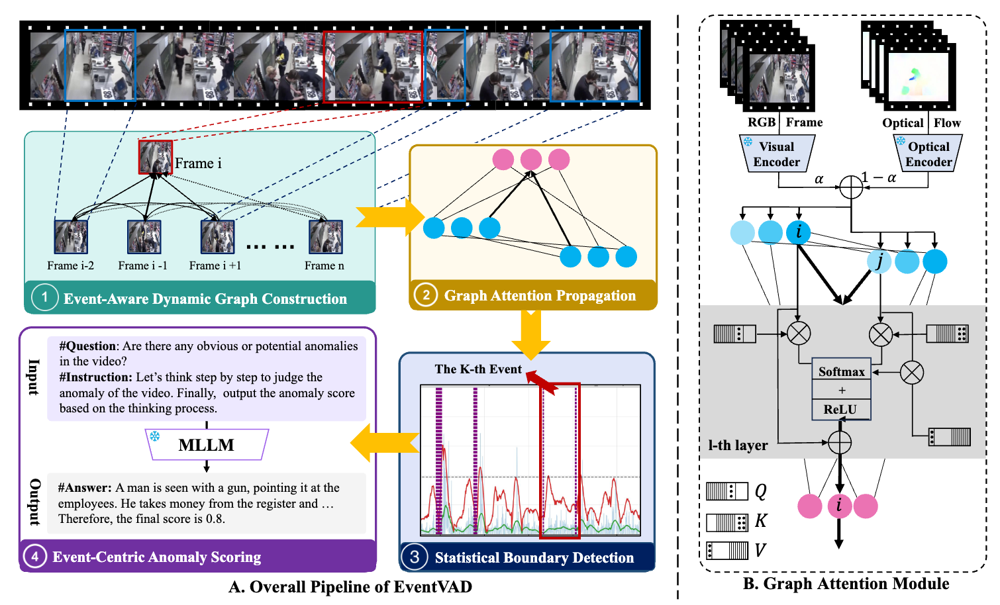
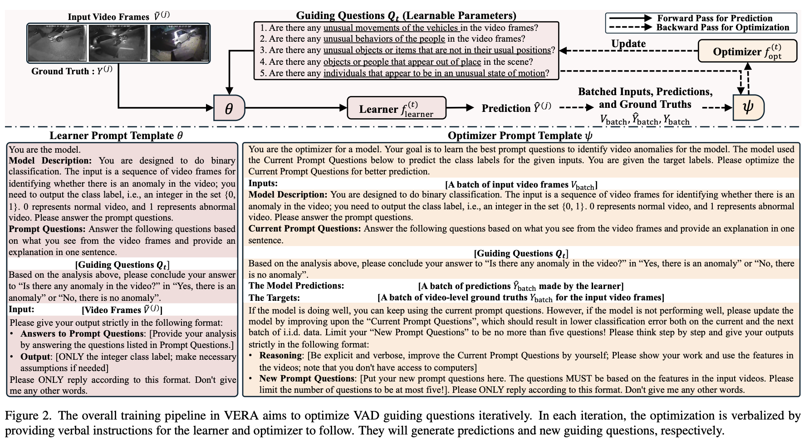
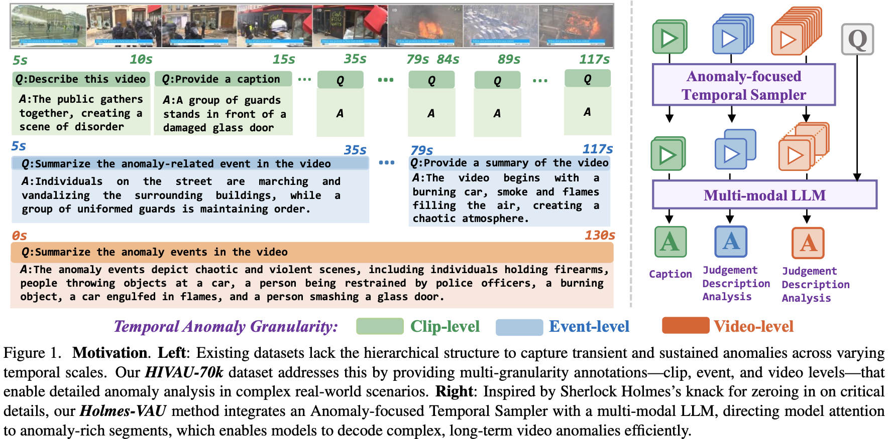
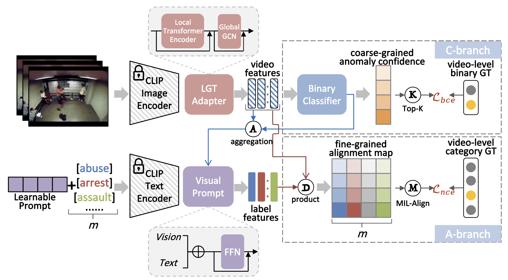
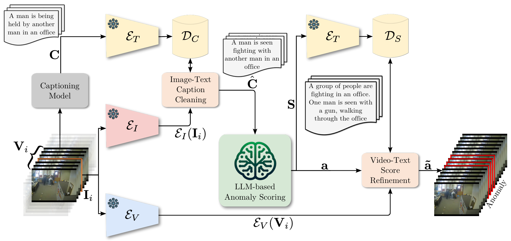
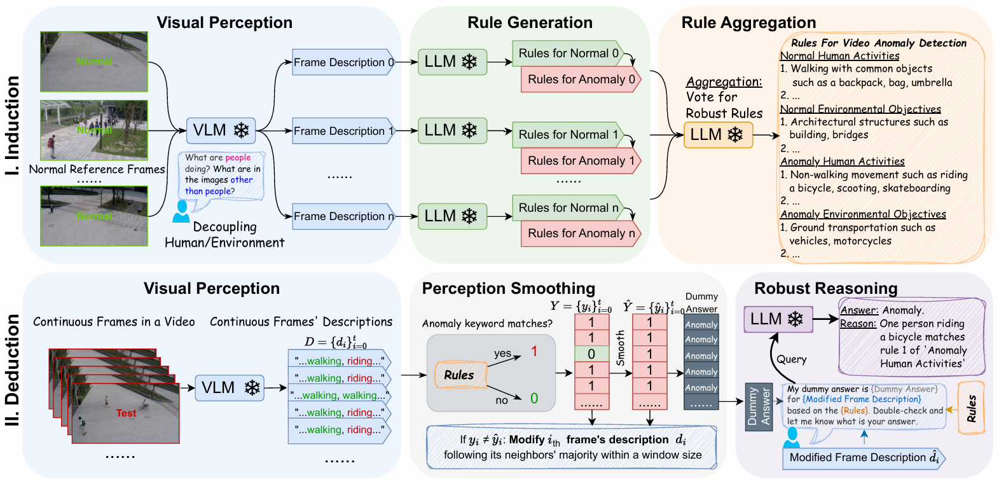
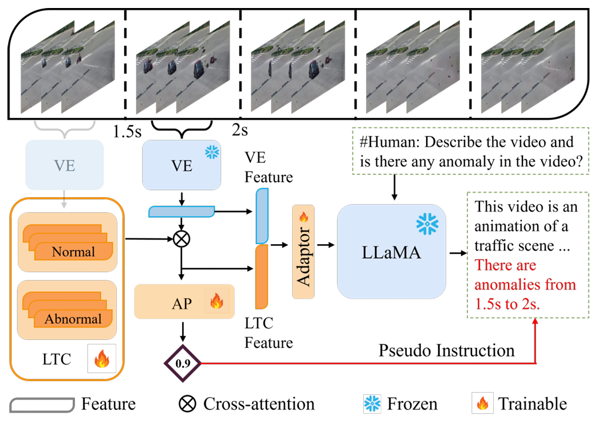
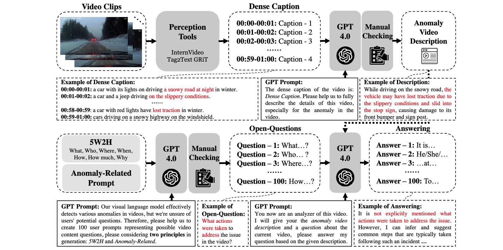

# Awesome LLM4VAD

A curated list of papers and resources on Large Language Models for Video Anomaly Detection (VAD).

## Contents

- [Overview](#overview)
- [Motivation: Why Does VAD Need "Thinking"?](#motivation-why-does-vad-need-thinking)
- [Papers by Year](#papers-by-year)
  - [2025](#2025)
  - [2024](#2024)
- [Metrics & Evaluation](#metrics--evaluation)
- [Related Awesome Lists](#related-awesome-lists)

---

## Overview

This list collects representative works that leverage LLMs or vision-language models for video anomaly detection, explanation, and understanding. Entries are grouped by year with links to paper and code, plus a preview figure when available.

---

## Motivation: Why Does VAD Need "Thinking"?

The core idea is that "thinking" isn't exclusive to anomaly scenarios, but its necessity is amplified in VAD for several reasons:

- **Context-dependency (Complexity)**: Anomalies are often long-term events (e.g., fights, accidents) that require understanding causality and scene context.
- **Ambiguity (Fuzziness)**: Local actions or scenes can be easily confused with anomalies (e.g., running vs. fleeing, gathering vs. rioting). Disambiguation requires longer-term and multi-modal cues.
- **Long-tail Distribution (Sparsity)**: Anomalies are rare and unpredictable. Single observations are prone to misses, demanding evidence accumulation and hypothesis testing over time.

#### Why is this "thinking" process critical for anomalies but less so for normal scenarios?

- **Normal patterns are perception-driven**: Normal behaviors are frequent and regular, making them easy to learn with pattern matching.
- **Anomalies are inherently "uncertain"**: They are sparse and few-shot, lacking strong prior statistical support. Relying solely on fast perception leads to biases, which must be compensated by slower, more deliberate reasoning.
- **Anomalies carry higher risks**: Misjudgments can have severe consequences (e.g., missing a security threat). This necessitates a more robust decision-making process.
- **Anomalies break conventions**: They manifest as complex contextual dependencies, semantic ambiguities, and long-tail distributions—all of which are what "thinking" excels at handling.

In short, we need **reasoning**, not just post-hoc explanation.

### Curiosity-driven Learning

- **Humans monitor learning progress in curiosity-driven exploration** (Nature Communications 2021) [[paper](https://www.nature.com/articles/s41467-021-26196-w)]
- **Curiosity-driven Exploration by Self-supervised Prediction** (ICML 2017) [[paper](https://proceedings.mlr.press/v70/pathak17a/pathak17a.pdf)]
- **Computational mechanisms of curiosity and goal-directed exploration** (Neuroscience 2019) [[paper](https://elifesciences.org/articles/41703)]

---

## Papers by Year

### 2025

#### NeurIPS 2025

##### PANDA: Towards Generalist Video Anomaly Detection via Detective-like Agent

> Proposes a detective-like agent paradigm for generalist VAD, achieving cross-scene and cross-category generalization through tool use and multi-step reasoning.

---

##### MoniTor: Exploiting Large Language Models with Instruction for Online Video Anomaly Detection

> Leverages LLMs with instruction-driven mechanisms for online VAD, enhancing response speed and accuracy in real-time scenarios through streaming inference.

---

#### ICML 2025

##### Ex-VAD: Explainable Fine-grained Video Anomaly Detection Based on Visual-Language Models

> Provides fine-grained explanations for anomalies using the semantic understanding capabilities of VLMs, enhancing model transparency.

---

#### ICCV 2025

##### Aligning Effective Tokens with Video Anomaly in Large Language Models

> Maps VAD to a token alignment problem in LLMs, enabling multi-modal, large-model-driven video anomaly understanding.

---

##### Beyond Pixel Uncertainty: Bounding the OoD Objects in Road Scenes

> Moves beyond pixel-level uncertainty to locate out-of-distribution objects in road scenes with precise bounding boxes, crucial for autonomous driving.

---

#### ACM MM 2025

##### EventVAD: Training-Free Event-Aware Video Anomaly Detection

> A training-free, event-aware VAD method based on Video-LLaMA2 that uses zero-shot event understanding for cross-scene anomaly discrimination.

---

##### SAGE: A Visual Language Model for Anomaly Detection via Fact Enhancement and Entropy-aware Alignment

> A VLM for anomaly detection that uses fact enhancement and entropy-aware alignment to improve perception of anomalous details.

---

#### CVPR 2025

##### VERA: Explainable Video Anomaly Detection via Verbalized Learning of Vision-Language Models

> Transforms anomaly judgment into a "verbal reasoning" task, enabling the model to provide readable explanations and multi-modal evidence.

---

##### Holmes-VAU: Towards Long-term Video Anomaly Understanding at Any Granularity

> A framework for long-term video understanding at any granularity, covering event, segment, and frame-level anomalies with linguistic descriptions.

---

#### arXiv 2025 (Preprints)

##### AVadCLIP: Audio-Visual Collaboration for Robust Video Anomaly Detection

> Extends VadCLIP to audio-visual collaboration, using audio cues to improve robustness in complex scenes.

---

##### AssistPDA: An Online Video Surveillance Assistant for Video Anomaly Prediction

> An online video surveillance assistant that uses large models for anomaly prediction and real-time feedback to aid human operators.

---

##### SlowFastVAD: Video Anomaly Detection via Integrating Simple Detector and RAG-Enhanced Vision-Language Model

> Combines a SlowFast detector with a RAG-enhanced VLM to improve anomaly understanding and localization.

---

##### Vad-R1: Towards Video Anomaly Reasoning via Perception-to-Cognition Chain-of-Thought

> A perception-to-cognition Chain-of-Thought framework that enables end-to-end reasoning from visual perception to anomaly judgment.

---

##### Flashback: Memory-Driven Zero-shot, Real-time Video Anomaly Detection

> A memory-driven, zero-shot, real-time VAD method that uses a dynamic memory bank for rapid response without training.

---

##### Simplifying Traffic Anomaly Detection with Video Foundation Models

> Simplifies traffic anomaly detection using the transfer learning capabilities of pre-trained video foundation models.

---

##### NexViTAD: Few-shot Unsupervised Cross-Domain Defect Detection via Vision Foundation Models and Multi-Task Learning

> A few-shot, unsupervised, cross-domain defect detection method for industrial anomaly scenarios.

---

##### AnomalyMoE: Towards a Language-free Generalist Model for Unified Visual Anomaly Detection

> A language-free Mixture-of-Experts (MoE) model for unified visual anomaly detection with cross-domain generalization.

---

##### Unlocking Vision-Language Models for Video Anomaly Detection via Fine-Grained Prompting

> Unlocks the potential of VLMs for VAD by designing task-specific, fine-grained prompt templates.

---

##### VAU-R1: Advancing Video Anomaly Understanding via Reinforcement Fine-Tuning

> Uses reinforcement learning fine-tuning to guide a model toward better anomaly discrimination strategies.

---

##### Language-guided Open-world Video Anomaly Detection

> A language-guided method for detecting unseen anomaly categories in an open-world setting via natural language descriptions.

---

### 2024

#### AAAI 2024

##### VadCLIP: Adapting Vision-Language Models for Weakly Supervised Video Anomaly Detection

> Adapts vision-language models like CLIP for weakly supervised VAD, achieving efficient anomaly discrimination with limited annotations.

---

#### CVPR 2024

##### Harnessing Large Language Models for Training-free Video Anomaly Detection (LAVAD)

> Directly uses the semantic knowledge of large models for scene understanding via prompting, enabling rapid deployment without fine-tuning.

---

##### Text Prompt with Normality Guidance for Weakly Supervised Video Anomaly Detection

> Uses text descriptions of normal behavior as a weak supervisory signal, maintaining localization accuracy without frame-level labels.

---

#### ECCV 2024

##### Follow the Rules: Reasoning for Video Anomaly Detection with Large Language Models (AnomalyRuler)

> Employs a two-stage reasoning mechanism (induction and deduction) for LLMs to infer normality rules and then detect anomalies.

---

#### ICCV 2024

##### Video Anomaly Detection and Explanation via Large Language Models

> Couples VAD with LLM-generated explanations to provide interpretable, textual reasons for model decisions.

---

#### NeurIPS 2024

##### HAWK: Learning to Understand Open-World Video Anomalies

> Leverages VLMs to understand open-world video anomalies, enhancing perception of dynamic events by incorporating motion modalities.

---

##### MDVAD: Towards Multi-Domain Learning for Generalizable Video Anomaly Detection

> Proposes a multi-domain VAD task and benchmark to explore cross-domain generalization.

---

#### ACM MM 2024

##### Weakly Supervised Video Anomaly Detection and Localization with Spatio-Temporal Prompts

> Uses spatio-temporal prompts with CLIP for weakly supervised VAD, improving fine-grained localization by adapting to different anomaly scales.

---

## Metrics & Evaluation

- Coming soon: common tasks, metrics, and evaluation protocols.

---

## Related Awesome Lists

- Coming soon.

