# 异常理解 · 论文年表

[按创新思路阅读](literature/catalog.md) · [方法比较](literature/comparison.md) · [数据集与评测](literature/benchmarks.md) · [阅读路线](literature/reading-guide.md) · [按会议查找](literature/venues.md) · [研究地图](https://2-mo.github.io/Awesome-Thinking-with-VAD/)

更新：2026-10-04 · 127 篇论文 · 7 个方法方向。

聚焦异常解释、推理、证据定位与理解评估，以及直接支撑这些目标的语义表征方法。会议与年份采用已核验的正式发表信息；未确认录用的论文保留 arXiv。

已配原论文图片 103 / 127 篇；点击图片查看大图。[图片来源与待补记录](assets/papers/README.md)。完整阅读关注见 [研究目录](literature/catalog.md)，作者、DOI 与 BibTeX 见 [引用导出](literature/citations.md)。

[2026](#year-2026) · [2025](#year-2025) · [2024](#year-2024) · [2023](#year-2023) · [2022](#year-2022) · [2021](#year-2021) · [2019](#year-2019) · [2014](#year-2014) · [2009](#year-2009) · [2008](#year-2008)

## 2026

### AAAI

#### CueBench: Advancing Unified Understanding of Context-Aware Video Anomalies in Real-World

[论文](<https://ojs.aaai.org/index.php/AAAI/article/view/38209>) · [阅读笔记](<literature/catalog.md#paper-cuebench>) · [引用 / BibTeX](<literature/citations.md#cite-cuebench>)

> **CueBench / Cue-R1 · 上下文异常分类体系与分层奖励**
>
> 以条件性与绝对异常为核心组织场景、属性和事件层级，统一评估识别、定位、检测与预判，并训练具有分层可验证奖励的 Cue-R1。

[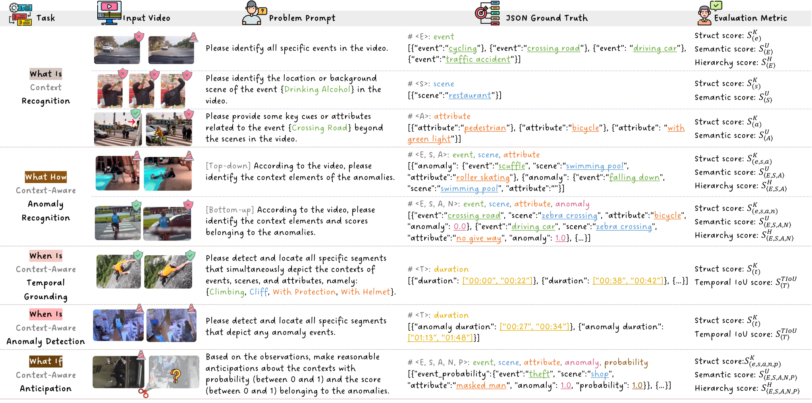](assets/papers/cuebench.png)

*CueBench 的统一评测框架与上下文异常任务示例（原文 Figure 3）。 Yu, Yating et al. / CueBench · [来源](<assets/papers/README.md#figure-cuebench>)*

---

#### FineVAU: A Novel Human-Aligned Benchmark for Fine-Grained Video Anomaly Understanding

[论文](<https://arxiv.org/abs/2601.17258>) · [阅读笔记](<literature/catalog.md#paper-finevau>) · [引用 / BibTeX](<literature/citations.md#cite-finevau>)

> **FineVAU · 关键视觉事实评估**
>
> 围绕事件、参与者与位置构建细粒度标注，并用 FVScore 检查关键视觉信息。

[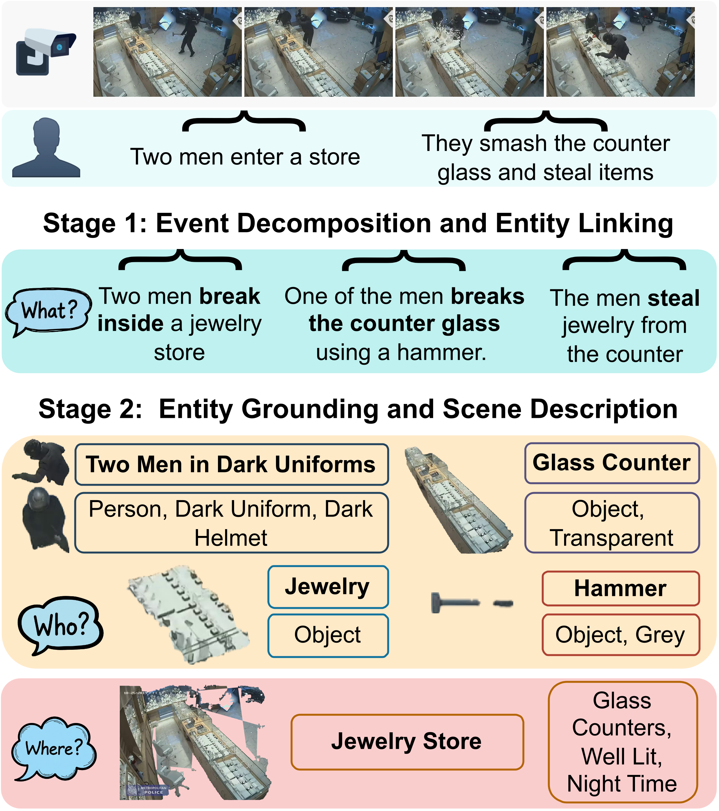](assets/papers/finevau.png)

*FineVAU：关键视觉事实评估。原文 Figure 2。 Pereira, Joao Alexandre Cardeira et al. / FineVAU · [来源](<assets/papers/README.md#figure-finevau>)*

---

#### HeadHunt-VAD: Hunting Robust Anomaly-Sensitive Heads in MLLM for Tuning-Free Video Anomaly Detection

[论文](<https://arxiv.org/abs/2512.17601>) · [阅读笔记](<literature/catalog.md#paper-headhunt-vad>) · [引用 / BibTeX](<literature/citations.md#cite-headhunt-vad>)

> **HeadHunt-VAD · 稳定异常敏感注意力头探测**
>
> 从冻结 MLLM 内部筛选对多种提示稳定的异常敏感注意力头，再用轻量评分器和时序定位器读取其特征。

[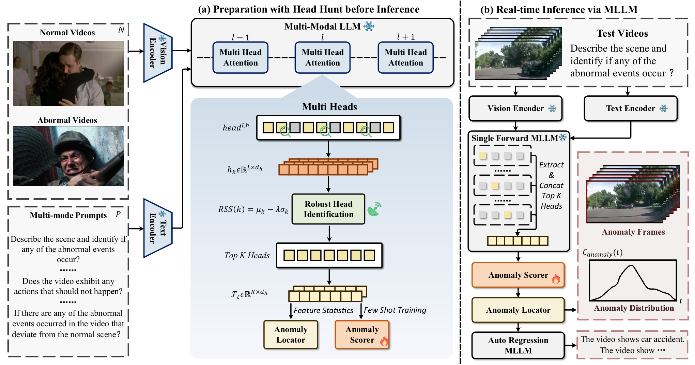](assets/papers/headhunt-vad.png)

*图 3：离线识别异常敏感注意力头并用于在线检测。 Cai, Zhaolin et al. / HeadHunt-VAD · [来源](<assets/papers/README.md#figure-headhunt-vad>)*

---

#### IAD-R1: Reinforcing Consistent Reasoning in Industrial Anomaly Detection

[论文](<https://ojs.aaai.org/index.php/AAAI/article/view/37588>) · [阅读笔记](<literature/catalog.md#paper-iad-r1>) · [引用 / BibTeX](<literature/citations.md#cite-iad-r1>)

> **IAD-R1 · 感知推理一致性微调与强化学习**
>
> 以 Expert-AD 思维链数据进行感知激活监督微调，再通过 SC-GRPO 联合优化正常性一致性、判断准确率、缺陷类型和位置奖励，使缺陷感知、推理与答案相互一致。

[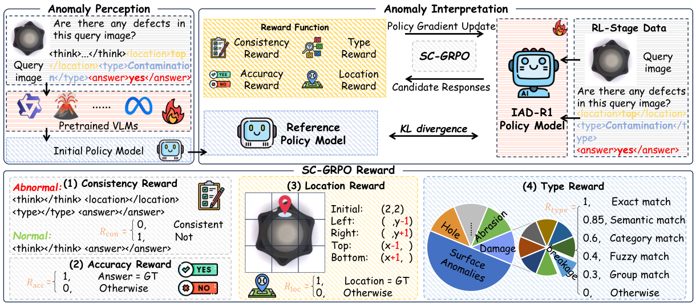](assets/papers/iad-r1.png)

*IAD-R1 的感知激活微调、结构化奖励和 SC-GRPO 框架。原文 Figure 2。 Li, Yanhui et al. / IAD-R1 · [来源](<assets/papers/README.md#figure-iad-r1>)*

---

#### TargetVAU: Multimodal Anomaly-Aware Reasoning for Target Behavior Understanding in Videos

[论文](<https://ojs.aaai.org/index.php/AAAI/article/view/38378>) · [阅读笔记](<literature/catalog.md#paper-targetvau>) · [引用 / BibTeX](<literature/citations.md#cite-targetvau>)

> **TargetVAU · 个体时空交互图与指令推理**
>
> 结合全局和人体中心视觉特征，用异常引导采样与时空交互图刻画个体关系，再以指令微调语言模型识别异常个体并解释行为。

[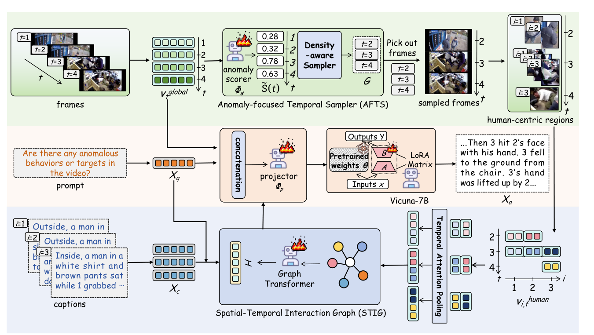](assets/papers/targetvau.png)

*TargetVAU：个体时空交互图与指令推理（原文 Figure 2）。 Zhou, Lingru et al. / TargetVAU · [来源](<assets/papers/README.md#figure-targetvau>)*

---

#### VAGU & GtS: LLM-Based Benchmark and Framework for Joint Video Anomaly Grounding and Understanding

[论文](<https://ojs.aaai.org/index.php/AAAI/article/view/42412>) · [阅读笔记](<literature/catalog.md#paper-vagu-gts>) · [引用 / BibTeX](<literature/citations.md#cite-vagu-gts>)

> **VAGU & GtS · 先全局粗定位再局部细查**
>
> 先通过文本引导粗定位异常区间，再细查异常语义与时间边界，并构建 VAGU 和 JeAUG 联合评价定位与理解。

[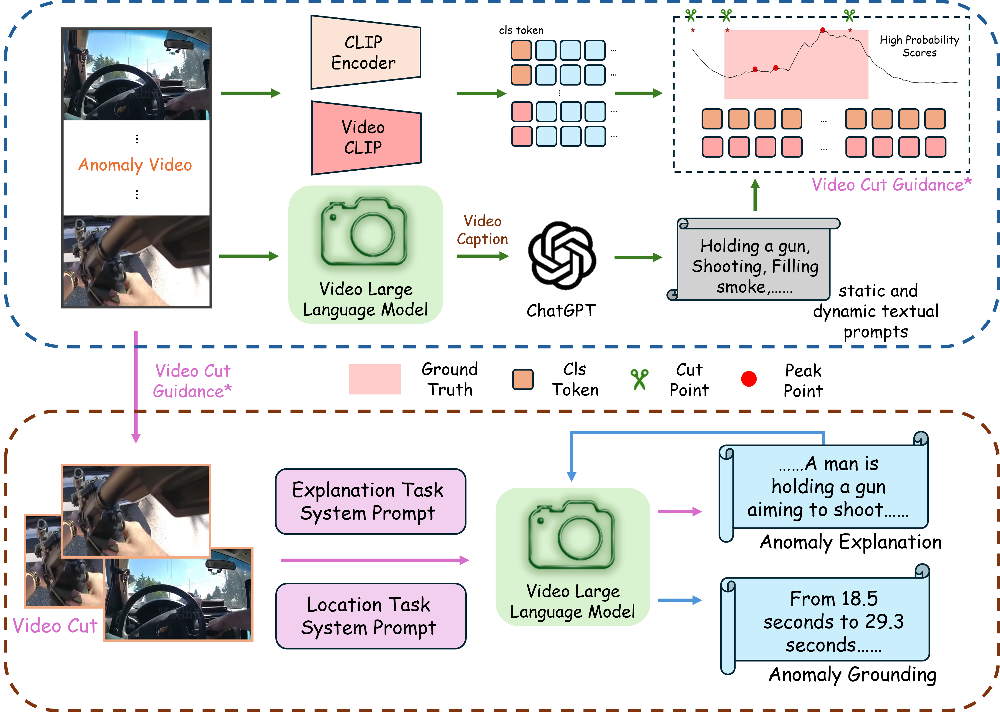](assets/papers/vagu-gts.png)

*图 4：通过文本引导先定位主事件，再进行细粒度异常理解。 Gao, Shibo et al. / VAGU & GtS · [来源](<assets/papers/README.md#figure-vagu-gts>)*

---

### ACL

#### VALU: A Benchmark for Video Anomaly Temporal Localization and Understanding at Multiple Semantic Levels

[论文](<https://aclanthology.org/2026.acl-long.56/>) · [阅读笔记](<literature/catalog.md#paper-valu>) · [引用 / BibTeX](<literature/citations.md#cite-valu>)

> **VALU · 语义分层边界评估**
>
> 用多个语义层级定义异常边界，联合考查定位、时间 grounding 与细节辨别。

[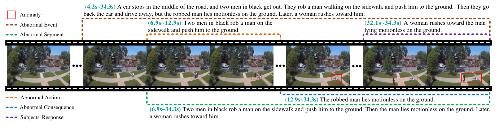](assets/papers/valu.png)

*多层级异常标注示例（原文 Figure 2）。 Yixiao He et al. / VALU · [来源](<assets/papers/README.md#figure-valu>)*

---

### ACM MM

#### Advancing Video Anomaly Retrieval via Action-Focused Temporal Reasoning and Query-Adaptive Routing

[论文](<https://2026.acmmm.org/site/technical-programme.html>) · [阅读笔记](<literature/catalog.md#paper-avar>) · [引用 / BibTeX](<literature/citations.md#cite-avar>)

> **AVAR · 动作聚焦与查询自适应路由**
>
> 用文本动作语义定位目标，以双路径时序异常推理和查询自适应路由检索视频中的异常事件。

*配图待补：尚未取得可核验的论文原图。[查看检索记录](<assets/papers/README.md#missing-avar>)*

---

#### Customized Anomalous Video Generation for Incremental Learning in Weakly-Supervised Video Anomaly Detection

[论文](<https://2026.acmmm.org/site/technical-programme.html>) · [阅读笔记](<literature/catalog.md#paper-cavge>) · [引用 / BibTeX](<literature/citations.md#cite-cavge>)

> **CAVGE · 脚本—关键帧—视频可控生成**
>
> 以语言脚本、文本引导关键帧和视频生成合成可定制异常，并用于弱监督视频异常检测的增量学习。

*配图待补：尚未取得可核验的论文原图。[查看检索记录](<assets/papers/README.md#missing-cavge>)*

---

#### DEAL: Deep Evidential Audio-Visual Learning for Weakly Supervised Video Anomaly Detection

[论文](<https://2026.acmmm.org/site/technical-programme.html>) · [阅读笔记](<literature/catalog.md#paper-deal-vad>) · [引用 / BibTeX](<literature/citations.md#cite-deal-vad>)

> **DEAL · 音视频时序对齐与证据融合**
>
> 以状态空间模块对齐音视频，再用证据式双分支融合估计模态不确定性，降低噪声和时间错位的影响。

*配图待补：尚未取得可核验的论文原图。[查看检索记录](<assets/papers/README.md#missing-deal-vad>)*

---

#### PEER-VAD: Prior-enhanced Event Refinement for Video Anomaly Detection

[论文](<https://2026.acmmm.org/site/technical-programme.html>) · [阅读笔记](<literature/catalog.md#paper-peer-vad>) · [引用 / BibTeX](<literature/citations.md#cite-peer-vad>)

> **PEER-VAD · 先验消歧与双向事件细化**
>
> 对大模型给出的帧级或短片段异常预测做先验消歧和双向窗口分析，修复碎片化事件预测。

*配图待补：尚未取得可核验的论文原图。[查看检索记录](<assets/papers/README.md#missing-peer-vad>)*

---

#### Rule-Guided Evolution of Hierarchical Reasoning for Explainable Video Anomaly Detection

[论文](<https://2026.acmmm.org/site/technical-programme.html>) · [阅读笔记](<literature/catalog.md#paper-prime-vad>) · [引用 / BibTeX](<literature/citations.md#cite-prime-vad>)

> **PRIME · 规则记忆与分层提示演化**
>
> 把场景、对象和推理提示拆成模块，从运行轨迹提炼规则记忆，并逐模块演化提示以获得可解释判据。

*配图待补：尚未取得可核验的论文原图。[查看检索记录](<assets/papers/README.md#missing-prime-vad>)*

---

#### S2MGraph-VAD: Scene-to-Moment Graph-Guided Training-Free Video Anomaly Detection

[论文](<https://2026.acmmm.org/site/technical-programme.html>) · [阅读笔记](<literature/catalog.md#paper-s2mgraph-vad>) · [引用 / BibTeX](<literature/citations.md#cite-s2mgraph-vad>)

> **S2MGraph-VAD · 场景—片段图与稀疏查询**
>
> 先把长视频划分为场景，再细化到短时片段，通过场景到片段的图连接上下文与局部异常线索，稀疏调用大模型定位。

*配图待补：尚未取得可核验的论文原图。[查看检索记录](<assets/papers/README.md#missing-s2mgraph-vad>)*

---

#### Scene-Dependent Video Anomaly Detection via Discriminative-Contrastive Learning from Intrinsic Scene Labels

[论文](<https://2026.acmmm.org/site/technical-programme.html>) · [阅读笔记](<literature/catalog.md#paper-scene-dependent-vad>) · [引用 / BibTeX](<literature/citations.md#cite-scene-dependent-vad>)

> **Scene-Dependent VAD · 场景标签判别与前景对比**
>
> 用内在场景标签训练事件分类，并以事件和场景的对比表示及距离构建场景依赖的异常分数。

*配图待补：尚未取得可核验的论文原图。[查看检索记录](<assets/papers/README.md#missing-scene-dependent-vad>)*

---

#### UPR-VAD: Uncertainty-guided Signal Purification and Regularization for Weakly-Supervised Video Anomaly Detection

[论文](<https://2026.acmmm.org/site/technical-programme.html>) · [阅读笔记](<literature/catalog.md#paper-upr-vad>) · [引用 / BibTeX](<literature/citations.md#cite-upr-vad>)

> **UPR-VAD · 不确定性净化与对比约束**
>
> 通过不确定性感知的信息瓶颈过滤模糊片段，结合视频内负例对比和稀疏置信约束学习弱监督异常信号。

*配图待补：尚未取得可核验的论文原图。[查看检索记录](<assets/papers/README.md#missing-upr-vad>)*

---

#### Zoom In, Reason Out: Efficient Far-field Anomaly Detection in Expressway Surveillance Videos via Focused VLM Reasoning Guided by Bayesian Inference

[论文](<https://2026.acmmm.org/site/technical-programme.html>) · [阅读笔记](<literature/catalog.md#paper-vibes>) · [引用 / BibTeX](<literature/citations.md#cite-vibes>)

> **VIBES · 贝叶斯轨迹触发与局部推理**
>
> 从高速公路车辆轨迹建立在线正常运动分布，贝叶斯偏离触发远景局部区域的视觉语言推理。

[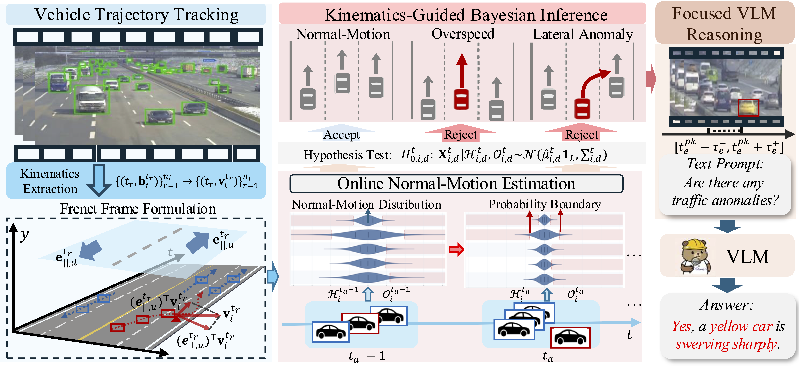](assets/papers/vibes.png)

*VIBES 贝叶斯异常提议与聚焦视觉语言推理框架（作者仓库） Xiaowei Mao et al. / VIBES · [来源](<assets/papers/README.md#figure-vibes>)*

---

#### VTO: Visual Tool Orchestration for Video Anomaly Detection

[论文](<https://2026.acmmm.org/site/technical-programme.html>) · [阅读笔记](<literature/catalog.md#paper-vto>) · [引用 / BibTeX](<literature/citations.md#cite-vto>)

> **VTO · 视觉工具编排与过程奖励**
>
> 让视频异常代理动态选择视觉工具，并用过程监督的强化学习及认知评价器引导多步证据获取。

[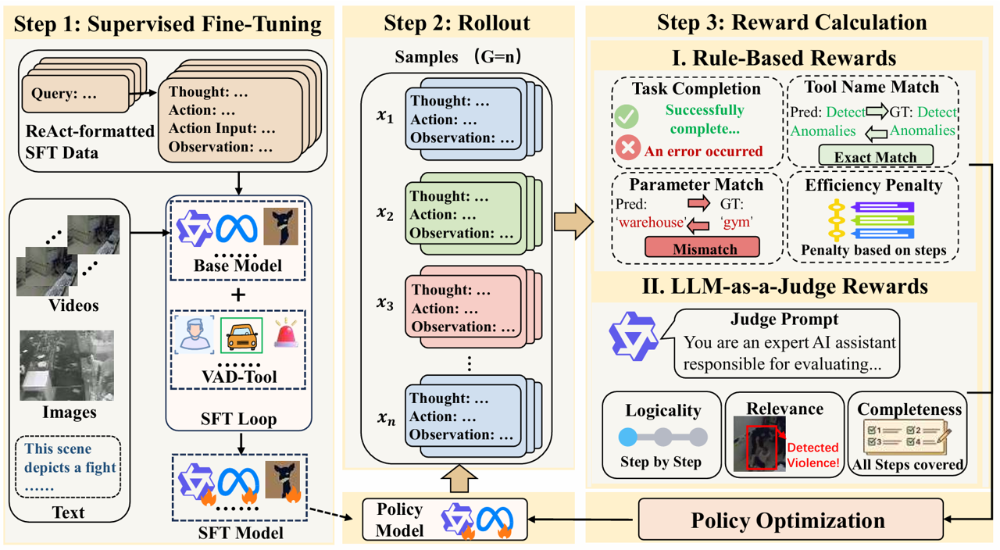](assets/papers/vto.png)

*VTO 视觉工具编排与过程监督强化学习框架（作者仓库） Rui Wang et al. / VTO · [来源](<assets/papers/README.md#figure-vto>)*

---

### CVPR

#### ADSeeker: A Knowledge-Grounded Reasoning Framework for Industry Anomaly Detection and Reasoning

[论文](<https://openaccess.thecvf.com/content/CVPR2026/html/Zhang_ADSeeker_A_Knowledge-Grounded_Reasoning_Framework_for_Industry_Anomaly_Detection_and_CVPR_2026_paper.html>) · [阅读笔记](<literature/catalog.md#paper-adseeker>) · [引用 / BibTeX](<literature/citations.md#cite-adseeker>)

> **ADSeeker · 图像查询驱动的领域知识检索**
>
> 构建图文知识库 SEEK-M&V，以 Q2K RAG 将查询图像关联到领域文档；结合层次稀疏提示和缺陷类型特征，为异常定位、判断与解释提供视觉和知识证据，并提出 MulA 数据。

[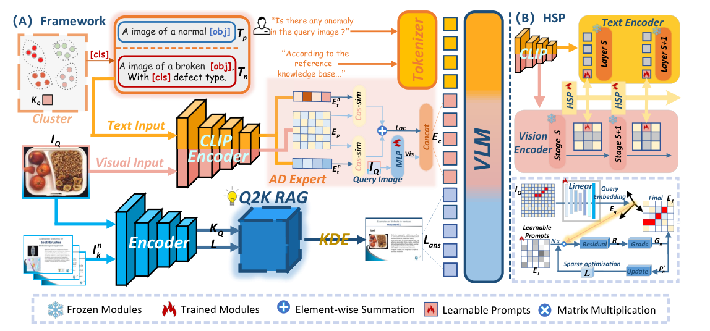](assets/papers/adseeker.png)

*ADSeeker 的 Q2K 知识检索与异常专家双路径架构。原文 Figure 4。 Zhang, Kai et al. / ADSeeker · [来源](<assets/papers/README.md#figure-adseeker>)*

---

#### Alert-CLIP: Abnormality-aware Latent-Enhanced Representation Tuning of CLIP for Video Anomaly Detection

[论文](<https://openaccess.thecvf.com/content/CVPR2026/html/Zhu_Alert-CLIP_Abnormality-aware_Latent-Enhanced_Representation_Tuning_of_CLIP_for_Video_Anomaly_CVPR_2026_paper.html>) · [阅读笔记](<literature/catalog.md#paper-alert-clip>) · [引用 / BibTeX](<literature/citations.md#cite-alert-clip>)

> **Alert-CLIP · 区域语义多层对齐**
>
> 通过视频与标签、区域与文本、区域与语义的多层对齐，增强视觉语言表征对正常和异常的区分能力。

[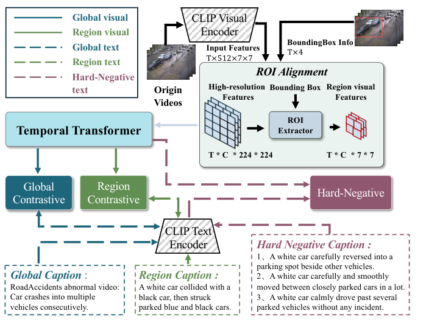](assets/papers/alert-clip.png)

*Alert-CLIP：区域语义多层对齐（原文 Figure 3）。 Zhu, Yiyan et al. / Alert-CLIP · [来源](<assets/papers/README.md#figure-alert-clip>)*

---

#### Learning from Noisy Supervision: A Denoising-Debiasing Framework for Weakly Supervised Video Anomaly Detection

[论文](<https://openaccess.thecvf.com/content/CVPR2026/html/Zhao_Learning_from_Noisy_Supervision_A_Denoising-Debiasing_Framework_for_Weakly_Supervised_CVPR_2026_paper.html>) · [阅读笔记](<literature/catalog.md#paper-d2mil>) · [引用 / BibTeX](<literature/citations.md#cite-d2mil>)

> **D²MIL · 动态去噪与视觉语言语义复核**
>
> 先按动态丢弃率筛除训练损失较高的疑似噪声片段，再用冻结视觉语言模型复核这些候选，找回因难以识别而被误删的异常实例，减少弱监督噪声和困难异常之间的混淆。

[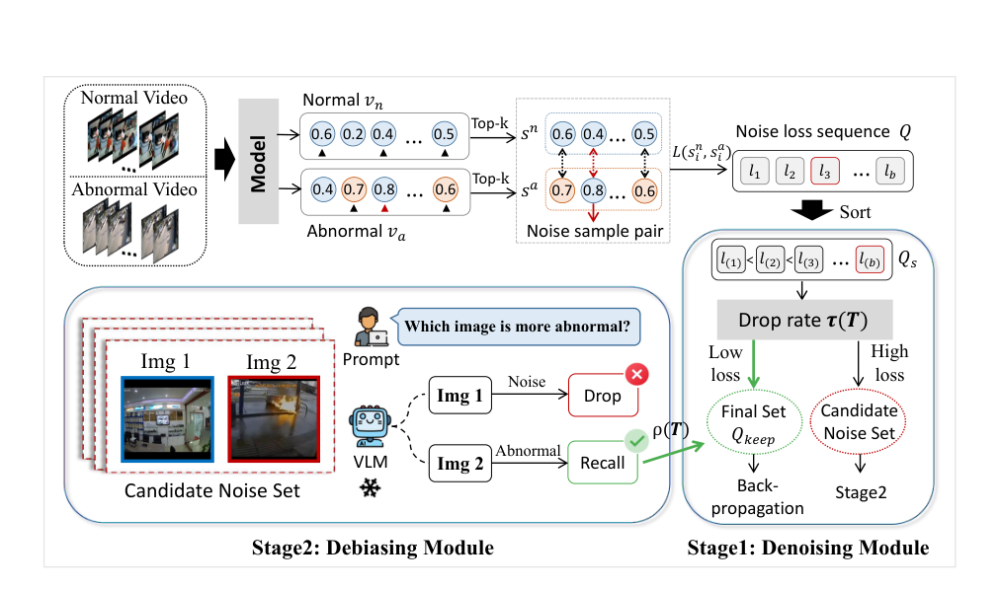](assets/papers/d2mil.png)

*Figure 2：D²MIL 的动态去噪与视觉语言去偏复核。 Yaxin Zhao et al. / CVPR 2026 · [来源](<assets/papers/README.md#figure-d2mil>)*

---

#### Fine-VAD: Towards Fine-Grained Video Anomaly Detection via Progressive Cross-Granularity Learning

[论文](<https://openaccess.thecvf.com/content/CVPR2026/html/Zhang_Fine-VAD_Towards_Fine-Grained_Video_Anomaly_Detection_via_Progressive_Cross-Granularity_Learning_CVPR_2026_paper.html>) · [阅读笔记](<literature/catalog.md#paper-fine-vad>) · [引用 / BibTeX](<literature/citations.md#cite-fine-vad>)

> **Fine-VAD · 跨粒度渐进对齐辨别异常类别**
>
> 从正常／异常粗粒度监督，经聚类构建的中间伪类别，逐步对齐到细粒度异常类别语义；利用互补监督缓解同类事件跨场景变化及不同异常共享视觉特征导致的混淆。

[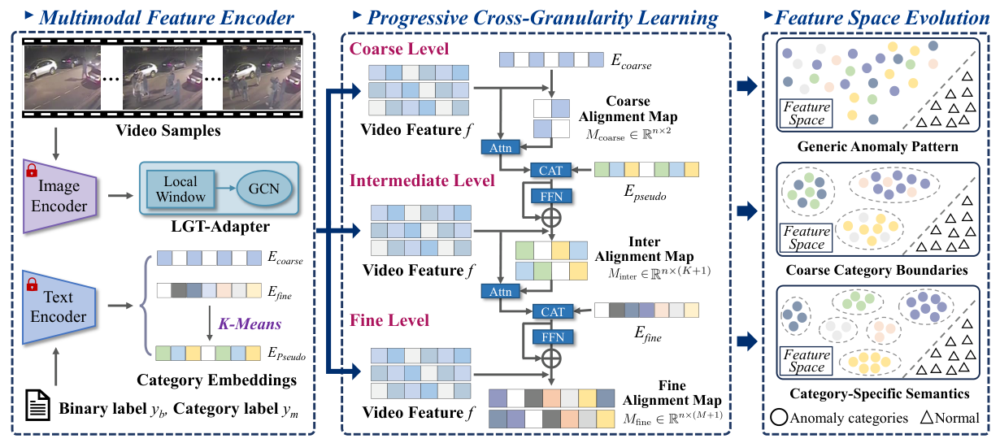](assets/papers/fine-vad.png)

*Figure 2：Fine-VAD 从粗粒度到类别语义的渐进对齐。 Menghao Zhang et al. / CVPR 2026 · [来源](<assets/papers/README.md#figure-fine-vad>)*

---

#### Weakly Supervised Video Anomaly Detection with Anomaly-Connected Components and Intention Reasoning

[论文](<https://openaccess.thecvf.com/content/CVPR2026/html/Wang_Weakly_Supervised_Video_Anomaly_Detection_with_Anomaly-Connected_Components_and_Intention_CVPR_2026_paper.html>) · [阅读笔记](<literature/catalog.md#paper-las-vad>) · [引用 / BibTeX](<literature/citations.md#cite-las-vad>)

> **LAS-VAD · 语义连通与意图感知**
>
> 将视频帧组织为语义相连的成分，并结合行为意图与异常属性信息，区分外观相似的正常和异常行为。

[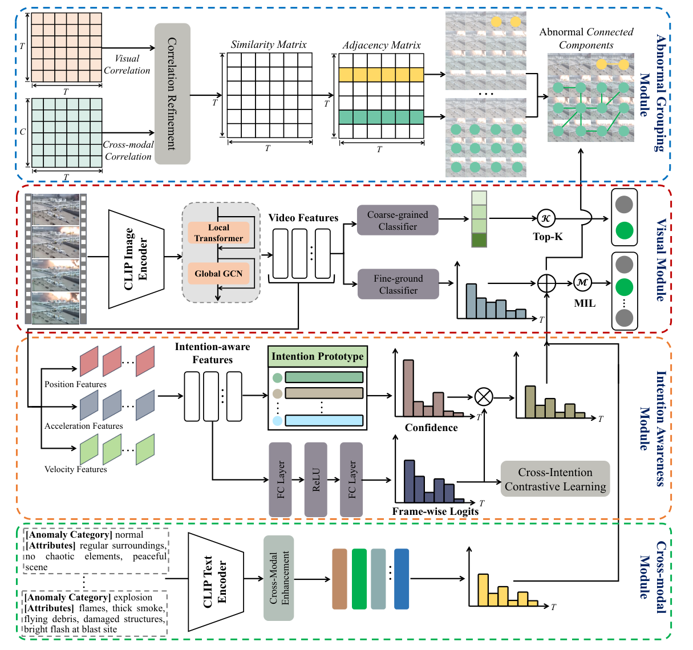](assets/papers/las-vad.png)

*LAS-VAD：语义连通与意图感知（原文 Figure 1）。 Wang, Yu et al. / LAS-VAD · [来源](<assets/papers/README.md#figure-las-vad>)*

---

#### No Need For Real Anomaly: MLLM Empowered Zero-Shot Video Anomaly Detection

[论文](<https://openaccess.thecvf.com/content/CVPR2026/html/Dai_No_Need_For_Real_Anomaly_MLLM_Empowered_Zero-Shot_Video_Anomaly_CVPR_2026_paper.html>) · [阅读笔记](<literature/catalog.md#paper-lavida>) · [引用 / BibTeX](<literature/citations.md#cite-lavida>)

> **LAVIDA · 伪异常与反向注意力**
>
> 仅用伪异常训练，结合多模态大模型语义理解与反向注意力词元压缩，实现零样本帧级和像素级异常检测。

[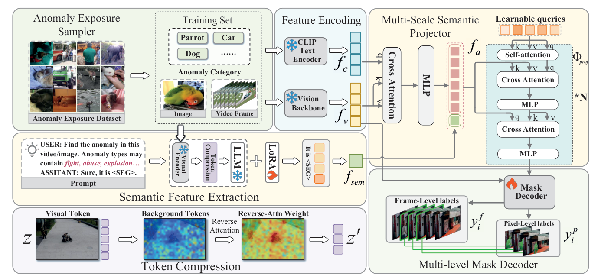](assets/papers/lavida.png)

*LAVIDA：伪异常与反向注意力（原文 Figure 2）。 Dai, Zunkai et al. / LAVIDA · [来源](<assets/papers/README.md#figure-lavida>)*

---

#### Streaming Video Crime Anticipation with Spatio-Temporal Causal Reasoning

[论文](<https://openaccess.thecvf.com/content/CVPR2026/html/Wang_Streaming_Video_Crime_Anticipation_with_Spatio-Temporal_Causal_Reasoning_CVPR_2026_paper.html>) · [阅读笔记](<literature/catalog.md#paper-stch>) · [引用 / BibTeX](<literature/citations.md#cite-stch>)

> **STCH · 流式时空因果超图**
>
> 构建具有递进推理任务的 STCRC 基准，并用流式时空因果超图显式组织实体动态，支撑犯罪事件预判。

[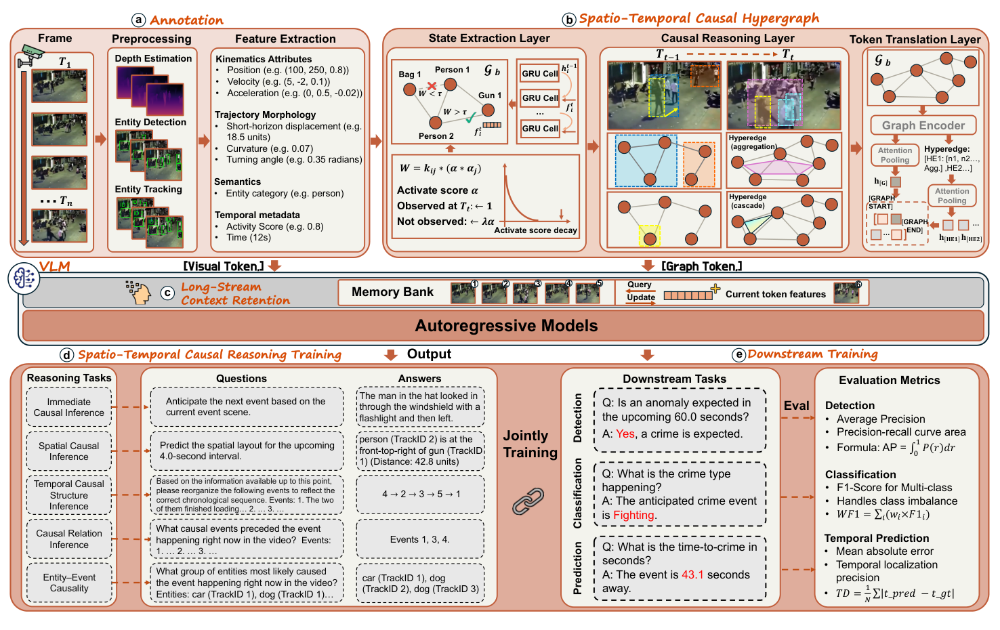](assets/papers/stch.png)

*图 3：时空因果超图、记忆库与流式犯罪预测训练流程。 Wang, Yusong et al. / STCH · [来源](<assets/papers/README.md#figure-stch>)*

---

### ECCV

#### CLUE-VAD: Structured Semantic Clues for Understanding Explainable Events in Video Anomaly Detection

[论文](<https://eccv.ecva.net/virtual/2026/poster/4744>) · [阅读笔记](<literature/catalog.md#paper-clue-vad>) · [引用 / BibTeX](<literature/citations.md#cite-clue-vad>)

> **CLUE-VAD · 结构化语义线索与类别感知归因**
>
> 将片段分解为动作、环境和对象线索，用类别感知权重融合并将异常分数归因到线索及关键词，生成有依据的解释。

[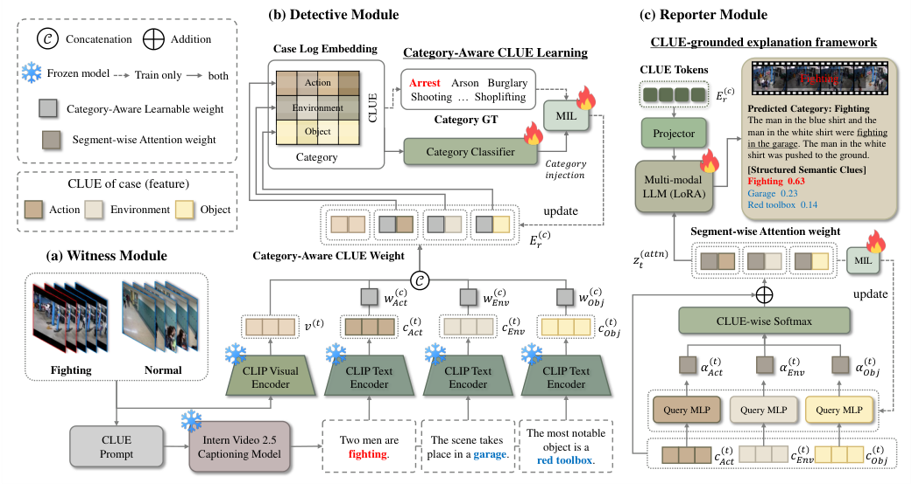](assets/papers/clue-vad.png)

*图 2：Witness、Detective 和 Reporter 模块将语义线索用于检测与解释。 MYOUNG-CHUL KIM et al. / CLUE-VAD · [来源](<assets/papers/README.md#figure-clue-vad>)*

---

#### Towards Video Anomaly Detection from Event Streams: A Baseline and Benchmark Datasets

[论文](<https://eccv.ecva.net/virtual/2026/poster/5214>) · [阅读笔记](<literature/catalog.md#paper-ewad>) · [引用 / BibTeX](<literature/citations.md#cite-ewad>)

> **EWAD · 事件密度采样与跨模态蒸馏**
>
> 构建同步事件流与 RGB 的视频异常基准，用事件密度引导采样、时序建模及 RGB 到事件流的蒸馏。

[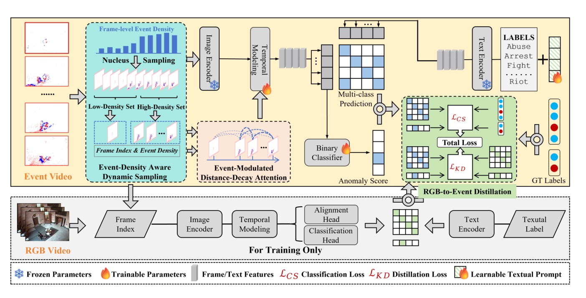](assets/papers/ewad.png)

*Figure 2: EWAD 事件流视频异常检测流程（作者预印本） Peng Wu et al. / EWAD · [来源](<assets/papers/README.md#figure-ewad>)*

---

#### O-VAD: Industrial Video Anomaly Detection through Object-Centric Tracking and Reasoning

[论文](<https://arxiv.org/abs/2607.18142>) · [阅读笔记](<literature/catalog.md#paper-o-vad>) · [引用 / BibTeX](<literature/citations.md#cite-o-vad>)

> **O-VAD · 对象状态轨迹与时序推理**
>
> 在工业视频中跟踪对象状态随时间的演化，再对对象轨迹推理，定位异常对象与帧并输出异常过程和类型报告。

[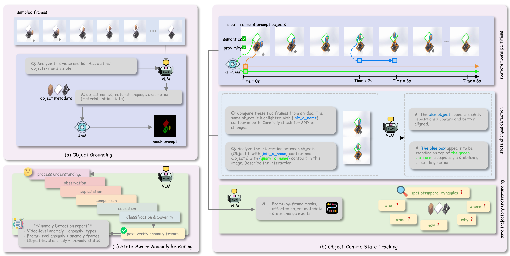](assets/papers/o-vad.png)

*图 2：对象发现、状态跟踪与多步推理相结合的检测流程。 Mei Yuan et al. / O-VAD · [来源](<assets/papers/README.md#figure-o-vad>)*

---

#### PA-VAD: Diffusion-Based Pseudo-Only Video Anomaly Detection via Domain-Aligned Memory Updates

[论文](<https://eccv.ecva.net/virtual/2026/poster/4682>) · [阅读笔记](<literature/catalog.md#paper-pa-vad>) · [引用 / BibTeX](<literature/citations.md#cite-pa-vad>)

> **PA-VAD · 伪异常生成与域对齐记忆**
>
> 用少量正常图像合成伪异常视频，与真实正常视频组成训练对；通过域对齐和记忆更新缓解合成异常的特征偏置。

[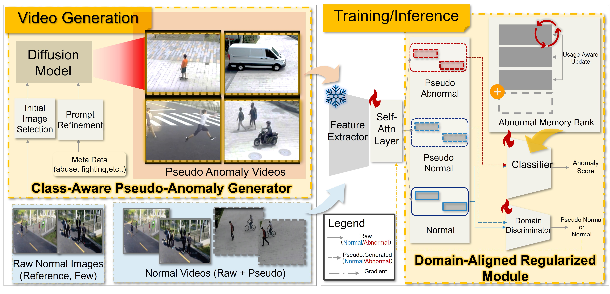](assets/papers/pa-vad.jpg)

*Figure 3: PA-VAD 伪异常视频生成与域对齐记忆框架（作者预印本） Satoshi Hashimoto et al. / PA-VAD · [来源](<assets/papers/README.md#figure-pa-vad>)*

---

#### Pistachio: Towards Synthetic, Balanced, and Long-Form Video Anomaly Benchmarks

[论文](<https://arxiv.org/abs/2511.19474>) · [阅读笔记](<literature/catalog.md#paper-pistachio>) · [引用 / BibTeX](<literature/citations.md#cite-pistachio>)

> **Pistachio · 可控生成与多事件评测**
>
> 通过可控场景、异常类型和时序叙事生成视频，构建检测与理解基准，包含事件级、视频级语义及多异常事件。

[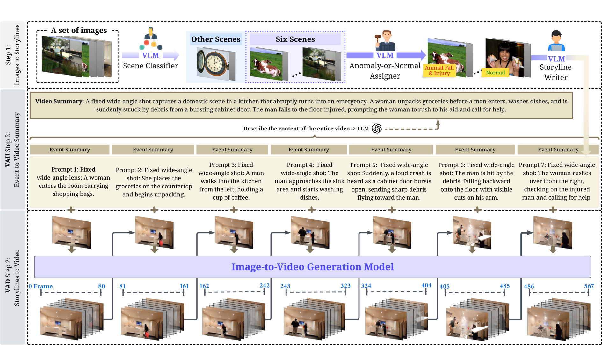](assets/papers/pistachio.png)

*图 2：从场景和故事线生成异常视频及事件摘要。 Li, Jie et al. / Pistachio · [来源](<assets/papers/README.md#figure-pistachio>)*

---

#### ReactVAU: A Slow-Fast Decoupled Framework for Streaming Video Anomaly Understanding

[论文](<https://arxiv.org/abs/2609.07941>) · [阅读笔记](<literature/catalog.md#paper-reactvau>) · [引用 / BibTeX](<literature/citations.md#cite-reactvau>)

> **ReactVAU · 快慢解耦与异常持久记忆**
>
> 用轻量检测连续筛查视频，以异常感知记忆保留短暂证据，仅在可疑事件触发重型模型进行语义验证与原因描述。

[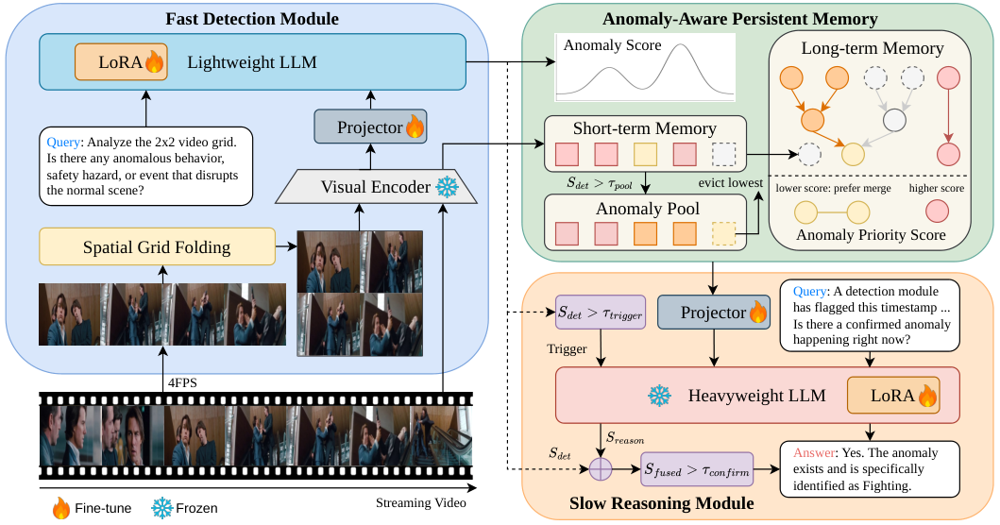](assets/papers/reactvau.png)

*图 2：快速检测、异常持久记忆与慢速推理模块。 Chen, Chia-Hui et al. / ReactVAU · [来源](<assets/papers/README.md#figure-reactvau>)*

---

#### STEP: Score-Based Temporal Energy for Human Pose Video Anomaly Detection

[论文](<https://eccv.ecva.net/virtual/2026/poster/3512>) · [阅读笔记](<literature/catalog.md#paper-step-vad>) · [引用 / BibTeX](<literature/citations.md#cite-step-vad>)

> **STEP · 姿态主成分空间的时序能量**
>
> 把连续人体姿态投影到白化主成分空间，利用去噪分数匹配学习正常序列能量，并用姿态置信度降低估计噪声影响。

[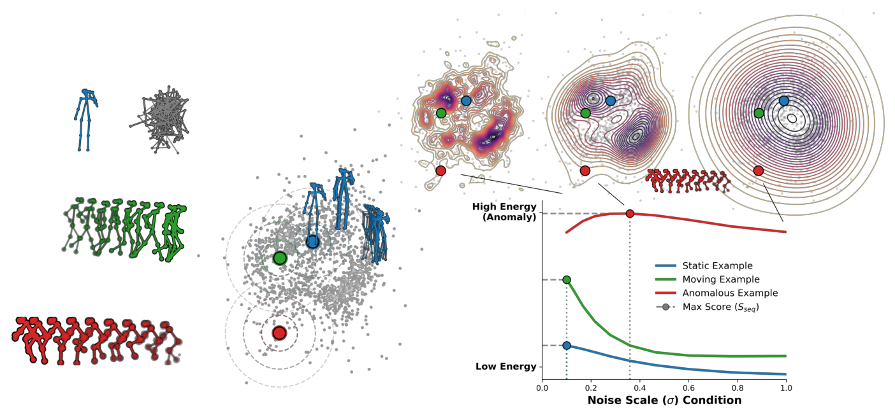](assets/papers/step-vad.png)

*Fig. 1：STEP 人体姿态时序能量异常检测流程（作者预印本，第 2 页）。 Jakub Micorek et al. / STEP · [来源](<assets/papers/README.md#figure-step-vad>)*

---

#### Bounding-Box Trajectories Matter for Video Anomaly Detection

[论文](<https://eccv.ecva.net/virtual/2026/poster/5841>) · [阅读笔记](<literature/catalog.md#paper-trajvad>) · [引用 / BibTeX](<literature/citations.md#cite-trajvad>)

> **TrajVAD · 轨迹流模型与姿态可靠门控**
>
> 以目标框轨迹作为主要异常线索，用归一化流学习正常运动分布；另以可靠性门控结合人体姿态。

[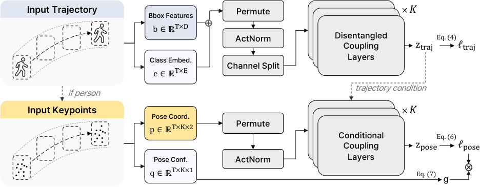](assets/papers/trajvad.png)

*Figure 2: TrajVAD 轨迹与姿态分支异常检测框架（作者预印本） Inpyo Song et al. / TrajVAD · [来源](<assets/papers/README.md#figure-trajvad>)*

---

### ICLR

#### JUDO: A Juxtaposed Domain-Oriented Multimodal Reasoner for Industrial Anomaly QA

[论文](<https://proceedings.iclr.cc/paper_files/paper/2026/hash/92a7a03e1c716970848a4a86cc8243ee-Abstract-Conference.html>) · [阅读笔记](<literature/catalog.md#paper-judo>) · [引用 / BibTeX](<literature/citations.md#cite-judo>)

> **JUDO · 正常参照对照与领域知识推理**
>
> 通过正常图像与缺陷图像的并置分割学习视觉对照，以监督微调注入领域知识，再用领域推理、分割与答案奖励的 GRPO 联合优化异常问答。

[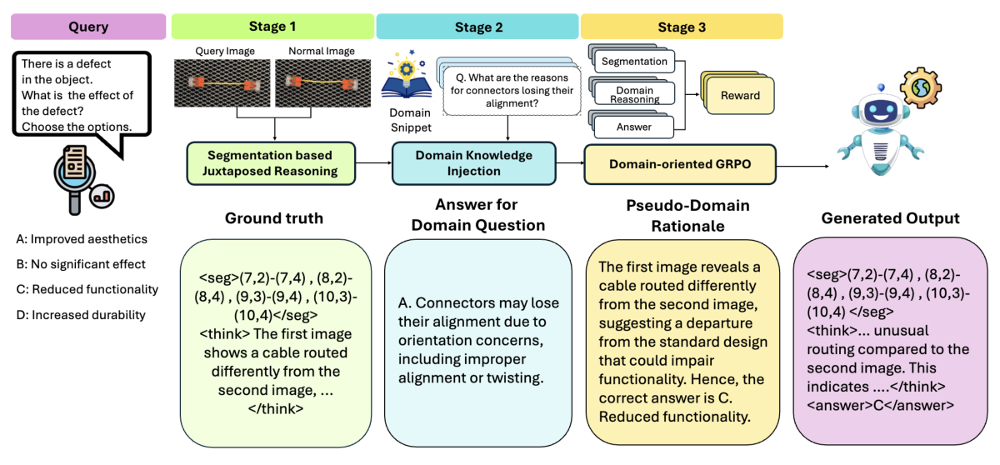](assets/papers/judo.png)

*JUDO 三阶段训练：并置分割、领域知识注入与领域推理强化学习。原文 Figure 1。 Kang, Hyunju et al. / JUDO · [来源](<assets/papers/README.md#figure-judo>)*

---

#### Language-guided Open-world Video Anomaly Detection under Weak Supervision

[论文](<https://proceedings.iclr.cc/paper_files/paper/2026/hash/f88bec15cc4cb56b432ee040bb63f94f-Abstract-Conference.html>) · [阅读笔记](<literature/catalog.md#paper-lagovad>) · [引用 / BibTeX](<literature/citations.md#cite-lagovad>)

> **LaGoVAD · 自然语言条件化异常定义**
>
> 把用户给定的自然语言异常定义作为推理输入，结合动态视频合成与负样本对比学习训练模型，并建设带异常定义的 PreVAD 数据。

[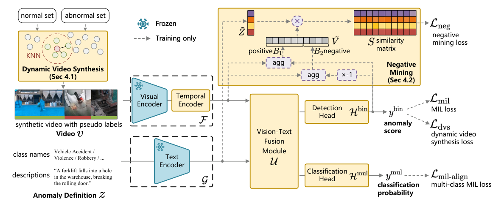](assets/papers/lagovad.png)

*图 2：语言异常定义分支、动态视频合成与负样本对比学习。 Liu, Zihao et al. / LaGoVAD · [来源](<assets/papers/README.md#figure-lagovad>)*

---

#### Steering and Rectifying Latent Representation Manifolds in Frozen Multi-modal LLMs for Video Anomaly Detection

[论文](<https://arxiv.org/abs/2602.24021>) · [阅读笔记](<literature/catalog.md#paper-steervad>) · [引用 / BibTeX](<literature/citations.md#cite-steervad>)

> **SteerVAD · 潜在异常专家头与上下文表示校正**
>
> 以表示可分性筛选潜在异常专家头，训练层次元控制器按上下文缩放其表示；异常片段可交回冻结模型生成事后解释。

[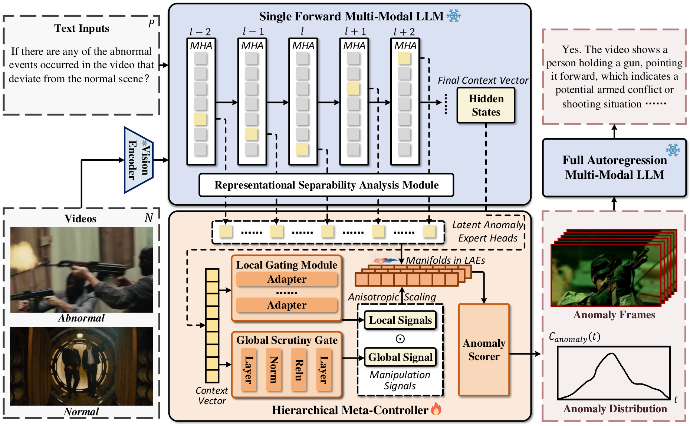](assets/papers/steervad.png)

*图 3：选择潜在异常专家并校正特征以完成异常检测。 Cai, Zhaolin et al. / SteerVAD · [来源](<assets/papers/README.md#figure-steervad>)*

---

### ICML

#### Learning to Watch: Active Video Anomaly Understanding via Interleaved Policy Optimization

[论文](<https://arxiv.org/abs/2607.00622>) · [阅读笔记](<literature/catalog.md#paper-anom-pi>) · [引用 / BibTeX](<literature/citations.md#cite-anom-pi>)

> **Anom-π · 交替推理与观察策略**
>
> 将推理与时间回溯、区间扩展、细粒度采样交替执行，学习主动获取证据的策略。

[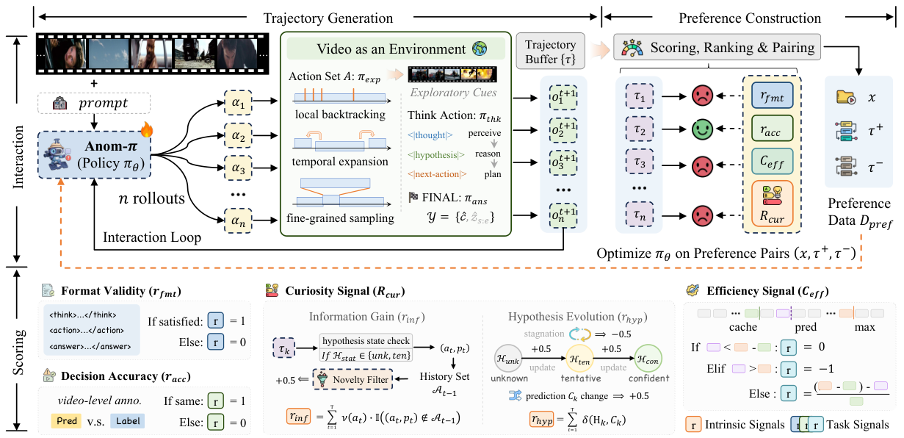](assets/papers/anom-pi.png)

*Anom-π：交替推理与观察策略。原文 Figure 2。 Mengjingcheng Mo et al. / Anom-π · [来源](<assets/papers/README.md#figure-anom-pi>)*

---

#### Towards Trustworthy Video Anomaly Understanding: A Class-Guided Chain-of-Evaluation Metric and An Anomaly-focused Meta-Benchmark

[论文](<https://icml.cc/virtual/2026/poster/66013>) · [阅读笔记](<literature/catalog.md#paper-cg-coe>) · [引用 / BibTeX](<literature/citations.md#cite-cg-coe>)

> **CG-CoE · 类别引导评价链与元评测**
>
> 以类别约束的异常事件抽取与匹配构建评价链，并用 AEA 与 CVP 子集检验指标有效性及措辞扰动鲁棒性。

[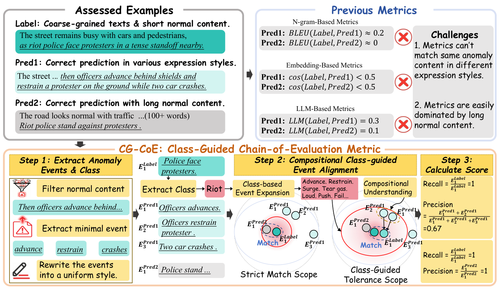](assets/papers/cg-coe.png)

*图 1：抽取异常事件并依据类别容忍边界进行组合匹配与评分。 Jiaxu Leng et al. / CG-CoE · [来源](<assets/papers/README.md#figure-cg-coe>)*

---

#### Linguistic Relative Policy Optimization for Video Anomaly Reasoning

[论文](<https://arxiv.org/abs/2607.00654>) · [阅读笔记](<literature/catalog.md#paper-lrpo>) · [引用 / BibTeX](<literature/citations.md#cite-lrpo>)

> **LRPO · 组相对语言经验优化**
>
> 从多条推理轨迹的组内语义优势归纳通用与场景经验，以语言先验注入上下文而不更新模型参数。

[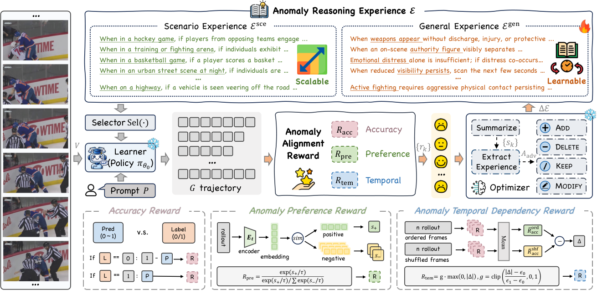](assets/papers/lrpo.png)

*图 2：学习者与优化器通过语言交互优化异常判断经验。 Jiaxu Leng et al. / LRPO · [来源](<assets/papers/README.md#figure-lrpo>)*

---

#### TD-VAD: Breaking Visual Dependence in Video Anomaly Detection with Text-Driven Learning

[论文](<https://arxiv.org/abs/2608.11820>) · [阅读笔记](<literature/catalog.md#paper-td-vad>) · [引用 / BibTeX](<literature/citations.md#cite-td-vad>)

> **TD-VAD · 文本时序监督与事件演化注意力**
>
> 以 LLM 生成的时序事件文本训练检测器，通过事件演化因果注意力建模长短期依赖，推理时用冻结 CLIP 对齐视频。

[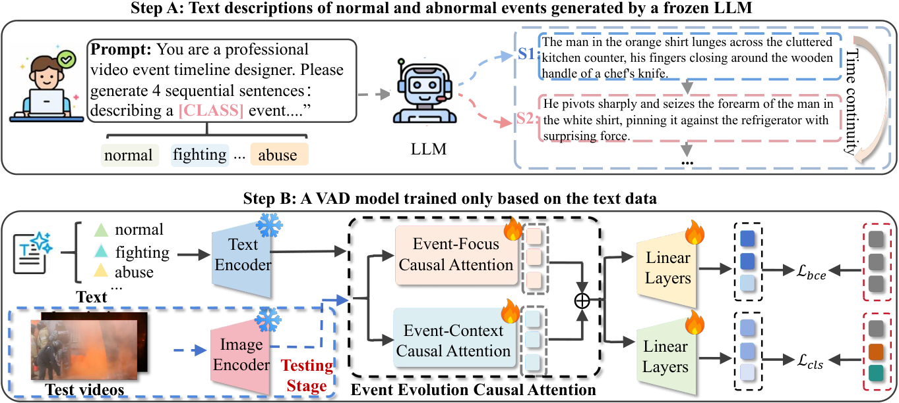](assets/papers/td-vad.png)

*图 2：利用语言模型生成描述并训练异常检测器的流程。 Shuangqing Zhang et al. / TD-VAD · [来源](<assets/papers/README.md#figure-td-vad>)*

---

### IJCAI

#### MemoVAD: Resource-Efficient Video Anomaly Detection via Dynamic Semantic Memory in Edge Computing Scenarios

[论文](<https://www.ijcai.org/proceedings/2026/618>) · [阅读笔记](<literature/catalog.md#paper-memovad>) · [引用 / BibTeX](<literature/citations.md#cite-memovad>)

> **MemoVAD · 不确定性门控与动态语义记忆**
>
> 边缘轻量检测器维护因果时序上下文，仅对高不确定且语义新颖的片段查询云端 VLM，并缓存验证后的语义原型用于后续检索。

[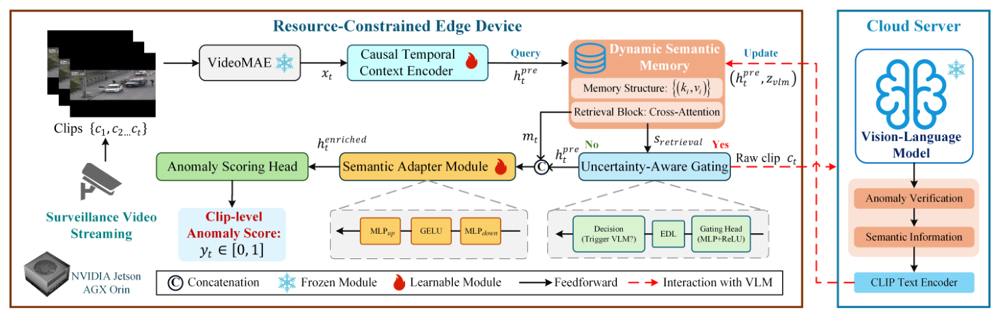](assets/papers/memovad.png)

*图 2：MemoVAD 的边缘检测、不确定性门控、动态语义记忆与云端验证。 Guo Li et al. / MemoVAD · [来源](<assets/papers/README.md#figure-memovad>)*

---

### IJCV

#### Exploring What Why and How: A Multifaceted Benchmark for Causation Understanding of Video Anomaly

[论文](<https://link.springer.com/article/10.1007/s11263-026-02983-0>) · [阅读笔记](<literature/catalog.md#paper-ecva-anomshield>) · [引用 / BibTeX](<literature/citations.md#cite-ecva-anomshield>)

> **ECVA / AnomShield · 因果任务基准与关键片段推理**
>
> 围绕异常事件、原因与后果构建 ECVA 基准；AnomShield 通过思维链选取关键时段并建模时空依赖，AnomEval 用于评估异常理解回答。

[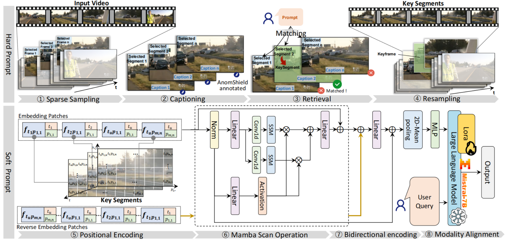](assets/papers/ecva-anomshield.png)

*Fig. 5: AnomShield 关键帧选择与视频异常因果理解架构（作者预印本） Hang Du et al. / ECVA / AnomShield · [来源](<assets/papers/README.md#figure-ecva-anomshield>)*

---

### NeurIPS

#### CA-Judge: Teach Large Models to Judge Anomalies via Comparison for Video Anomaly Detection

[论文](<https://neurips.cc/virtual/2026/poster/153516>) · [阅读笔记](<literature/catalog.md#paper-ca-judge>) · [引用 / BibTeX](<literature/citations.md#cite-ca-judge>)

> **CA-Judge · 比较驱动的异常判断**
>
> 依据题名，暂将其归为通过比较教导大模型判断视频异常的方法。

方法归类按题名暂定，[核验依据](<https://neurips.cc/Downloads/2026>)。

*配图待补：尚未取得可核验的论文原图。[查看检索记录](<assets/papers/README.md#missing-ca-judge>)*

---

#### COPRA: Conditional Parameter Adaptation with Reinforcement Learning for Video Anomaly Detection

[论文](<https://arxiv.org/abs/2605.15325>) · [阅读笔记](<literature/catalog.md#paper-copra>) · [引用 / BibTeX](<literature/citations.md#cite-copra>)

> **COPRA · 片段条件化参数适配**
>
> 根据视频片段为冻结视觉语言模型生成条件化参数更新，在训练和推理时采用一致适配；除异常检测外，还可迁移到视频问答与密集字幕。

[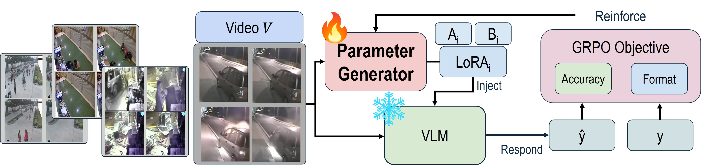](assets/papers/copra.jpg)

*Figure 2: COPRA 实例条件参数生成与强化学习框架（作者预印本） Darryl Cherian Jacob et al. / COPRA · [来源](<assets/papers/README.md#figure-copra>)*

---

#### ROAD: Rule-Grounded Context-Aware Open-World Driver Anomaly Detection

[论文](<https://neurips.cc/virtual/2026/poster/154937>) · [阅读笔记](<literature/catalog.md#paper-road>) · [引用 / BibTeX](<literature/citations.md#cite-road>)

> **ROAD · 规则约束与上下文判断**
>
> 依据题名，暂将其归为规则约束、上下文感知的开放世界驾驶员异常检测。

方法归类按题名暂定，[核验依据](<https://neurips.cc/Downloads/2026>)。

*配图待补：尚未取得可核验的论文原图。[查看检索记录](<assets/papers/README.md#missing-road>)*

---

#### SEEK-VAU: Towards Evidence-Faithful Video Anomaly Understanding via Agentic Search

[论文](<https://neurips.cc/virtual/2026/poster/152176>) · [阅读笔记](<literature/catalog.md#paper-seek-vau>) · [引用 / BibTeX](<literature/citations.md#cite-seek-vau>)

> **SEEK-VAU · 智能体搜索与证据忠实性**
>
> 依据题名，暂将其归为通过智能体搜索获取证据的视频异常理解方法。

方法归类按题名暂定，[核验依据](<https://neurips.cc/Downloads/2026>)。

*配图待补：尚未取得可核验的论文原图。[查看检索记录](<assets/papers/README.md#missing-seek-vau>)*

---

#### SphereVAD: Training-Free Video Anomaly Detection via Geodesic Inference on the Unit Hypersphere

[论文](<https://neurips.cc/virtual/2026/poster/152043>) · [阅读笔记](<literature/catalog.md#paper-spherevad>) · [引用 / BibTeX](<literature/citations.md#cite-spherevad>)

> **SphereVAD · 超球面测地异常推断**
>
> 读取预训练多模态大模型的中间层特征，在单位超球面上进行中心化、场景注意力与测地推断，以少量合成图像校准实现免训练零样本异常评分。

[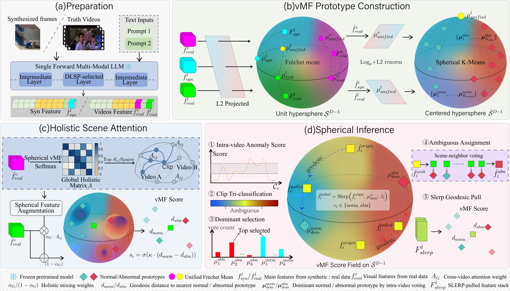](assets/papers/spherevad.png)

*Figure 2: SphereVAD 单位超球面测地推理流程（作者预印本） Chao Huang et al. / SphereVAD · [来源](<assets/papers/README.md#figure-spherevad>)*

---

#### From Detection to Understanding — A Multi-Task Dataset for Traffic Anomaly Reasoning

Evaluations and Datasets · [论文](<https://neurips.cc/virtual/2026/poster/139099>) · [阅读笔记](<literature/catalog.md#paper-tar-bench>) · [引用 / BibTeX](<literature/citations.md#cite-tar-bench>)

> **TAR / TAR-Bench · 交通异常多任务推理基准**
>
> 面向交通异常构建训练集 TAR 与人工核验的 TAR-Bench，覆盖问答、时序推理及场景理解等十类任务。

[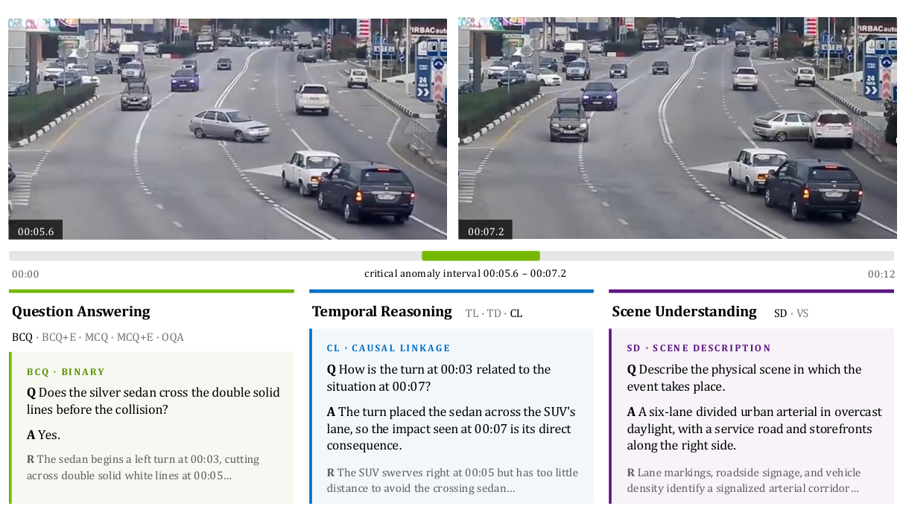](assets/papers/tar-bench.png)

*Figure 1: TAR 与 TAR-Bench 交通异常多任务标注示意（作者预印本） Han Zhang et al. / TAR / TAR-Bench · [来源](<assets/papers/README.md#figure-tar-bench>)*

---

### TCSVT

#### CAGC-VAD: Controlled Abstraction and Graph Competition for Video Anomaly Detection

[论文](<https://doi.org/10.1109/TCSVT.2026.3735599>) · [阅读笔记](<literature/catalog.md#paper-cagc-vad>) · [引用 / BibTeX](<literature/citations.md#cite-cagc-vad>)

> **CAGC-VAD · 受控抽象与图竞争（题名暂定）**
>
> 以受控抽象与图竞争开展视频异常检测。已核验正式书目信息，摘要与正文暂未获取；具体推理机制、解释输出和实验设置待核验。

方法归类按题名暂定，[核验依据](<https://api.crossref.org/works/10.1109/TCSVT.2026.3735599>)。

*配图待补：尚未取得可核验的论文原图。[查看检索记录](<assets/papers/README.md#missing-cagc-vad>)*

---

### TNNLS

#### PromptVAD: Abnormal Prompt via Vision-Language Model

[论文](<https://doi.org/10.1109/tnnls.2025.3621336>) · [阅读笔记](<literature/catalog.md#paper-promptvad>) · [引用 / BibTeX](<literature/citations.md#cite-promptvad>)

> **PromptVAD · 领域与类别提示协同学习**
>
> 结合可学习的领域提示、类别提示与固定类别定义，缩小视觉特征和异常类别的语义差距，联合学习粗粒度与细粒度异常检测。

*配图待补：尚未取得可核验的论文原图。[查看检索记录](<assets/papers/README.md#missing-promptvad>)*

---

### TPAMI

#### ADVersa: Abductive Driving Accident Video Understanding

[论文](<https://doi.org/10.1109/TPAMI.2026.3663545>) · [阅读笔记](<literature/catalog.md#paper-adversa>) · [引用 / BibTeX](<literature/citations.md#cite-adversa>)

> **ADVersa · 关系感知的跨模态事故溯因**
>
> 用 Abductive CLIP 与关系感知的对比图视频预训练组织跨模态证据，为缺失的近事故场景推断图像和文本解释，并支持过去恢复、未来预测及原因条件的视频生成。

[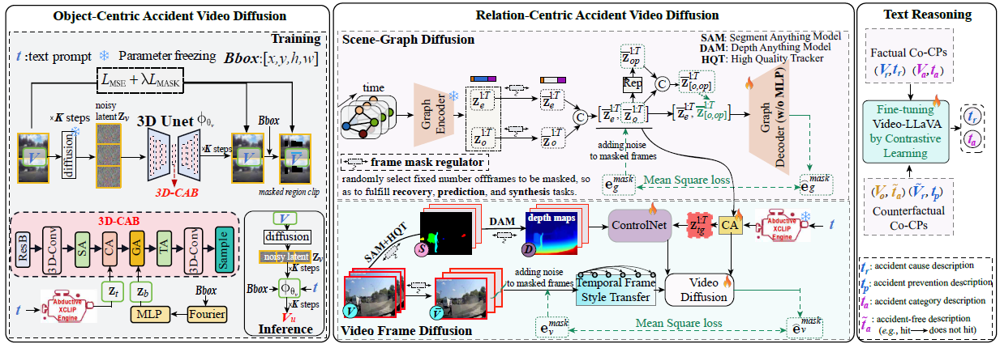](assets/papers/adversa.png)

*ADVersa 事故视频扩散与文本推理框架（作者主页所示 TPAMI 2026 版本） Lei-Lei Li et al. / ADVersa · [来源](<assets/papers/README.md#figure-adversa>)*

---

#### PiercingEye: Dual-Space Video Violence Detection With Hyperbolic Vision-Language Guidance

[论文](<https://doi.org/10.1109/tpami.2025.3617460>) · [阅读笔记](<literature/catalog.md#paper-piercingeye>) · [引用 / BibTeX](<literature/citations.md#cite-piercingeye>)

> **PiercingEye · 易混淆文本与双曲视语对齐**
>
> 在 DSRL 双空间表征上，利用 VLM／LLM 改写场景或行为生成易混淆事件描述，再以动态加权的双曲视觉语言对比损失强化细粒度区分。

[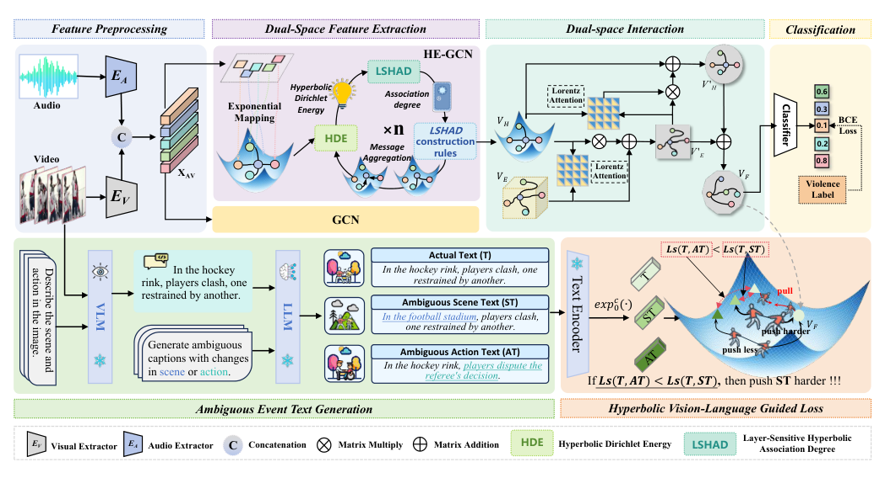](assets/papers/piercingeye.png)

*Figure 2：双空间表征、易混淆文本生成与双曲视觉语言监督（作者预印本）。 Jiaxu Leng et al. / PiercingEye · [来源](<assets/papers/README.md#figure-piercingeye>)*

---

### arXiv · 预印本

#### AgenticVAU: Multi-Agent Explore-Verify Reasoning for Video Anomaly Understanding

[论文](<https://arxiv.org/abs/2608.03779>) · [阅读笔记](<literature/catalog.md#paper-agenticvau>) · [引用 / BibTeX](<literature/citations.md#cite-agenticvau>)

> **AgenticVAU · 多智能体探索验证与证据记忆**
>
> 用规则构建、搜索规划、视频观察和最终决策四类智能体，交替探索疑点与局部验证，并通过共享证据记忆协调判断。

[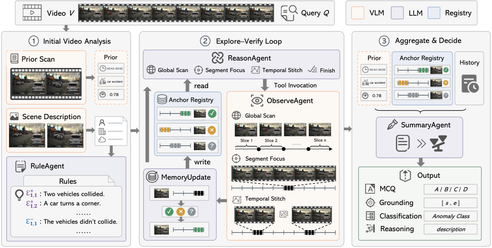](assets/papers/agenticvau.png)

*图 2：多智能体通过探索、观察、证据记忆与验证形成异常判断。 Duan, Yuxiang et al. / AgenticVAU · [来源](<assets/papers/README.md#figure-agenticvau>)*

---

#### AnomalyCraft-700K: Component-Level Controllable and Verifiable Synthetic Anomalies for Fine-Grained Video Anomaly Understanding

[论文](<https://arxiv.org/abs/2609.06978>) · [阅读笔记](<literature/catalog.md#paper-anomalycraft>) · [引用 / BibTeX](<literature/citations.md#cite-anomalycraft>)

> **AnomalyCraft-700K · 语义组件控制生成与逐项验证**
>
> 以细粒度语义组件控制异常视频生成，逐组件校正文图不一致，并构造类别相关的困难正常样本，支持多任务异常理解。

[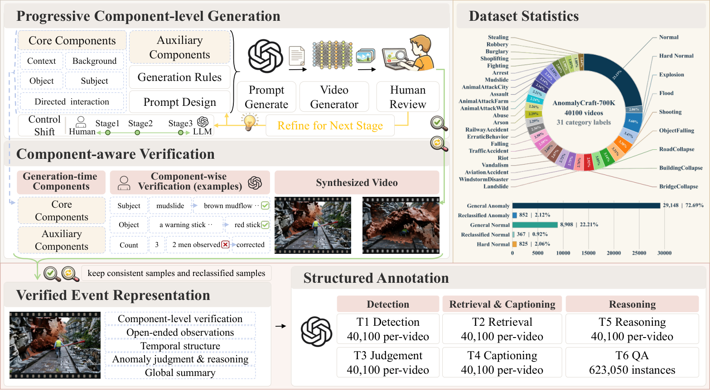](assets/papers/anomalycraft.png)

*图 2：AnomalyCraft 视频异常数据生成流程。 Long, Yuzhou et al. / AnomalyCraft-700K · [来源](<assets/papers/README.md#figure-anomalycraft>)*

---

#### Probe-VAD: Ordinal Likelihood Probing for Training-Free Video Anomaly Detection

[论文](<https://arxiv.org/abs/2609.17211>) · [阅读笔记](<literature/catalog.md#paper-probe-vad>) · [引用 / BibTeX](<literature/citations.md#cite-probe-vad>)

> **Probe-VAD · 序数语言探测与一致性评分**
>
> 以冻结 VLM 对有序严重程度阈值作是／否判断，通过续写似然与序数一致性约束得到连续异常分数。

[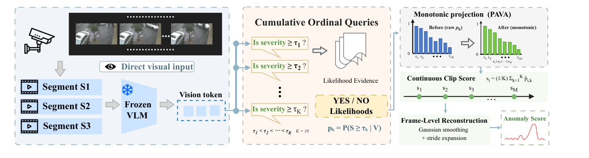](assets/papers/probe-vad.png)

*图 2：利用有序严重程度阈值探测视觉语言模型并汇总异常分数。 Gu, Jiawei et al. / Probe-VAD · [来源](<assets/papers/README.md#figure-probe-vad>)*

---

#### SRVAU-R1: Enhancing Video Anomaly Understanding via Reflection-Aware Learning

[论文](<https://arxiv.org/abs/2602.01004>) · [阅读笔记](<literature/catalog.md#paper-srvau-r1>) · [引用 / BibTeX](<literature/citations.md#cite-srvau-r1>)

> **SRVAU-R1 · 反思修正序列训练**
>
> 构建初始推理、反思和修正推理的监督序列，再结合监督与强化微调。

[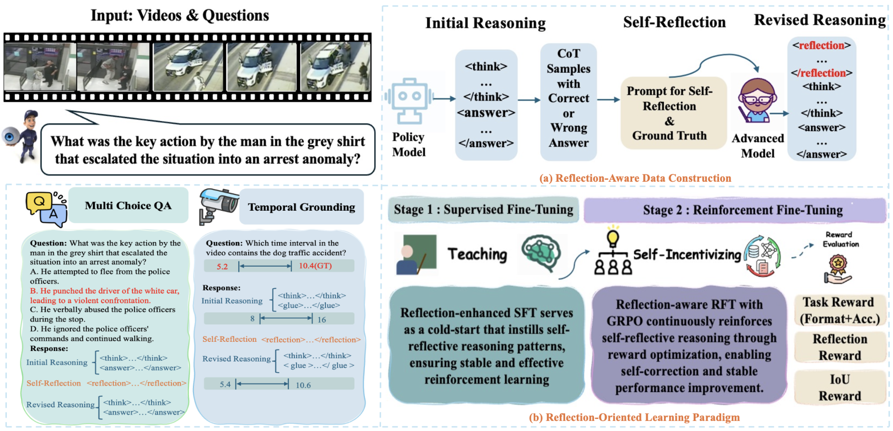](assets/papers/srvau-r1.png)

*SRVAU-R1：反思修正序列训练。原文 Figure 2。 Zhao, Zihao et al. / SRVAU-R1 · [来源](<assets/papers/README.md#figure-srvau-r1>)*

---

#### TAU-Bench: From Anomaly Instance Tracking to Fine-Grained Video Anomaly Understanding

[论文](<https://arxiv.org/abs/2608.05699>) · [阅读笔记](<literature/catalog.md#paper-tau-bench>) · [引用 / BibTeX](<literature/citations.md#cite-tau-bench>)

> **TAU-Bench · 实例轨迹与层级语义联合评估**
>
> 把异常实例轨迹、像素掩码与实例、事件、场景三级描述绑定，联合评估跟踪和细粒度理解是否指向同一异常对象。

[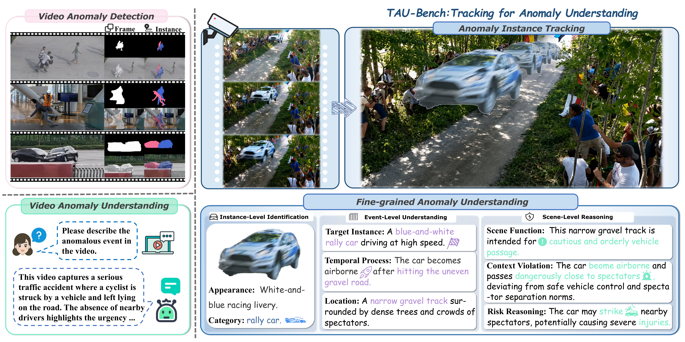](assets/papers/tau-bench.png)

*图 1：关联异常实例轨迹与细粒度语义理解的基准概览。 Yang, Kepeng et al. / TAU-Bench · [来源](<assets/papers/README.md#figure-tau-bench>)*

---

#### Advancing Adaptive Multi-Stage Video Anomaly Reasoning: A Benchmark Dataset and Method

[论文](<https://arxiv.org/abs/2601.10165>) · [阅读笔记](<literature/catalog.md#paper-vad-r1-plus>) · [引用 / BibTeX](<literature/citations.md#cite-vad-r1-plus>)

> **Vad-R1-Plus · 感知认知行动链与异常感知优化**
>
> 用感知、认知与行动三级思维链组织异常推理，并以异常感知的组相对策略优化训练支持不同推理深度和风险判断的模型。

[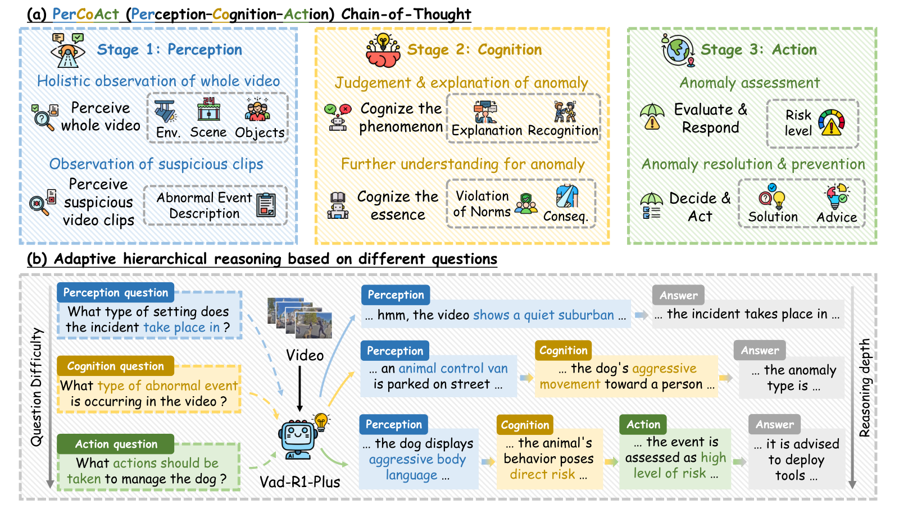](assets/papers/vad-r1-plus.png)

*图 2：结构化思维链与自适应混合推理机制。 Huang, Chao et al. / Vad-R1-Plus · [来源](<assets/papers/README.md#figure-vad-r1-plus>)*

---

## 2025

### AAAI

#### VarCMP: Adapting Cross-Modal Pre-Training Models for Video Anomaly Retrieval

[论文](<https://doi.org/10.1609/aaai.v39i8.32909>) · [阅读笔记](<literature/catalog.md#paper-varcmp>) · [引用 / BibTeX](<literature/citations.md#cite-varcmp>)

> **VarCMP · 层级跨模态对齐与异常加权**
>
> 将跨模态预训练模型用于长视频异常检索，通过统一层级对齐和异常偏置加权，匹配视频与文本或音频查询。

[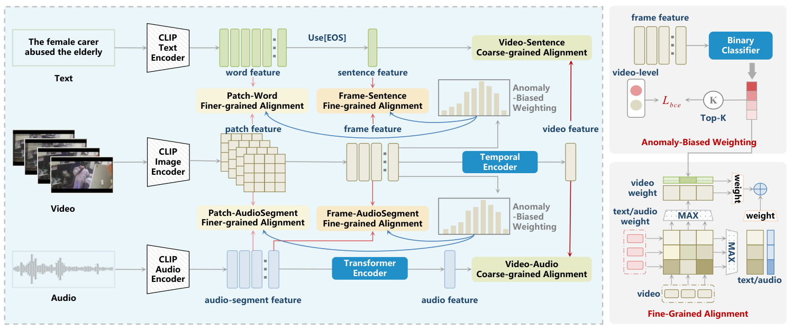](assets/papers/varcmp.png)

*图 1：统一层级跨模态对齐与异常偏置加权的视频异常检索框架。 Wu, Peng et al. / VarCMP · [来源](<assets/papers/README.md#figure-varcmp>)*

---

### ACM MM

#### EventVAD: Training-Free Event-Aware Video Anomaly Detection

[论文](<https://arxiv.org/abs/2504.13092>) · [阅读笔记](<literature/catalog.md#paper-eventvad>) · [引用 / BibTeX](<literature/citations.md#cite-eventvad>)

> **EventVAD · 时空图划分事件边界**
>
> 利用动态时空图寻找事件边界，再通过层级提示完成事件级异常推理。

[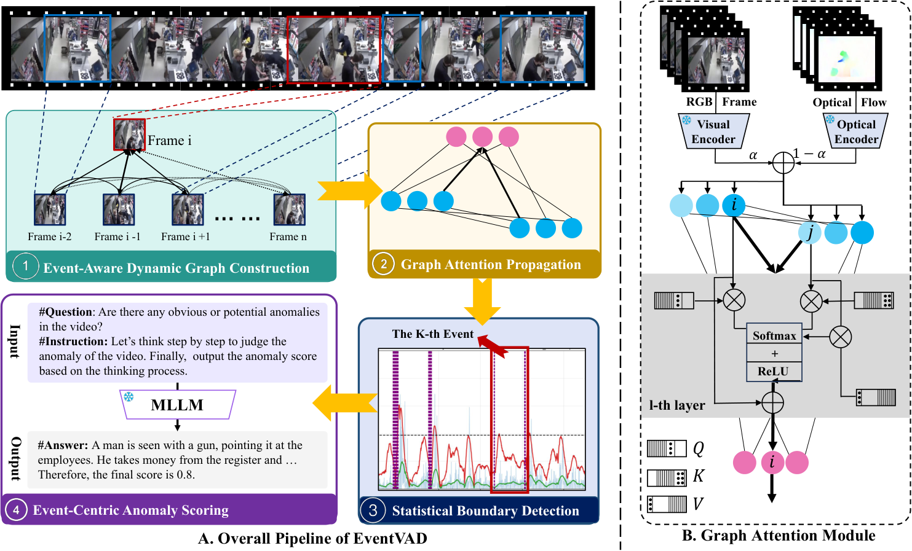](assets/papers/eventvad.png)

*EventVAD：时空图划分事件边界。原文 Figure 2。 Shao, Yihua et al. / EventVAD · [来源](<assets/papers/README.md#figure-eventvad>)*

---

#### HiProbe-VAD: Video Anomaly Detection via Hidden States Probing in Tuning-Free Multimodal LLMs

[论文](<https://doi.org/10.1145/3746027.3755575>) · [阅读笔记](<literature/catalog.md#paper-hiprobe-vad>) · [引用 / BibTeX](<literature/citations.md#cite-hiprobe-vad>)

> **HiProbe-VAD · 中间层探测与轻量异常评分**
>
> 从冻结多模态大模型的中间隐藏状态选择异常敏感层，训练轻量逻辑回归评分器，并结合时序定位与文本解释分析异常。

[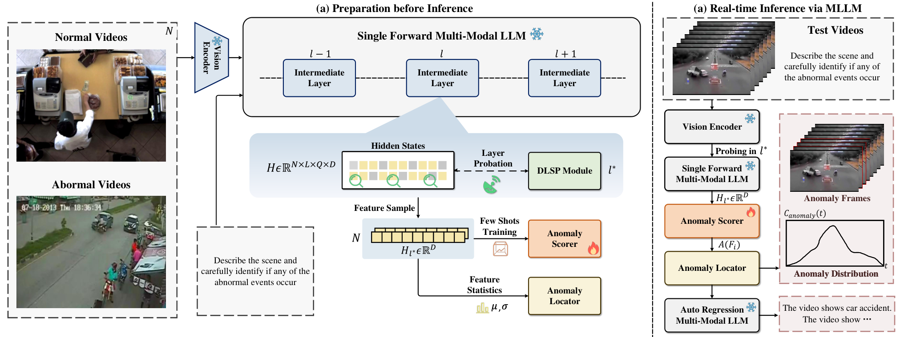](assets/papers/hiprobe-vad.png)

*图 5：离线隐藏状态探测和评分器训练，以及在线评分与定位。 Cai, Zhaolin et al. / HiProbe-VAD · [来源](<assets/papers/README.md#figure-hiprobe-vad>)*

---

#### HoloTrace: LLM-based Bidirectional Causal Knowledge Graph for Edge-Cloud Video Anomaly Detection

[论文](<https://doi.org/10.1145/3746027.3755185>) · [阅读笔记](<literature/catalog.md#paper-holotrace>) · [引用 / BibTeX](<literature/citations.md#cite-holotrace>)

> **HoloTrace · 双向因果知识图与边云更新**
>
> 用 LLM 构建并更新双向因果知识图，边缘侧结合隐马尔可夫模型进行事件推理与边界判断，云端依据关键帧更新事件关系。

[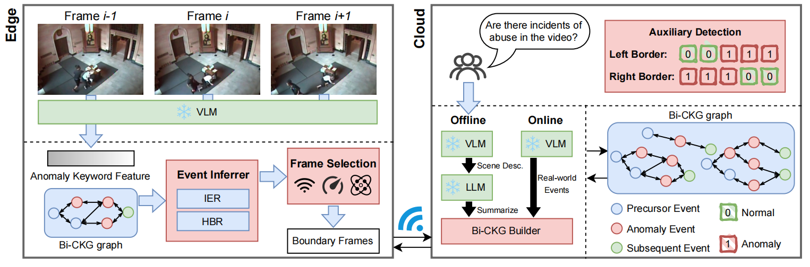](assets/papers/holotrace.png)

*边云协同的双向因果知识图异常检测系统。 Wang, Hanling et al. / HoloTrace · [来源](<assets/papers/README.md#figure-holotrace>)*

---

### CVPR

#### Towards Zero-Shot Anomaly Detection and Reasoning with Multimodal Large Language Models

[论文](<https://openaccess.thecvf.com/content/CVPR2025/html/Xu_Towards_Zero-Shot_Anomaly_Detection_and_Reasoning_with_Multimodal_Large_Language_CVPR_2025_paper.html>) · [阅读笔记](<literature/catalog.md#paper-anomaly-ov>) · [引用 / BibTeX](<literature/citations.md#cite-anomaly-ov>)

> **Anomaly-OV · 二次特征匹配与异常视觉token筛选**
>
> 通过 Look-Twice Feature Matching 学习异常表征并突出可疑视觉 token，结合异常指令微调生成缺陷描述、可能原因和改进建议；配套 Anomaly-Instruct-125k 与 VisA-D&R。

[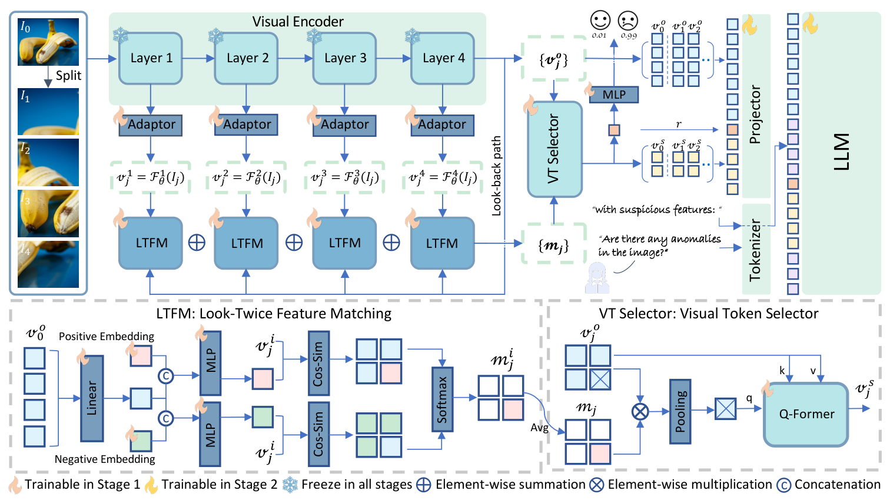](assets/papers/anomaly-ov.png)

*Anomaly-OV 的异常专家、Look-Twice 特征匹配与视觉 token 选择框架。原文 Figure 3。 Xu, Jiacong et al. / Anomaly-OV · [来源](<assets/papers/README.md#figure-anomaly-ov>)*

---

#### Anomize: Better Open Vocabulary Video Anomaly Detection

[论文](<https://openaccess.thecvf.com/content/CVPR2025/html/Li_Anomize_Better_Open_Vocabulary_Video_Anomaly_Detection_CVPR_2025_paper.html>) · [阅读笔记](<literature/catalog.md#paper-anomize>) · [引用 / BibTeX](<literature/citations.md#cite-anomize>)

> **Anomize · 多源语义与标签关系**
>
> 结合多层视觉信息与匹配文本，并利用标签关系编码新类别，改善未见异常的检测和语义分类。

[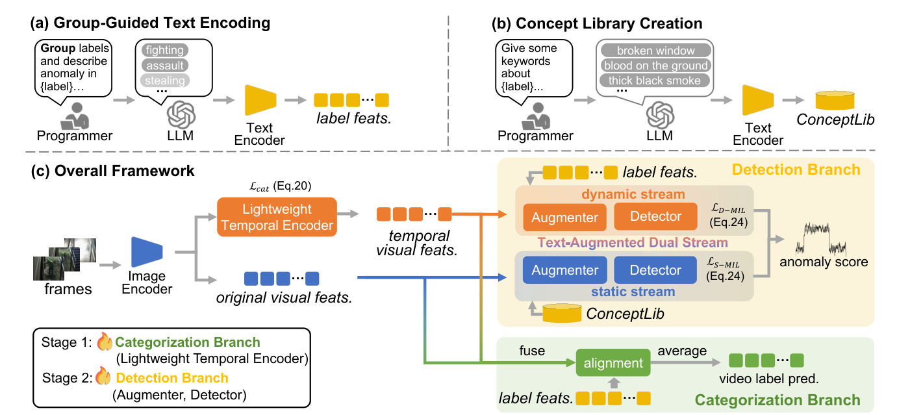](assets/papers/anomize.png)

*Anomize：多源语义与标签关系（原文 Figure 3）。 Li, Fei et al. / Anomize · [来源](<assets/papers/README.md#figure-anomize>)*

---

#### Black Swan: Abductive and Defeasible Video Reasoning in Unpredictable Events

[论文](<https://openaccess.thecvf.com/content/CVPR2025/html/Chinchure_Black_Swan_Abductive_and_Defeasible_Video_Reasoning_in_Unpredictable_Events_CVPR_2025_paper.html>) · [阅读笔记](<literature/catalog.md#paper-black-swan>) · [引用 / BibTeX](<literature/citations.md#cite-black-swan>)

> **Black Swan · 意外事件溯因与证据更新评测**
>
> 将意外事件视频拆成事件前、事件中与事件后观察，构建 Forecaster、Detective、Reporter 三类任务，评估候选事件预测、缺失事件溯因以及新证据出现后的解释修正。

[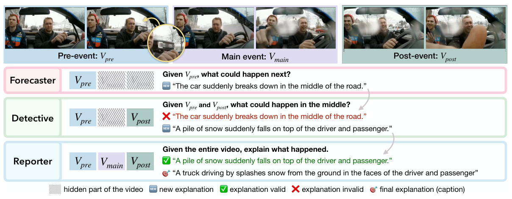](assets/papers/black-swan.png)

*BlackSwanSuite 的 Forecaster、Detective 与 Reporter 三类任务示例。原文 Figure 1。 Chinchure, Aditya et al. / Black Swan · [来源](<assets/papers/README.md#figure-black-swan>)*

---

#### EchoTraffic: Enhancing Traffic Anomaly Understanding with Audio-Visual Insights

[论文](<https://openaccess.thecvf.com/content/CVPR2025/html/Xing_EchoTraffic_Enhancing_Traffic_Anomaly_Understanding_with_Audio-Visual_Insights_CVPR_2025_paper.html>) · [阅读笔记](<literature/catalog.md#paper-echotraffic>) · [引用 / BibTeX](<literature/citations.md#cite-echotraffic>)

> **EchoTraffic · 声音引导选帧与音视频动态融合**
>
> 用声音变化引导关键帧选择，再经动态连接器融合音视频信息进行交通异常问答；构建 AV-TAU，覆盖事件描述、原因、时段、预防与响应五项任务。

[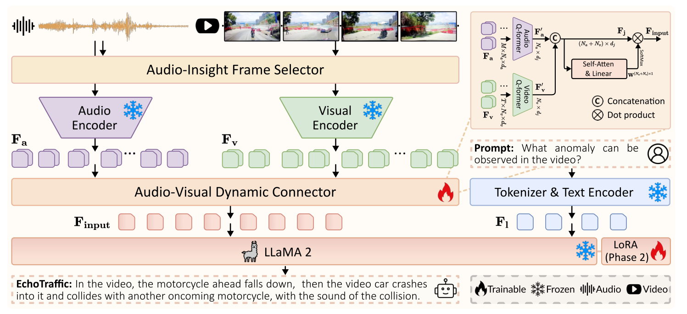](assets/papers/echotraffic.png)

*EchoTraffic 的声音引导选帧与音视频动态连接器。原文 Figure 4。 Xing, Zhenghao et al. / EchoTraffic · [来源](<assets/papers/README.md#figure-echotraffic>)*

---

#### Holmes-VAU: Towards Long-term Video Anomaly Understanding at Any Granularity

[论文](<https://arxiv.org/abs/2412.06171>) · [阅读笔记](<literature/catalog.md#paper-holmes-vau>) · [引用 / BibTeX](<literature/citations.md#cite-holmes-vau>)

> **Holmes-VAU · 多粒度指令与采样**
>
> 构建多粒度异常指令数据，并用异常聚焦采样连接片段、事件和整段视频的理解。

[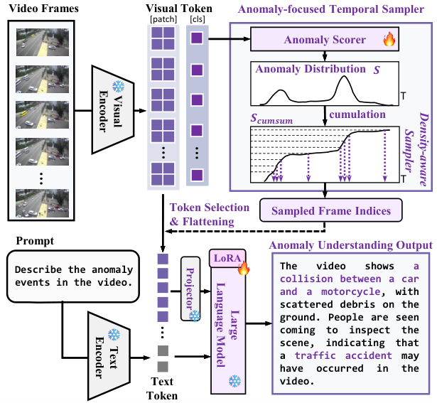](assets/papers/holmes-vau.png)

*Holmes-VAU：多粒度指令与采样。原文 Figure 4。 Zhang, Huaxin et al. / Holmes-VAU · [来源](<assets/papers/README.md#figure-holmes-vau>)*

---

#### Towards Training-free Anomaly Detection with Vision and Language Foundation Models

[论文](<https://openaccess.thecvf.com/content/CVPR2025/html/Zhang_Towards_Training-free_Anomaly_Detection_with_Vision_and_Language_Foundation_Models_CVPR_2025_paper.html>) · [阅读笔记](<literature/catalog.md#paper-log-sad>) · [引用 / BibTeX](<literature/citations.md#cite-log-sad>)

> **LogSAD · 组合规则引导的多粒度异常匹配**
>
> 通过 match-of-thought 从正常图像和语言规则构造匹配方案，联合局部、对象兴趣集合与组合层面的匹配，经检测器校准融合识别结构和逻辑异常。

[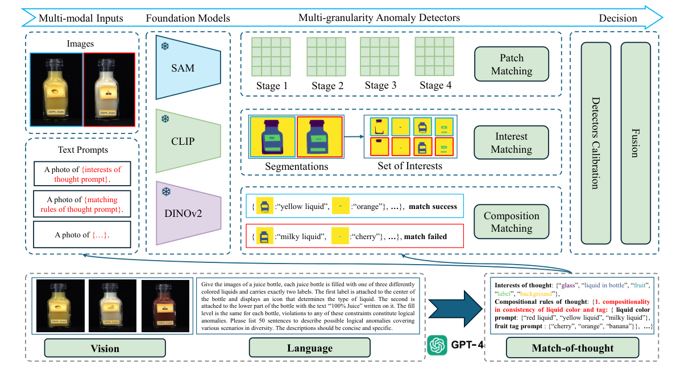](assets/papers/log-sad.png)

*LogSAD 的规则提示与局部、对象集合、组合三级匹配框架。原文 Figure 2。 Zhang, Jinjin et al. / LogSAD · [来源](<assets/papers/README.md#figure-log-sad>)*

---

#### Towards Visual Discrimination and Reasoning of Real-World Physical Dynamics: Physics-Grounded Anomaly Detection

[论文](<https://openaccess.thecvf.com/content/CVPR2025/html/Li_Towards_Visual_Discrimination_and_Reasoning_of_Real-World_Physical_Dynamics_Physics-Grounded_CVPR_2025_paper.html>) · [阅读笔记](<literature/catalog.md#paper-phys-ad>) · [引用 / BibTeX](<literature/citations.md#cite-phys-ad>)

> **Phys-AD · 物理交互异常与原因解释评测**
>
> 采集机械臂与电机作用于真实物体的动态异常视频，分别评估异常判别、现象描述和物理原因解释，提出 Phys-AD 数据与 PAEval 指标。

[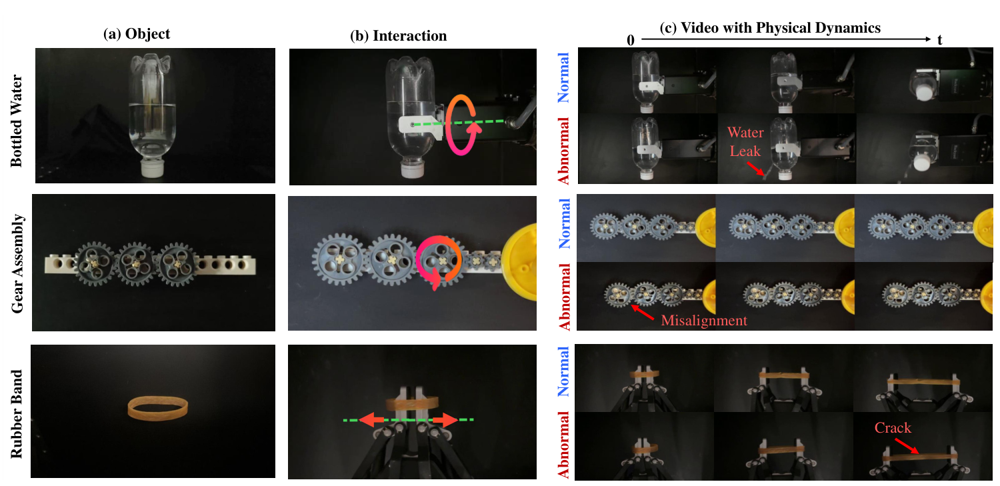](assets/papers/phys-ad.png)

*Phys-AD 的物体、交互动作与正常／异常动态示例。原文 Figure 1。 Li, Wenqiao et al. / Phys-AD · [来源](<assets/papers/README.md#figure-phys-ad>)*

---

#### Just Dance with pi! A Poly-modal Inductor for Weakly-supervised Video Anomaly Detection

[论文](<https://openaccess.thecvf.com/content/CVPR2025/html/Majhi_Just_Dance_with_pi_A_Poly-modal_Inductor_for_Weakly-supervised_Video_CVPR_2025_paper.html>) · [阅读笔记](<literature/catalog.md#paper-pi-vad>) · [引用 / BibTeX](<literature/citations.md#cite-pi-vad>)

> **PI-VAD · 五类模态线索诱导语义检测表征**
>
> 训练时利用姿态、深度、全景分割、光流和视觉语言语义五类线索，通过伪模态生成与跨模态诱导补充 RGB 表征，区分外观相似而动作或场景含义不同的异常事件。

[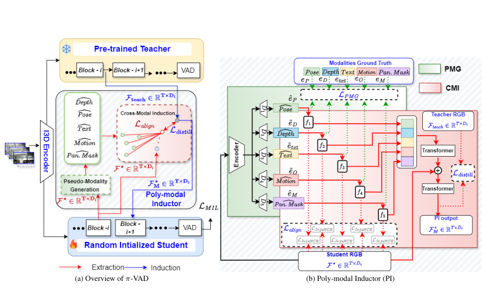](assets/papers/pi-vad.png)

*Figure 2：PI-VAD 的伪模态生成与跨模态诱导。 Snehashis Majhi et al. / CVPR 2025 · [来源](<assets/papers/README.md#figure-pi-vad>)*

---

#### VERA: Explainable Video Anomaly Detection via Verbalized Learning of Vision-Language Models

[论文](<https://arxiv.org/abs/2412.01095>) · [阅读笔记](<literature/catalog.md#paper-vera>) · [引用 / BibTeX](<literature/citations.md#cite-vera>)

> **VERA · 语言反馈优化问题**
>
> 用视频级弱标签优化自然语言引导问题，让冻结 VLM 分解并判断异常模式。

[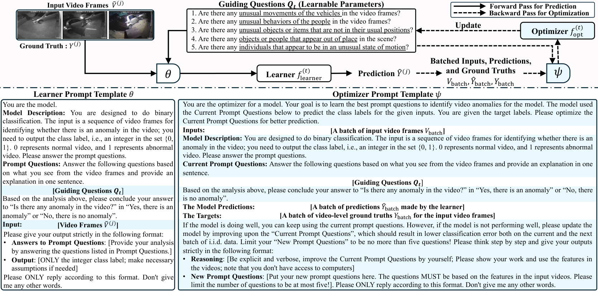](assets/papers/vera.png)

*VERA：语言反馈优化问题。原文 Figure 2。 Ye, Muchao et al. / VERA · [来源](<assets/papers/README.md#figure-vera>)*

---

### ICCV

#### Autoregressive Denoising Score Matching is a Good Video Anomaly Detector

[论文](<https://openaccess.thecvf.com/content/ICCV2025/html/Zhang_Autoregressive_Denoising_Score_Matching_is_a_Good_Video_Anomaly_Detector_ICCV_2025_paper.html>) · [阅读笔记](<literature/catalog.md#paper-adsm>) · [引用 / BibTeX](<literature/citations.md#cite-adsm>)

> **ADSM · 场景运动感知自回归去噪评分**
>
> 在原始视频空间以噪声条件 Transformer 学习得分函数，结合场景条件和运动权重，并通过自回归加噪、去噪与外观差异累积增强异常判断。

[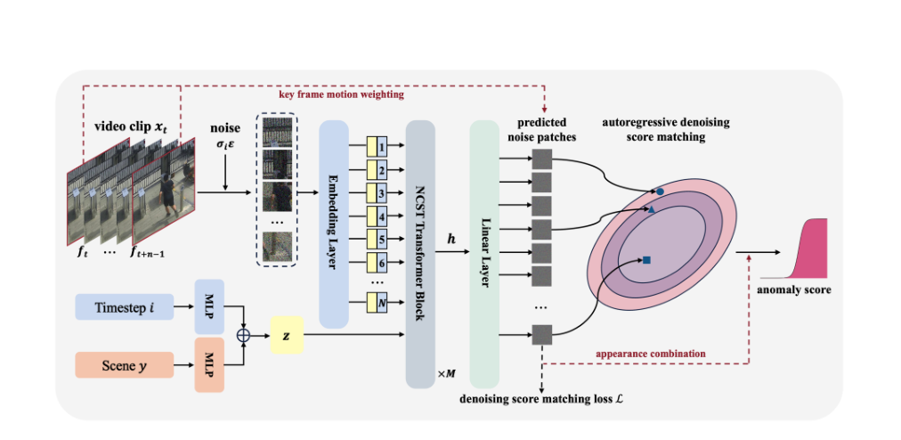](assets/papers/adsm.png)

*Figure 2：ADSM 的场景与运动感知去噪得分网络。 Hanwen Zhang et al. / ICCV 2025 · [来源](<assets/papers/README.md#figure-adsm>)*

---

#### Aligning Effective Tokens with Video Anomaly in Large Language Models

[论文](<https://openaccess.thecvf.com/content/ICCV2025/html/Chen_Aligning_Effective_Tokens_with_Video_Anomaly_in_Large_Language_Models_ICCV_2025_paper.html>) · [阅读笔记](<literature/catalog.md#paper-va-gpt>) · [引用 / BibTeX](<literature/citations.md#cite-va-gpt>)

> **VA-GPT · 时空有效词元对齐**
>
> 通过空间有效词元选择与时间有效词元生成，减少冗余视觉信息，支持异常总结和时间定位。

[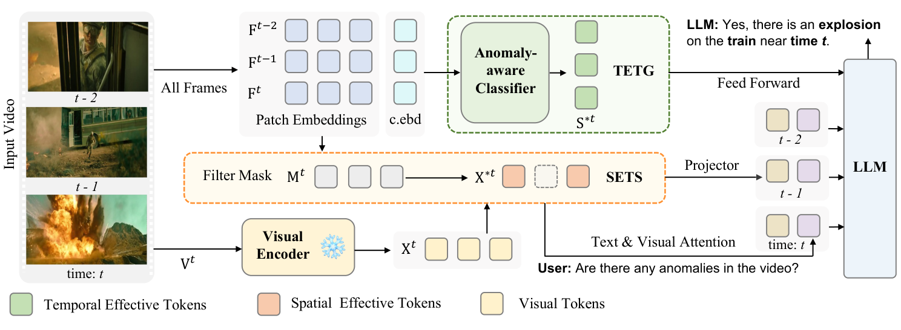](assets/papers/va-gpt.png)

*VA-GPT：时空有效词元对齐（原文 Figure 2）。 Chen, Yingxian et al. / VA-GPT · [来源](<assets/papers/README.md#figure-va-gpt>)*

---

### ICLR

#### MMAD: A Comprehensive Benchmark for Multimodal Large Language Models in Industrial Anomaly Detection

[论文](<https://proceedings.iclr.cc/paper_files/paper/2025/hash/d91ffbe9c126765755ff52d36b715683-Abstract-Conference.html>) · [阅读笔记](<literature/catalog.md#paper-mmad>) · [引用 / BibTeX](<literature/citations.md#cite-mmad>)

> **MMAD · 七任务异常问答与缺陷分析评测**
>
> 将工业异常判别、缺陷分类、位置、描述、影响分析和物体知识组织为七项问答任务，以 8,366 张图像和 39,672 个问题评估多模态模型。

[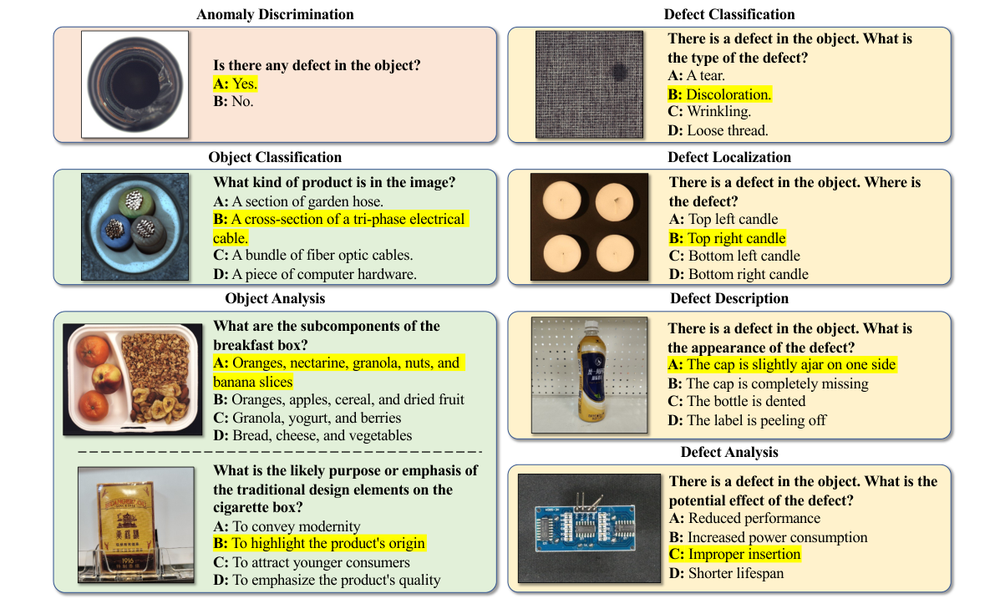](assets/papers/mmad.png)

*MMAD 七项任务的图像与多项选择问答示例。原文 Figure 2。 Jiang, Xi et al. / MMAD · [来源](<assets/papers/README.md#figure-mmad>)*

---

### ICML

#### Ex-VAD: Explainable Fine-grained Video Anomaly Detection Based on Visual-Language Models

[论文](<https://proceedings.mlr.press/v267/huang25ad.html>) · [阅读笔记](<literature/catalog.md#paper-ex-vad>) · [引用 / BibTeX](<literature/citations.md#cite-ex-vad>)

> **Ex-VAD · 解释融合与标签对齐**
>
> 由帧字幕生成视频级异常解释，再结合视觉特征与标签增强对齐进行细粒度检测。

[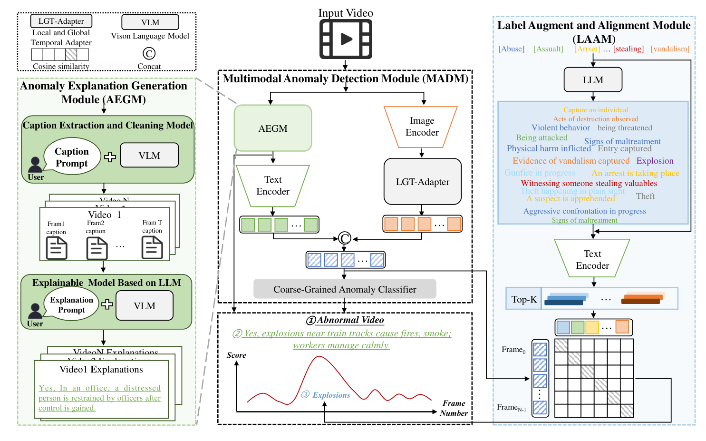](assets/papers/ex-vad.png)

*Ex-VAD：解释融合与标签对齐（原文 Figure 2）。 Chao Huang et al. / Ex-VAD · [来源](<assets/papers/README.md#figure-ex-vad>)*

---

#### Learning Event Completeness for Weakly Supervised Video Anomaly Detection

[论文](<https://proceedings.mlr.press/v267/wang25l.html>) · [阅读笔记](<literature/catalog.md#paper-lec-vad>) · [引用 / BibTeX](<literature/citations.md#cite-lec-vad>)

> **LEC-VAD · 双路视觉语言语义与完整事件定位**
>
> 联合类别感知与类别无关的视觉语言语义分支，以异常感知高斯混合约束事件边界，并通过记忆库原型丰富简短的异常类别文本，缓解弱监督检测只覆盖事件局部的问题。

[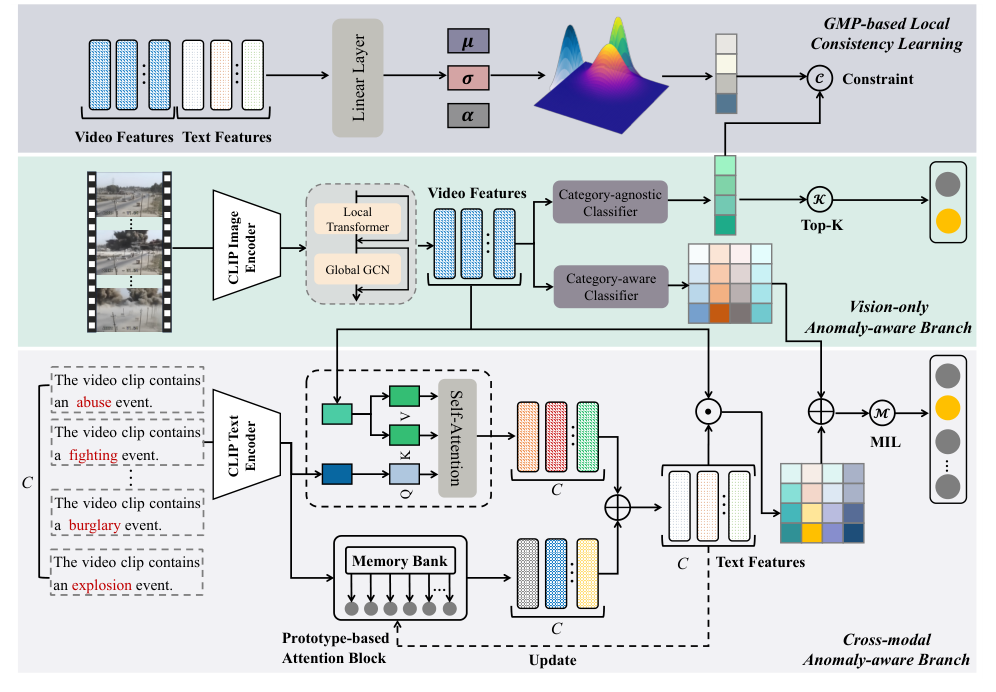](assets/papers/lec-vad.png)

*Figure 2：LEC-VAD 的类别语义、原型记忆与完整事件建模。 Yu Wang et al. / ICML 2025 · [来源](<assets/papers/README.md#figure-lec-vad>)*

---

### NAACL Findings

#### VANE-Bench: Video Anomaly Evaluation Benchmark for Conversational LMMs

[论文](<https://aclanthology.org/2025.findings-naacl.171/>) · [阅读笔记](<literature/catalog.md#paper-vane-bench>) · [引用 / BibTeX](<literature/citations.md#cite-vane-bench>)

> **VANE-Bench · 合成与真实异常问答评测**
>
> 以视频问答评测模型对异常的检测和定位，同时覆盖五类合成视频不一致性与真实世界异常。

[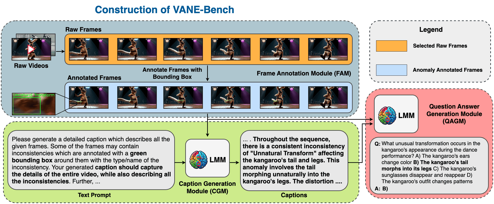](assets/papers/vane-bench.png)

*VANE-Bench 的视频异常评测与问答构建流程。 Gani, Hanan et al. / VANE-Bench · [来源](<assets/papers/README.md#figure-vane-bench>)*

---

### NeurIPS

#### A2Seek: Towards Reasoning-Centric Benchmark for Aerial Anomaly Understanding

Datasets and Benchmarks · [论文](<https://proceedings.neurips.cc/paper_files/paper/2025/hash/de02de513503962e1d21035ab50ce661-Abstract-Datasets_and_Benchmarks_Track.html>) · [阅读笔记](<literature/catalog.md#paper-a2seek>) · [引用 / BibTeX](<literature/citations.md#cite-a2seek>)

> **A2Seek / A2Seek-R1 · 图式推理与主动区域观察**
>
> 构建含事件类别、时间戳、区域框和语言解释的真实航拍异常基准，以图式推理监督、A-GRPO 与区域 seeking 机制训练 A2Seek-R1。

[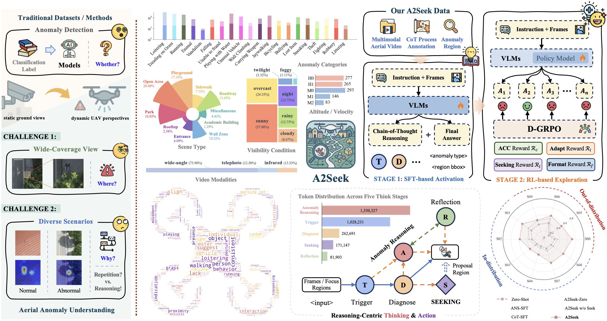](assets/papers/a2seek.png)

*航拍异常理解基准的任务、场景与标注概览。 Mo, Mengjingcheng et al. / A2Seek / A2Seek-R1 · [来源](<assets/papers/README.md#figure-a2seek>)*

---

#### MoniTor: Exploiting Large Language Models with Instruction for Online Video Anomaly Detection

[论文](<https://arxiv.org/abs/2510.21449>) · [阅读笔记](<literature/catalog.md#paper-monitor>) · [引用 / BibTeX](<literature/citations.md#cite-monitor>)

> **MoniTor · 流式记忆与分数队列**
>
> 使用流式输入、历史预测记忆和分数队列，在不训练的条件下持续判断异常。

[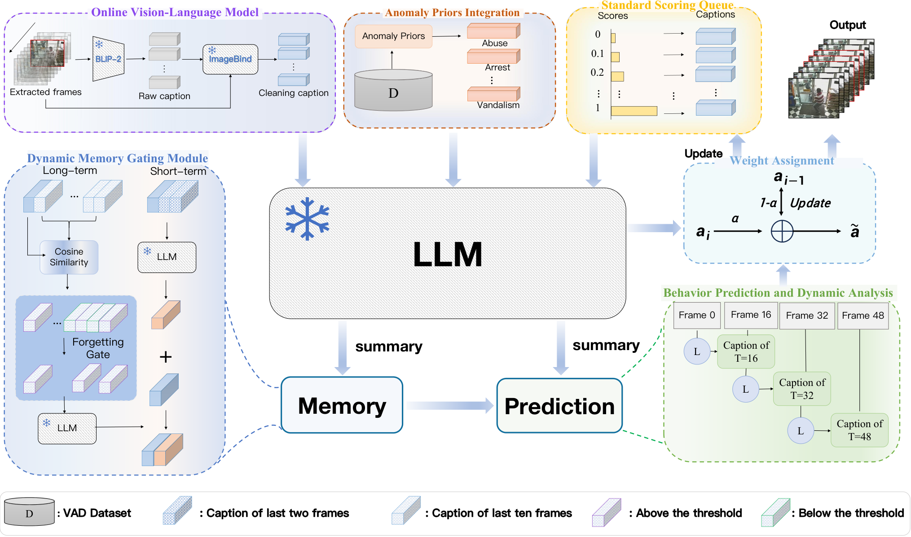](assets/papers/monitor.png)

*MoniTor：流式记忆与分数队列。原文 Figure 2。 Yang, Shengtian et al. / MoniTor · [来源](<assets/papers/README.md#figure-monitor>)*

---

#### PANDA: Towards Generalist Video Anomaly Detection via Agentic AI Engineer

[论文](<https://arxiv.org/abs/2509.26386>) · [阅读笔记](<literature/catalog.md#paper-panda>) · [引用 / BibTeX](<literature/citations.md#cite-panda>)

> **PANDA · 场景规划、工具反思与长短时记忆**
>
> 把场景规划、工具反思与长短时记忆链组合为通用异常检测智能体：短期记忆保留近期视觉／文本上下文，长期记忆积累推理和反思轨迹，并检索历史案例辅助工具决策。

[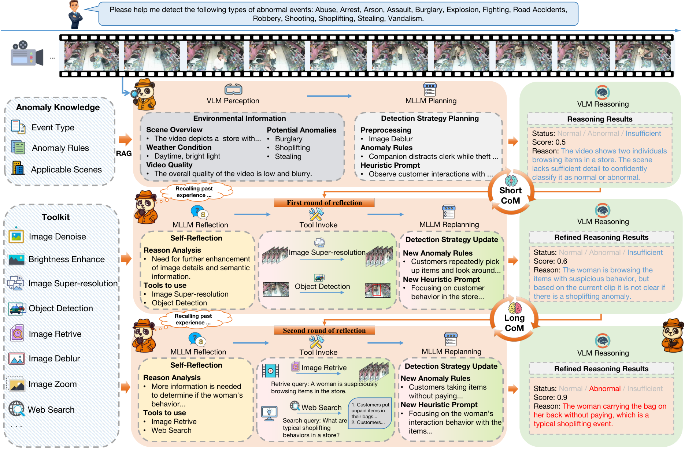](assets/papers/panda.png)

*PANDA：场景规划与工具反思。原文 Figure 2。 Yang, Zhiwei et al. / PANDA · [来源](<assets/papers/README.md#figure-panda>)*

---

#### A Unified Reasoning Framework for Holistic Zero-Shot Video Anomaly Analysis

[论文](<https://proceedings.neurips.cc/paper_files/paper/2025/hash/2aa95cf3b6aefa84d6b001928b107b4e-Abstract-Conference.html>) · [阅读笔记](<literature/catalog.md#paper-urf-zs-hvaa>) · [引用 / BibTeX](<literature/citations.md#cite-urf-zs-hvaa>)

> **URF-ZS-HVAA · 任务内细化与跨任务推理链**
>
> 任务内推理用视频上下文细化时间检测，任务间链式推理再引导冻结模型完成空间定位与文本解释。

[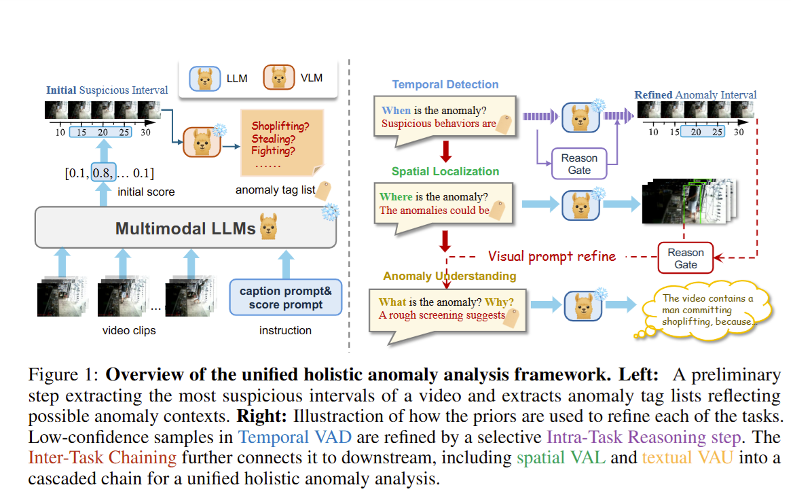](assets/papers/urf-zs-hvaa.png)

*图 1：时间检测、空间定位与异常理解任务之间的链式推理框架。 Lin, Dongheng et al. / URF-ZS-HVAA · [来源](<assets/papers/README.md#figure-urf-zs-hvaa>)*

---

#### Do LVLMs Truly Understand Video Anomalies? Revealing Hallucination via Co-Occurrence Patterns

[论文](<https://papers.nips.cc/paper_files/paper/2025/hash/99b419554537c66bf27e5eb7a74c7de4-Abstract-Conference.html>) · [阅读笔记](<literature/catalog.md#paper-vad-dpo>) · [引用 / BibTeX](<literature/citations.md#cite-vad-dpo>)

> **VAD-DPO · 反例偏好优化抑制共现捷径**
>
> 诊断模型对物体与异常词语共现的捷径依赖，以视觉相似但语义相反的视频对进行偏好优化，增强场景语义判断。

[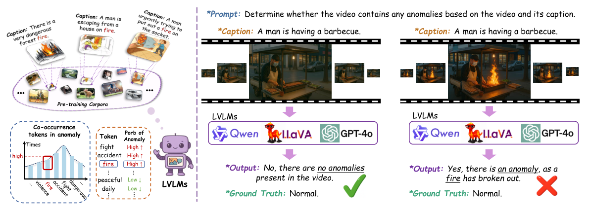](assets/papers/vad-dpo.png)

*图 1：视觉与文本共现偏差导致异常误判的研究动机示意。 Zhang, Menghao et al. / VAD-DPO · [来源](<assets/papers/README.md#figure-vad-dpo>)*

---

#### Vad-R1: Towards Video Anomaly Reasoning via Perception-to-Cognition Chain-of-Thought

[论文](<https://papers.nips.cc/paper_files/paper/2025/hash/abccc325c84dedf23dbe8de3f686c733-Abstract-Conference.html>) · [阅读笔记](<literature/catalog.md#paper-vad-r1>) · [引用 / BibTeX](<literature/citations.md#cite-vad-r1>)

> **Vad-R1 · 感知认知推理链与自验证奖励**
>
> 把视频异常推理独立为任务，构建从感知到认知的结构化推理链及 Vad-Reasoning 数据，并以带自验证的 AVA-GRPO 训练模型。

[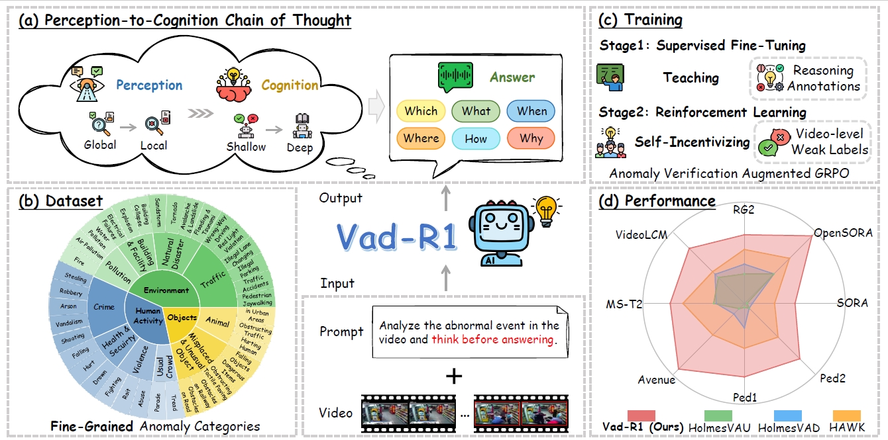](assets/papers/vad-r1.jpg)

*Vad-R1：感知认知推理链与自验证奖励。 Huang, Chao et al. / Vad-R1 · [来源](<assets/papers/README.md#figure-vad-r1>)*

---

#### VADTree: Explainable Training-Free Video Anomaly Detection via Hierarchical Granularity-Aware Tree

[论文](<https://papers.nips.cc/paper_files/paper/2025/hash/da19d18dfc5434bf419ce9c113f1865f-Abstract-Conference.html>) · [阅读笔记](<literature/catalog.md#paper-vadtree>) · [引用 / BibTeX](<literature/citations.md#cite-vadtree>)

> **VADTree · 事件边界驱动的层次粒度树**
>
> 由通用事件边界构建层次粒度树，在粗细事件节点上分别调用 VLM 感知与 LLM 推理，再融合跨粒度异常分数。

[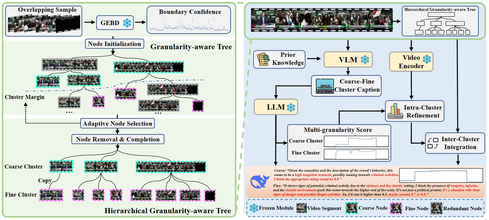](assets/papers/vadtree.jpg)

*VADTree：事件边界驱动的层次粒度树。 Li, Wenlong et al. / VADTree · [来源](<assets/papers/README.md#figure-vadtree>)*

---

### TIP

#### CRCL: Causal Representation Consistency Learning for Anomaly Detection in Surveillance Videos

[论文](<https://doi.org/10.1109/tip.2025.3558089>) · [阅读笔记](<literature/catalog.md#paper-crcl>) · [引用 / BibTeX](<literature/citations.md#cite-crcl>)

> **CRCL · 场景去偏与因果正常性表征**
>
> 基于结构因果模型，将场景去偏与因果正常性学习结合，从无监督视频正常模式中学习对场景变化更稳定的表征。

[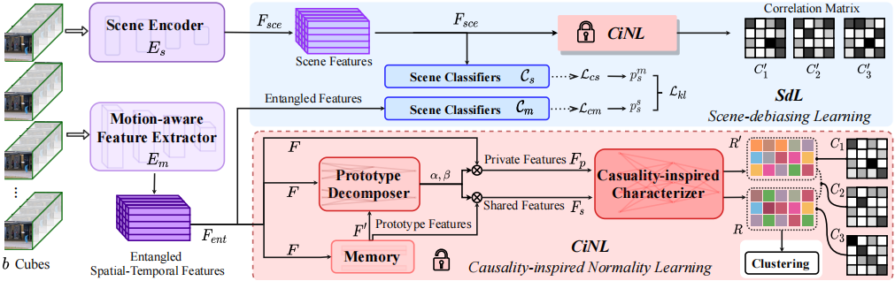](assets/papers/crcl.png)

*Fig. 2: CRCL 场景去偏与因果正常性学习流程（作者预印本） Liu, Yang et al. / CRCL · [来源](<assets/papers/README.md#figure-crcl>)*

---

#### Where and What: Contextual Dynamics-Aware Anomaly Detection in Surveillance Videos

[论文](<https://doi.org/10.1109/TIP.2025.3623392>) · [阅读笔记](<literature/catalog.md#paper-where-what>) · [引用 / BibTeX](<literature/citations.md#cite-where-what>)

> **Where and What · 场景与原子动作的时序关系建模**
>
> 用轻量场景分类器提供位置上下文，以原子动作特征刻画事件，通过时序语义关系网络 TSRN 联合建模多模态特征，并用片段选择的焦点间隔损失缓解类别不平衡。

[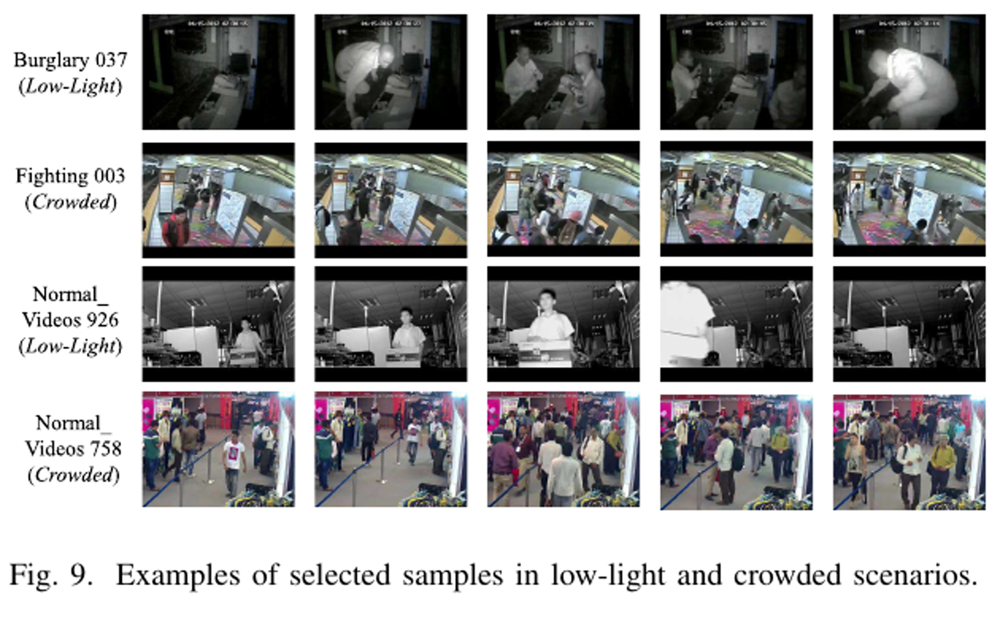](assets/papers/where-what.png)

*低照度和拥挤监控场景示例。作者主页提供的原文 Figure 9。 Deok-Hyun Ahn et al. / Where and What · [来源](<assets/papers/README.md#figure-where-what>)*

---

### TPAMI

#### Scene-Dependent Prediction in Latent Space for Video Anomaly Detection and Anticipation

[论文](<https://doi.org/10.1109/tpami.2024.3461718>) · [阅读笔记](<literature/catalog.md#paper-scene-dependent-vaa>) · [引用 / BibTeX](<literature/citations.md#cite-scene-dependent-vaa>)

> **Latent-Space VAA · 场景依赖潜空间双向预测**
>
> 扩展 NWPU Campus 工作，以层次 VAE、潜空间扩散和场景信息自编码器建模事件与场景关系，并用关键帧时序损失约束运动一致性。

*配图待补：尚未取得可核验的论文原图。[查看检索记录](<assets/papers/README.md#missing-scene-dependent-vaa>)*

---

#### Multilingual-Prompt-Guided Directional Feature Learning for Weakly Supervised Video Anomaly Detection

[论文](<https://doi.org/10.1109/tpami.2025.3590242>) · [阅读笔记](<literature/catalog.md#paper-mpgdfl>) · [引用 / BibTeX](<literature/citations.md#cite-mpgdfl>)

> **Multilingual VAD · 多语言提示选择与方向特征学习**
>
> 以多语言、多提示定义正常与异常，按片段自适应选择提示，并结合 Transformer–Mamba 时序建模与方向损失学习视觉特征。

*配图待补：尚未取得可核验的论文原图。[查看检索记录](<assets/papers/README.md#missing-mpgdfl>)*

---

### arXiv · 预印本

#### Flashback: Memory-Driven Zero-shot, Real-time Video Anomaly Detection

[论文](<https://arxiv.org/abs/2505.15205>) · [阅读笔记](<literature/catalog.md#paper-flashback>) · [引用 / BibTeX](<literature/citations.md#cite-flashback>)

> **Flashback · 离线语义记忆与在线匹配**
>
> 离线用语言模型构建正常与异常字幕记忆，在线将视频片段与文本记忆匹配，以检索结果给出异常判断与文本依据。

[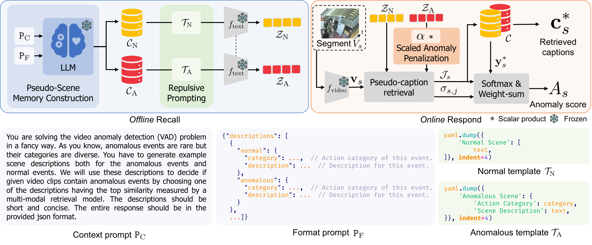](assets/papers/flashback.png)

*图 2：离线构建语义记忆，在线检索并生成异常分数。 Lee, Hyogun et al. / Flashback · [来源](<assets/papers/README.md#figure-flashback>)*

---

#### SlowFastVAD: Video Anomaly Detection via Integrating Simple Detector and RAG-Enhanced Vision-Language Model

[论文](<https://arxiv.org/abs/2504.10320>) · [阅读笔记](<literature/catalog.md#paper-slowfastvad>) · [引用 / BibTeX](<literature/citations.md#cite-slowfastvad>)

> **SlowFastVAD · 快检测门控与检索增强慢推理**
>
> 快速检测器先给出异常置信度，仅将模糊片段交给检索增强 VLM，利用正常参考与推断异常模式组成知识库辅助判断。

[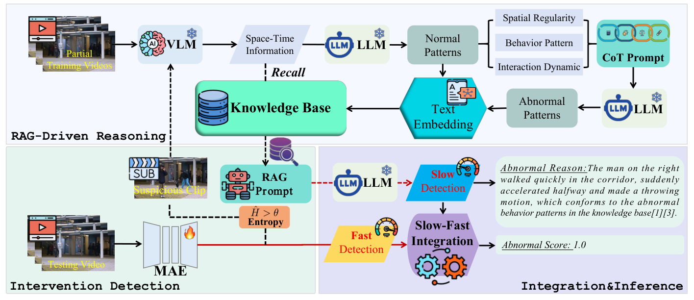](assets/papers/slowfastvad.png)

*图 2：结合快速检测、检索增强的慢速推理与结果融合。 Ding, Zongcan et al. / SlowFastVAD · [来源](<assets/papers/README.md#figure-slowfastvad>)*

---

#### VAU-R1: Advancing Video Anomaly Understanding via Reinforcement Fine-Tuning

[论文](<https://arxiv.org/abs/2505.23504>) · [阅读笔记](<literature/catalog.md#paper-vau-r1>) · [引用 / BibTeX](<literature/citations.md#cite-vau-r1>)

> **VAU-R1 · 多任务奖励与强化微调**
>
> 通过任务专属奖励进行强化微调，并构建包含选择问答、推理依据、时间边界和描述的 VAU-Bench。

[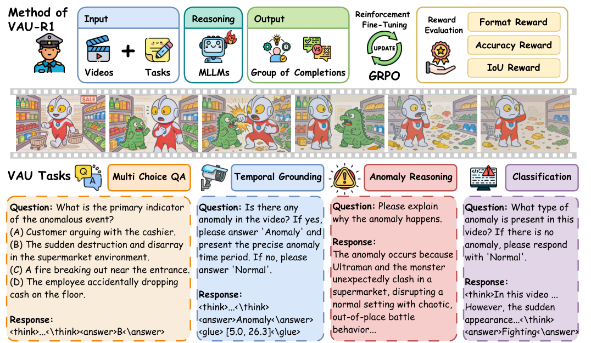](assets/papers/vau-r1.png)

*图 2：使用 GRPO 强化微调提升视频异常推理。 Zhu, Liyun et al. / VAU-R1 · [来源](<assets/papers/README.md#figure-vau-r1>)*

---

## 2024

### AAAI

#### AnomalyGPT: Detecting Industrial Anomalies Using Large Vision-Language Models

[论文](<https://ojs.aaai.org/index.php/AAAI/article/view/27963>) · [阅读笔记](<literature/catalog.md#paper-anomalygpt>) · [引用 / BibTeX](<literature/citations.md#cite-anomalygpt>)

> **AnomalyGPT · 缺陷定位特征与语言提示对齐**
>
> 用合成缺陷图像和对应描述构造监督，通过细粒度视觉语言解码器产生定位特征，再以可学习提示接入大视觉语言模型，支持缺陷判断、定位和多轮交互。

[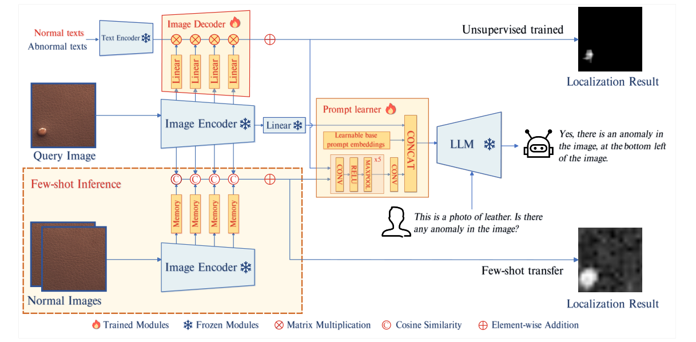](assets/papers/anomalygpt.png)

*AnomalyGPT 的细粒度异常解码器、提示学习与大视觉语言模型架构。原文 Figure 2。 Gu, Zhaopeng et al. / AnomalyGPT · [来源](<assets/papers/README.md#figure-anomalygpt>)*

---

#### VadCLIP: Adapting Vision-Language Models for Weakly Supervised Video Anomaly Detection

[论文](<https://arxiv.org/abs/2308.11681>) · [阅读笔记](<literature/catalog.md#paper-vadclip>) · [引用 / BibTeX](<literature/citations.md#cite-vadclip>)

> **VadCLIP · 视觉语言双分支对齐**
>
> 利用冻结 CLIP 的视觉语言关联，通过双分支完成粗粒度和细粒度异常检测。

[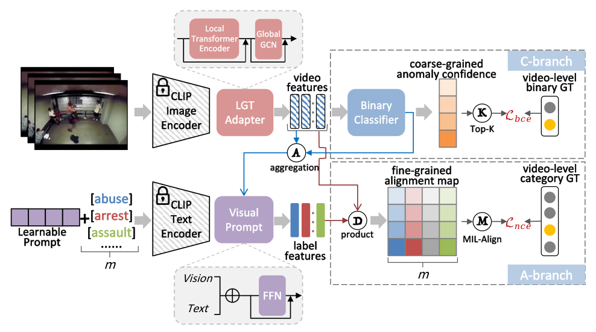](assets/papers/vadclip.png)

*VadCLIP：视觉语言双分支对齐。原文 Figure 2。 Wu, Peng et al. / VadCLIP · [来源](<assets/papers/README.md#figure-vadclip>)*

---

### ACM MM

#### Weakly Supervised Video Anomaly Detection and Localization with Spatio-Temporal Prompts

[论文](<https://doi.org/10.1145/3664647.3681442>) · [阅读笔记](<literature/catalog.md#paper-stprompt>) · [引用 / BibTeX](<literature/citations.md#cite-stprompt>)

> **STPrompt · 时空提示将语义对齐到异常区域**
>
> 以预训练视觉语言模型的语义知识和视频运动先验学习时空提示，在双分支网络中同时进行帧级异常判断与局部异常区域定位，减轻整帧背景信息对检测的干扰。

[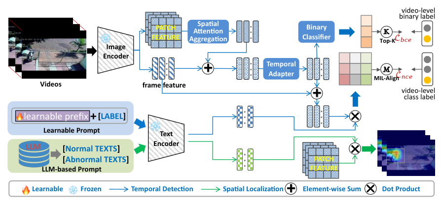](assets/papers/stprompt.png)

*Figure 2：STPrompt 的时序检测与空间定位双分支。 Peng Wu et al. / ACM MM 2024 · [来源](<assets/papers/README.md#figure-stprompt>)*

---

### CVPR

#### Abductive Ego-View Accident Video Understanding for Safe Driving Perception

[论文](<https://doi.org/10.1109/cvpr52733.2024.02080>) · [阅读笔记](<literature/catalog.md#paper-adversa-sd>) · [引用 / BibTeX](<literature/citations.md#cite-adversa-sd>)

> **AdVersa-SD · 事故原因预防文本对与对象扩散**
>
> 提出 MM-AU 多模态事故理解数据，以事故原因和预防建议的对比文本对训练 AbductiveCLIP，并用对象中心扩散生成事故前后视频。

[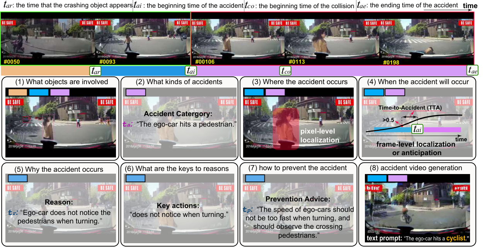](assets/papers/adversa-sd.png)

*Figure 1：MM-AU 的事故对象、类别、时空位置、原因与预防等理解任务。 Jianwu Fang et al. / CVPR 2024 · [来源](<assets/papers/README.md#figure-adversa-sd>)*

---

#### Uncovering What, Why and How: A Comprehensive Benchmark for Causation Understanding of Video Anomaly

[论文](<https://arxiv.org/abs/2405.00181>) · [阅读笔记](<literature/catalog.md#paper-cuva>) · [引用 / BibTeX](<literature/citations.md#cite-cuva>)

> **CUVA · 事件因果任务分解**
>
> 用事件、原因和后果标注，将视频异常理解拓展到因果解释及评估。

*CUVA：事件因果任务分解。原文 Figure 2。 Du, Hang et al. / CUVA · [来源](<assets/papers/README.md#figure-cuva>)*

---

#### Harnessing Large Language Models for Training-free Video Anomaly Detection

[论文](<https://arxiv.org/abs/2404.01014>) · [阅读笔记](<literature/catalog.md#paper-lavad>) · [引用 / BibTeX](<literature/citations.md#cite-lavad>)

> **LAVAD · 字幕聚合语言评分**
>
> 先描述帧内容，再由语言模型聚合时序信息并估计异常分数。

[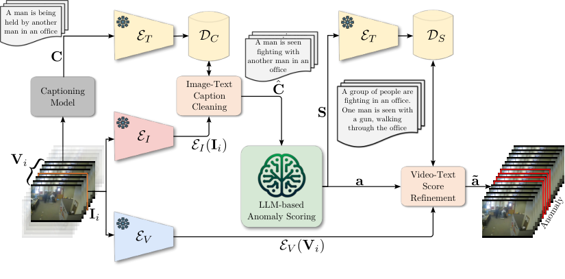](assets/papers/lavad.png)

*LAVAD：字幕聚合语言评分。原文 Figure 4。 Zanella, Luca et al. / LAVAD · [来源](<assets/papers/README.md#figure-lavad>)*

---

#### Open-Vocabulary Video Anomaly Detection

[论文](<https://openaccess.thecvf.com/content/CVPR2024/html/Wu_Open-Vocabulary_Video_Anomaly_Detection_CVPR_2024_paper.html>) · [阅读笔记](<literature/catalog.md#paper-ovvad>) · [引用 / BibTeX](<literature/citations.md#cite-ovvad>)

> **OVVAD · 语言知识与异常合成**
>
> 将开放词汇检测分解为类别无关检测与类别识别，用语言知识和合成未知异常支持未见类别。

[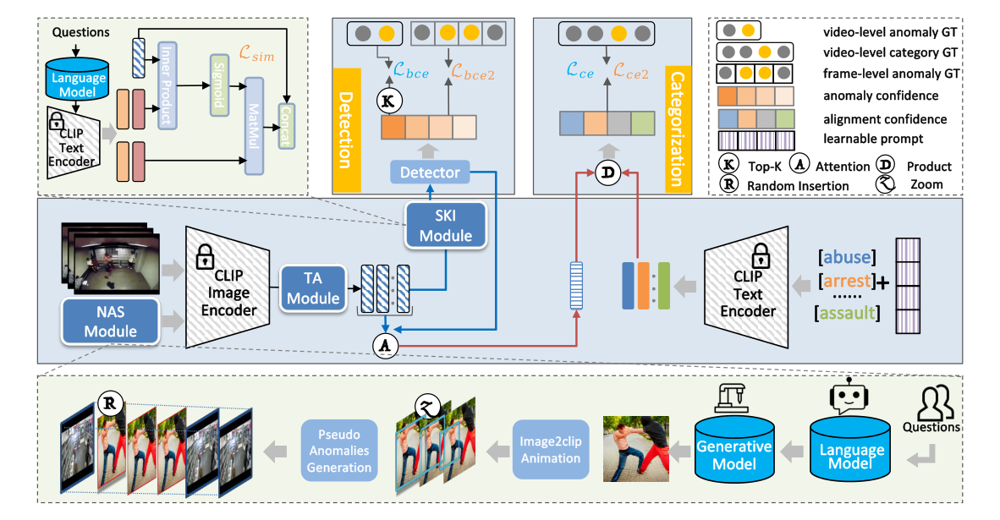](assets/papers/ovvad.png)

*OVVAD：语言知识与异常合成（原文 Figure 2）。 Wu, Peng et al. / OVVAD · [来源](<assets/papers/README.md#figure-ovvad>)*

---

#### Prompt-Enhanced Multiple Instance Learning for Weakly Supervised Video Anomaly Detection

[论文](<https://openaccess.thecvf.com/content/CVPR2024/html/Chen_Prompt-Enhanced_Multiple_Instance_Learning_for_Weakly_Supervised_Video_Anomaly_Detection_CVPR_2024_paper.html>) · [阅读笔记](<literature/catalog.md#paper-pe-mil>) · [引用 / BibTeX](<literature/citations.md#cite-pe-mil>)

> **PE-MIL · 异常语义与正常上下文双提示**
>
> 以异常类别标注和可学习提示向视频特征注入语义先验，再用正常上下文提示区分异常动作与周围背景，增强多实例学习对多样异常及事件边界的辨别能力。

[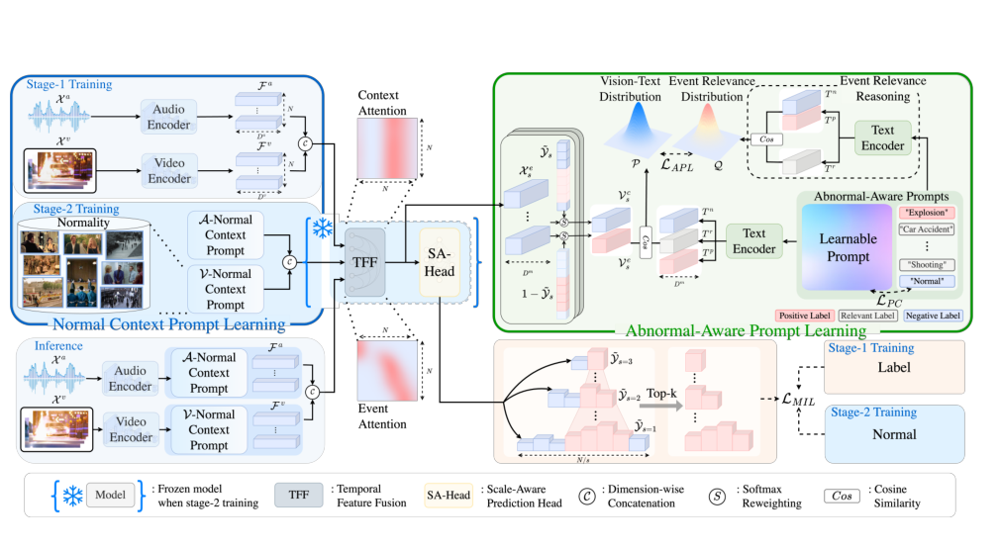](assets/papers/pe-mil.png)

*Figure 2：异常感知提示与正常上下文提示共同增强 MIL。 Junxi Chen et al. / CVPR 2024 · [来源](<assets/papers/README.md#figure-pe-mil>)*

---

#### Self-Distilled Masked Auto-Encoders are Efficient Video Anomaly Detectors

[论文](<https://openaccess.thecvf.com/content/CVPR2024/html/Ristea_Self-Distilled_Masked_Auto-Encoders_are_Efficient_Video_Anomaly_Detectors_CVPR_2024_paper.html>) · [阅读笔记](<literature/catalog.md#paper-sd-mae>) · [引用 / BibTeX](<literature/citations.md#cite-sd-mae>)

> **Self-Distilled MAE · 运动引导掩码重构与自蒸馏**
>
> 用运动梯度突出前景 token，令共享编码器的教师与学生解码器形成自蒸馏差异；同时以合成异常增强训练，联合学习正常帧重构与像素异常图。

[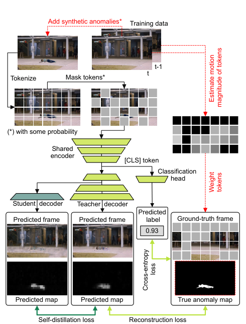](assets/papers/sd-mae.png)

*Figure 1：运动引导掩码、自蒸馏与合成异常训练。 Nicolae-Cătălin Ristea et al. / CVPR 2024 · [来源](<assets/papers/README.md#figure-sd-mae>)*

---

#### Text Prompt with Normality Guidance for Weakly Supervised Video Anomaly Detection

[论文](<https://openaccess.thecvf.com/content/CVPR2024/html/Yang_Text_Prompt_with_Normality_Guidance_for_Weakly_Supervised_Video_Anomaly_CVPR_2024_paper.html>) · [阅读笔记](<literature/catalog.md#paper-tpwng>) · [引用 / BibTeX](<literature/citations.md#cite-tpwng>)

> **TPWNG · 正常引导伪标签学习**
>
> 将事件描述与视频帧对齐，结合正常性视觉提示生成帧级伪标签，再进行时序自训练。

[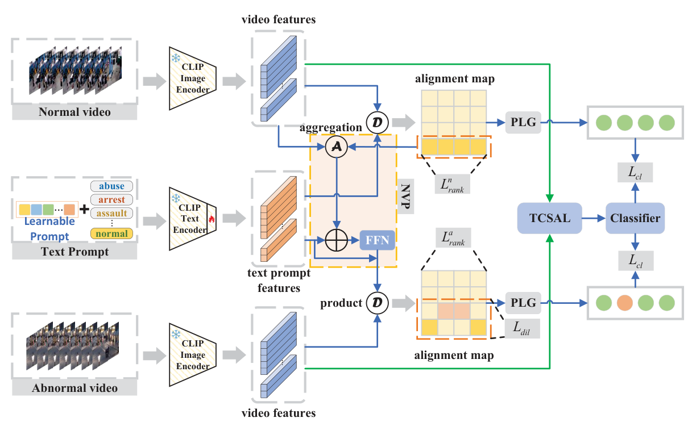](assets/papers/tpwng.png)

*TPWNG：正常引导伪标签学习（原文 Figure 2）。 Yang, Zhiwei et al. / TPWNG · [来源](<assets/papers/README.md#figure-tpwng>)*

---

#### Towards Surveillance Video-and-Language Understanding: New Dataset, Baselines, and Challenges

[论文](<https://openaccess.thecvf.com/content/CVPR2024/html/Yuan_Towards_Surveillance_Video-and-Language_Understanding_New_Dataset_Baselines_and_Challenges_CVPR_2024_paper.html>) · [阅读笔记](<literature/catalog.md#paper-uca-paper>) · [引用 / BibTeX](<literature/citations.md#cite-uca-paper>)

> **UCA · 事件句子与时间对齐**
>
> 为 UCF-Crime 添加句子级事件描述与时间标注，建立监控视频定位、描述等语言理解任务基线。

[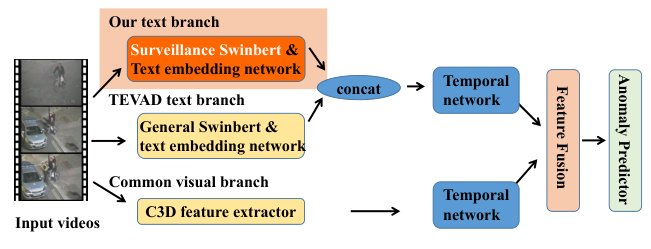](assets/papers/uca-paper.png)

*用于多模态异常检测的增强 TEVAD 基线框架（原文 Figure 3）。 Yuan, Tongtong et al. / UCA · [来源](<assets/papers/README.md#figure-uca-paper>)*

---

### ECCV

#### Follow the Rules: Reasoning for Video Anomaly Detection with Large Language Models

[论文](<https://arxiv.org/abs/2407.10299>) · [阅读笔记](<literature/catalog.md#paper-anomalyruler>) · [引用 / BibTeX](<literature/citations.md#cite-anomalyruler>)

> **AnomalyRuler · 正常规则归纳演绎**
>
> 从少量正常样本归纳场景规则，再依据规则判断测试视频中的异常。

[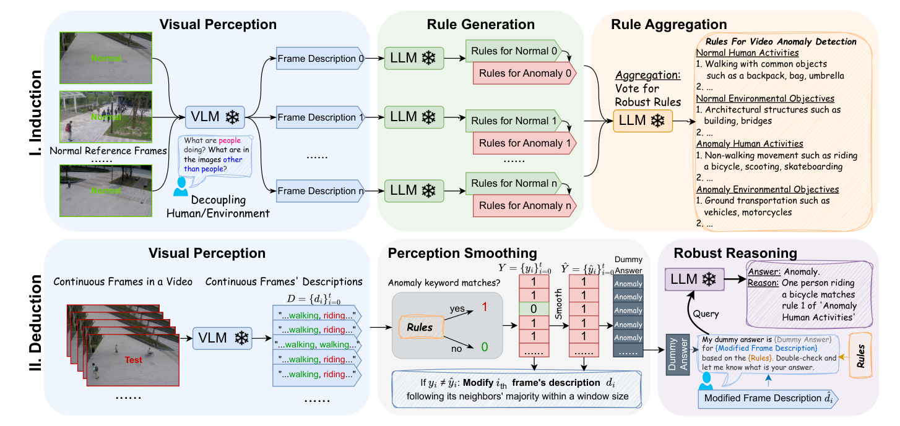](assets/papers/anomalyruler.png)

*AnomalyRuler：正常规则归纳演绎。原文 Figure 2。 Yang, Yuchen et al. / AnomalyRuler · [来源](<assets/papers/README.md#figure-anomalyruler>)*

---

#### FedVAD: Enhancing Federated Video Anomaly Detection with GPT-Driven Semantic Distillation

[论文](<https://www.ecva.net/papers/eccv_2024/papers_ECCV/html/6981_ECCV_2024_paper.php>) · [阅读笔记](<literature/catalog.md#paper-fedvad>) · [引用 / BibTeX](<literature/citations.md#cite-fedvad>)

> **FedVAD · 语言语义生成校准与联邦蒸馏**
>
> 用大语言模型为公共视频生成并校准语义描述，以视频文本对适配多模态教师，再将语义知识自适应蒸馏进联邦全局检测模型；同时按视觉一致性对客户端分组。

[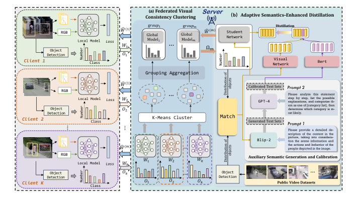](assets/papers/fedvad.png)

*Figure 2：FedVAD 的联邦聚合与自适应语义增强蒸馏。 Fan Qi et al. / ECCV 2024 · [来源](<assets/papers/README.md#figure-fedvad>)*

---

### NeurIPS

#### Beyond Euclidean: Dual-Space Representation Learning for Weakly Supervised Video Violence Detection

[论文](<https://proceedings.neurips.cc/paper_files/paper/2024/hash/1f471322127d6347e5ae09a14b1e5cf7-Abstract-Conference.html>) · [阅读笔记](<literature/catalog.md#paper-dsrl>) · [引用 / BibTeX](<literature/citations.md#cite-dsrl>)

> **DSRL · 欧氏与双曲空间交互表征**
>
> 结合欧氏空间的视觉特征与双曲空间的事件层次关系，通过能量约束的分层信息聚合和跨空间注意力区分外观相似的正常与暴力事件。

[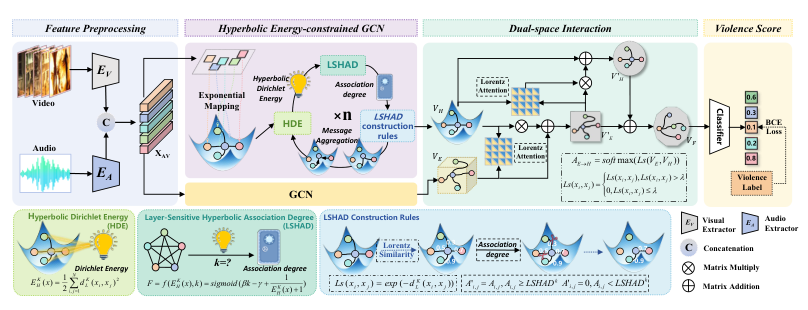](assets/papers/dsrl.png)

*Figure 2：DSRL 的双曲能量约束图卷积与双空间交互。 Jiaxu Leng et al. / NeurIPS 2024 · [来源](<assets/papers/README.md#figure-dsrl>)*

---

#### Hawk: Learning to Understand Open-World Video Anomalies

[论文](<https://arxiv.org/abs/2405.16886>) · [阅读笔记](<literature/catalog.md#paper-hawk>) · [引用 / BibTeX](<literature/citations.md#cite-hawk>)

> **HAWK · 运动语言监督对齐**
>
> 显式引入运动信息，并用异常视频描述与问答数据训练开放场景理解能力。

[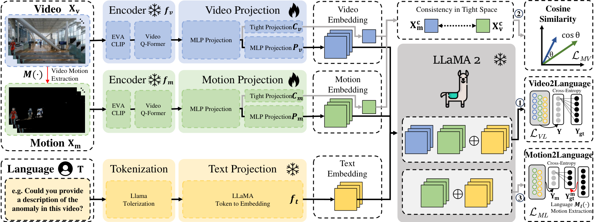](assets/papers/hawk.png)

*HAWK：运动语言监督对齐。原文 Figure 3。 Tang, Jiaqi et al. / HAWK · [来源](<assets/papers/README.md#figure-hawk>)*

---

### TCSVT

#### BatchNorm-Based Weakly Supervised Video Anomaly Detection

[论文](<https://ieeexplore.ieee.org/document/10649595/>) · [阅读笔记](<literature/catalog.md#paper-bn-wvad>) · [引用 / BibTeX](<literature/citations.md#cite-bn-wvad>)

> **BN-WVAD · 批归一化均值偏离与片段筛选**
>
> 以特征偏离 BatchNorm 均值的程度作为异常判据，结合样本与批次级片段选择学习异常分类，并用统计评分修正易受标签噪声影响的预测。

[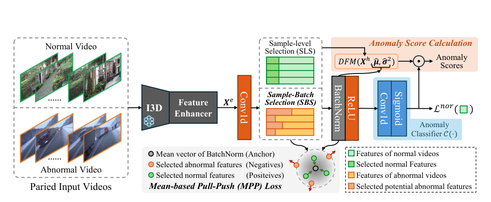](assets/papers/bn-wvad.png)

*Figure 3：BN-WVAD 的特征均值偏离评分与片段选择（作者预印本）。 Yixuan Zhou et al. / TCSVT 2024 · [来源](<assets/papers/README.md#figure-bn-wvad>)*

---

#### Text-Driven Traffic Anomaly Detection With Temporal High-Frequency Modeling in Driving Videos

[论文](<https://doi.org/10.1109/tcsvt.2024.3390173>) · [阅读笔记](<literature/catalog.md#paper-tthf>) · [引用 / BibTeX](<literature/citations.md#cite-tthf>)

> **TTHF · 文本对齐与时序高频异常聚焦**
>
> 将文本提示与驾驶视频对齐，结合时序高频建模和注意力异常聚焦模块，提高道路异常事件的视觉语言判别。

[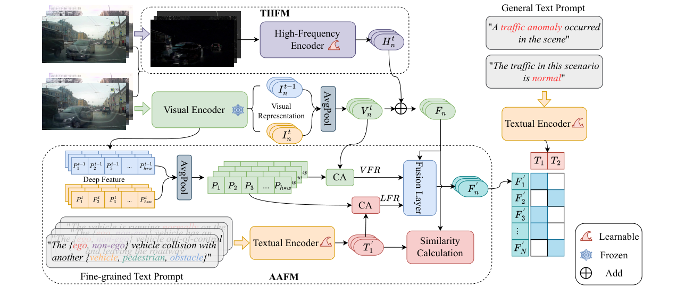](assets/papers/tthf.png)

*Figure 2：文本驱动道路异常检测与时序高频建模框架。 Rongqin Liang et al. / TCSVT 2024 · [来源](<assets/papers/README.md#figure-tthf>)*

---

### TIP

#### Toward Video Anomaly Retrieval From Video Anomaly Detection: New Benchmarks and Model

[论文](<https://doi.org/10.1109/tip.2024.3374070>) · [阅读笔记](<literature/catalog.md#paper-alan>) · [引用 / BibTeX](<literature/citations.md#cite-alan>)

> **ALAN / VAR · 异常引导采样与跨模态检索**
>
> 提出长视频异常检索任务及 UCFCrime-AR、XDViolence-AR，使用异常引导采样、视频提示掩码短语建模和跨模态对齐检索相关视频。

[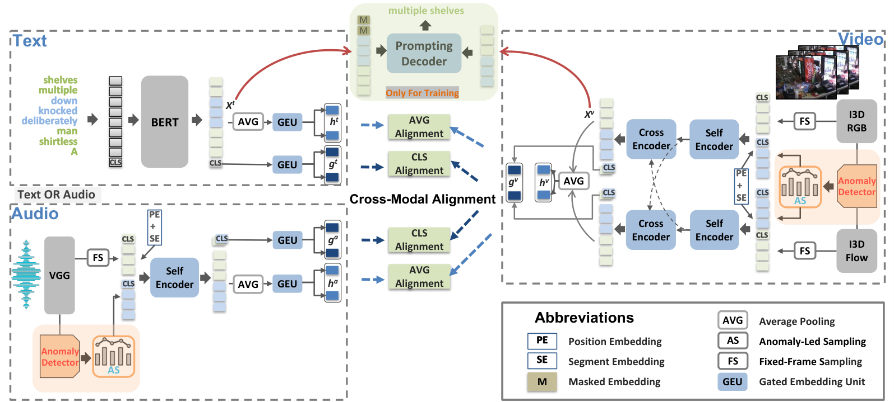](assets/papers/alan.png)

*Fig. 4: ALAN 的视频、文本、音频编码与跨模态对齐框架（作者预印本） Wu, Peng et al. / ALAN / VAR · [来源](<assets/papers/README.md#figure-alan>)*

---

#### Learning Prompt-Enhanced Context Features for Weakly-Supervised Video Anomaly Detection

[论文](<https://doi.org/10.1109/tip.2024.3451935>) · [阅读笔记](<literature/catalog.md#paper-pel>) · [引用 / BibTeX](<literature/citations.md#cite-pel>)

> **PEL · 提示增强语义与时序上下文聚合**
>
> 通过共享注意力矩阵和自适应融合聚合局部与全局时序上下文，再以知识提示增强视觉特征的异常子类区分能力。

[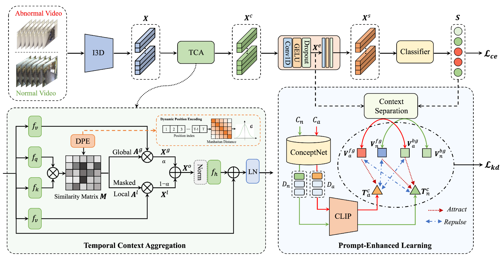](assets/papers/pel.png)

*Fig. 2：PEL 时序上下文聚合与提示增强学习框架（作者预印本，第 4 页）。 Pu, Yujiang et al. / PEL · [来源](<assets/papers/README.md#figure-pel>)*

---

### TPAMI

#### Self-Supervised Masked Convolutional Transformer Block for Anomaly Detection

[论文](<https://doi.org/10.1109/tpami.2023.3322604>) · [阅读笔记](<literature/catalog.md#paper-ssmctb>) · [引用 / BibTeX](<literature/citations.md#cite-ssmctb>)

> **SSMCTB · 掩码卷积与通道注意力自监督**
>
> 在网络内部用掩码卷积、通道 Transformer 与 Huber 自监督目标重构被遮蔽信息，可接入图像和视频异常检测网络。

[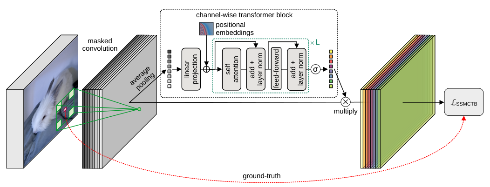](assets/papers/ssmctb.png)

*Figure 1：SSMCTB 的掩码卷积与通道 Transformer 模块。 Neelu Madan et al. / TPAMI · [来源](<assets/papers/README.md#figure-ssmctb>)*

---

## 2023

### AAAI

#### MGFN: Magnitude-Contrastive Glance-and-Focus Network for Weakly-Supervised Video Anomaly Detection

[论文](<https://ojs.aaai.org/index.php/AAAI/article/view/25112>) · [阅读笔记](<literature/catalog.md#paper-mgfn>) · [引用 / BibTeX](<literature/citations.md#cite-mgfn>)

> **MGFN · 全局局部建模与幅值对比学习**
>
> 用 Glance-and-Focus 网络联合长程上下文与局部时序特征，通过特征幅值增强和幅值对比损失减轻不同场景下幅值与异常性不一致的问题。

[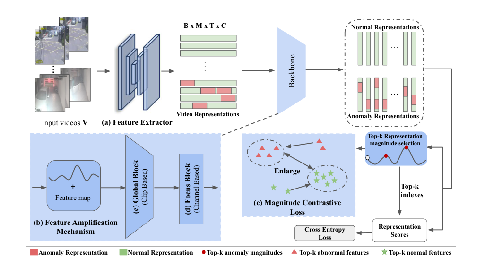](assets/papers/mgfn.png)

*Figure 3：MGFN 的特征幅值增强与 Glance-and-Focus 网络。 Yingxian Chen et al. / AAAI 2023 · [来源](<assets/papers/README.md#figure-mgfn>)*

---

#### Dual Memory Units with Uncertainty Regulation for Weakly Supervised Video Anomaly Detection

[论文](<https://ojs.aaai.org/index.php/AAAI/article/view/25489>) · [阅读笔记](<literature/catalog.md#paper-ur-dmu>) · [引用 / BibTeX](<literature/citations.md#cite-ur-dmu>)

> **UR-DMU · 正常异常双记忆与不确定性约束**
>
> 以全局与局部自注意力提取时序特征，分别记忆正常和异常原型，并约束正常特征的潜在分布，以区分易混淆片段并抑制噪声影响。

[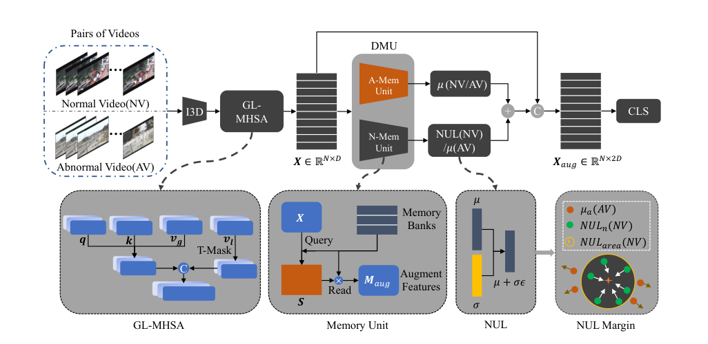](assets/papers/ur-dmu.png)

*Figure 2：UR-DMU 的双记忆库与正常性不确定性建模。 Hang Zhou et al. / AAAI 2023 · [来源](<assets/papers/README.md#figure-ur-dmu>)*

---

### CVPR

#### EVAL: Explainable Video Anomaly Localization

[论文](<https://openaccess.thecvf.com/content/CVPR2023/html/Singh_EVAL_Explainable_Video_Anomaly_Localization_CVPR_2023_paper.html>) · [阅读笔记](<literature/catalog.md#paper-eval>) · [引用 / BibTeX](<literature/citations.md#cite-eval>)

> **EVAL · 对象运动属性解释**
>
> 以对象类别、运动方向和速度等可读属性建立位置相关的正常模式，解释局部异常。

[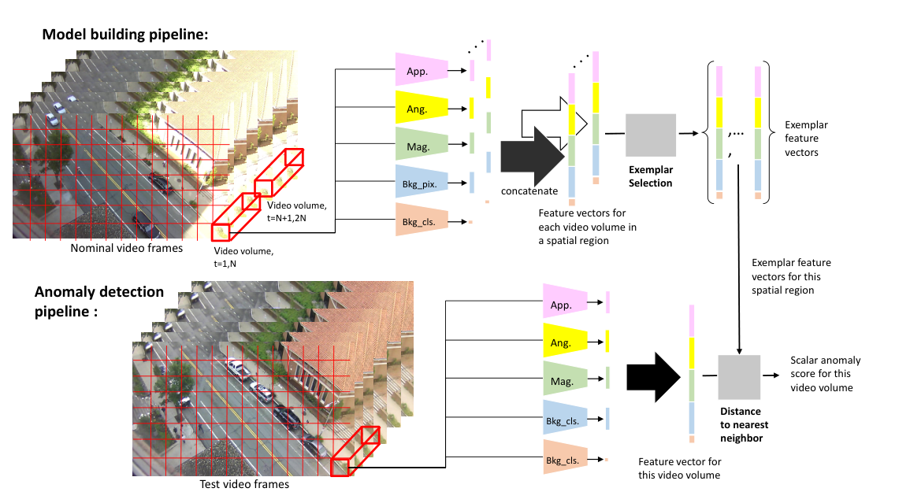](assets/papers/eval.png)

*EVAL：对象运动属性解释（原文 Figure 1）。 Singh, Ashish et al. / EVAL · [来源](<assets/papers/README.md#figure-eval>)*

---

#### A New Comprehensive Benchmark for Semi-Supervised Video Anomaly Detection and Anticipation

[论文](<https://openaccess.thecvf.com/content/CVPR2023/html/Cao_A_New_Comprehensive_Benchmark_for_Semi-Supervised_Video_Anomaly_Detection_and_CVPR_2023_paper.html>) · [阅读笔记](<literature/catalog.md#paper-nwpu-campus-paper>) · [引用 / BibTeX](<literature/citations.md#cite-nwpu-campus-paper>)

> **NWPU Campus · 场景条件前后向帧预测**
>
> 提出 NWPU Campus 基准，覆盖随场景规则改变正常性的行为；以前后向场景条件帧预测统一异常检测与提前预判。

[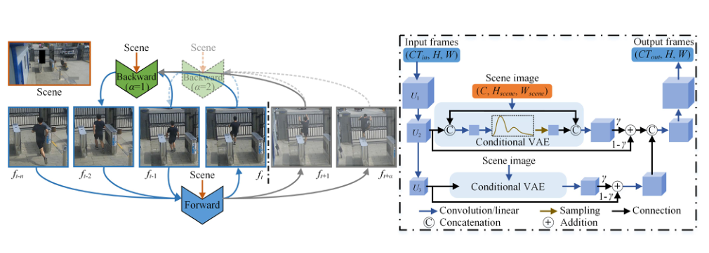](assets/papers/nwpu-campus-paper.png)

*Figure 4：场景条件前后向帧预测框架。 Congqi Cao et al. / CVPR 2023 · [来源](<assets/papers/README.md#figure-nwpu-campus-paper>)*

---

### ICCV

#### Feature Prediction Diffusion Model for Video Anomaly Detection

[论文](<https://openaccess.thecvf.com/content/ICCV2023/html/Yan_Feature_Prediction_Diffusion_Model_for_Video_Anomaly_Detection_ICCV_2023_paper.html>) · [阅读笔记](<literature/catalog.md#paper-fpdm>) · [引用 / BibTeX](<literature/citations.md#cite-fpdm>)

> **FPDM · 运动预测与外观细化双扩散**
>
> 以两个去噪扩散隐式模块分别预测和细化视频帧特征，学习正常运动与外观分布，再用特征预测误差评估异常，无需额外的对象或动作语义提取模型。

[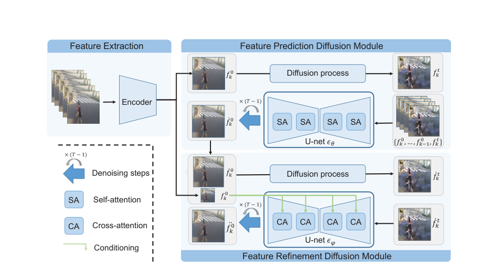](assets/papers/fpdm.png)

*Figure 2：FPDM 的特征预测与细化扩散模块。 Cheng Yan et al. / ICCV 2023 · [来源](<assets/papers/README.md#figure-fpdm>)*

---

#### Normalizing Flows for Human Pose Anomaly Detection

[论文](<https://openaccess.thecvf.com/content/ICCV2023/html/Hirschorn_Normalizing_Flows_for_Human_Pose_Anomaly_Detection_ICCV_2023_paper.html>) · [阅读笔记](<literature/catalog.md#paper-stg-nf>) · [引用 / BibTeX](<literature/citations.md#cite-stg-nf>)

> **STG-NF · 姿态时空图归一化流似然**
>
> 将人体姿态图序列映射到潜在概率分布，用时空图归一化流直接计算似然并评估人体动作异常；同时研究仅正常数据训练和带异常标签的监督设置。

[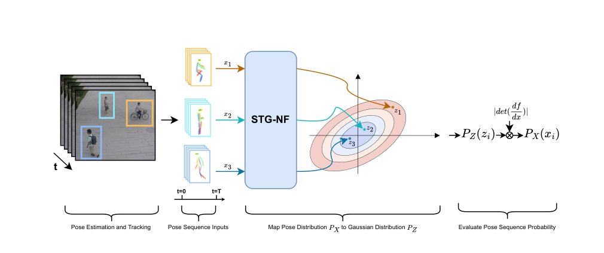](assets/papers/stg-nf.png)

*Figure 1：STG-NF 的人体姿态序列概率建模。 Or Hirschorn et al. / ICCV 2023 · [来源](<assets/papers/README.md#figure-stg-nf>)*

---

### TPAMI

#### Cross-Modal Causal Relational Reasoning for Event-Level Visual Question Answering

[论文](<https://doi.org/10.1109/tpami.2023.3284038>) · [阅读笔记](<literature/catalog.md#paper-cmcir>) · [引用 / BibTeX](<literature/citations.md#cite-cmcir>)

> **CMCIR · 前后门干预与跨模态因果关系推理**
>
> 以视觉前门干预、语言后门干预和时空 Transformer 减少问答中的伪相关，并在 SUTD-TrafficQA 等基准研究事件级视觉问答。

[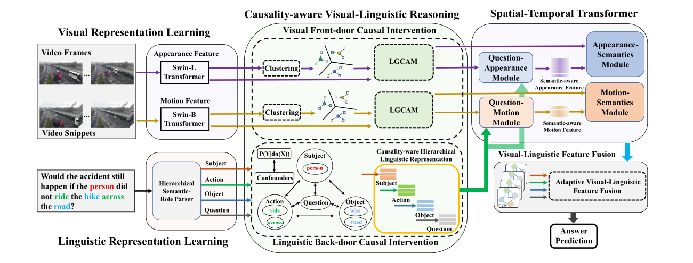](assets/papers/cmcir.png)

*Figure 3：视觉前门干预、语言后门干预与时空 Transformer。 Yang Liu, Guanbin Li and Liang Lin / TPAMI 2023 · [来源](<assets/papers/README.md#figure-cmcir>)*

---

#### DoTA: Unsupervised Detection of Traffic Anomaly in Driving Videos

[论文](<https://doi.org/10.1109/tpami.2022.3150763>) · [阅读笔记](<literature/catalog.md#paper-dota-paper>) · [引用 / BibTeX](<literature/citations.md#cite-dota-paper>)

> **DoTA · 自车运动与对象轨迹预测检测**
>
> 提出驾驶视频异常数据 DoTA，以时间、对象框和类别描述异常，并结合自车运动与对象轨迹预测进行无监督检测，使用 STAUC 联合衡量时空定位。

[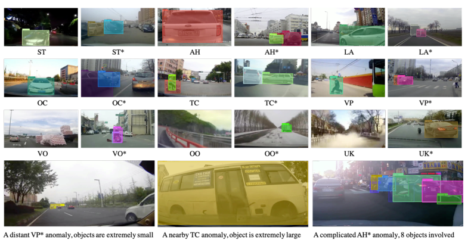](assets/papers/dota-paper.png)

*Figure 2：DoTA 数据样例及异常对象框，取自早期作者预印本，不代表 TPAMI 新增方法框架。 Yu Yao et al. / DoTA author preprint (2020) · [来源](<assets/papers/README.md#figure-dota-paper>)*

---

## 2022

### TPAMI

#### A Background-Agnostic Framework with Adversarial Training for Abnormal Event Detection in Video

[论文](<https://doi.org/10.1109/tpami.2021.3074805>) · [阅读笔记](<literature/catalog.md#paper-background-agnostic-vad>) · [引用 / BibTeX](<literature/citations.md#cite-background-agnostic-vad>)

> **Background-Agnostic VAD · 对象级重构与伪异常对抗训练**
>
> 围绕检测到的对象建模外观与运动，用域外伪异常对抗训练自编码器和判别器，并补充区域与轨迹级异常标注。

*配图待补：尚未取得可核验的论文原图。[查看检索记录](<assets/papers/README.md#missing-background-agnostic-vad>)*

---

#### Future Frame Prediction Network for Video Anomaly Detection

[论文](<https://doi.org/10.1109/tpami.2021.3129349>) · [阅读笔记](<literature/catalog.md#paper-future-frame-vad>) · [引用 / BibTeX](<literature/citations.md#cite-future-frame-vad>)

> **Future Frame Prediction · 外观运动约束预测与跨场景适配**
>
> 以外观和运动约束设计未来帧预测网络，并研究元学习使预测模型用少量起始帧适配新测试场景。

*配图待补：尚未取得可核验的论文原图。[查看检索记录](<assets/papers/README.md#missing-future-frame-vad>)*

---

#### A Survey of Single-Scene Video Anomaly Detection

[论文](<https://doi.org/10.1109/tpami.2020.3040591>) · [阅读笔记](<literature/catalog.md#paper-single-scene-vad-survey>) · [引用 / BibTeX](<literature/citations.md#cite-single-scene-vad-survey>)

> **Single-Scene VAD Survey · 单场景异常检测综述与评测梳理**
>
> 系统梳理单场景视频异常检测的问题定义、公开数据、评测准则与方法分类，并比较标准测试集上的算法表现。

*配图待补：尚未取得可核验的论文原图。[查看检索记录](<assets/papers/README.md#missing-single-scene-vad-survey>)*

---

## 2021

### TPAMI

#### Video Anomaly Detection with Sparse Coding Inspired Deep Neural Networks

[论文](<https://doi.org/10.1109/tpami.2019.2944377>) · [阅读笔记](<literature/catalog.md#paper-sparse-coding-vad>) · [引用 / BibTeX](<literature/citations.md#cite-sparse-coding-vad>)

> **TSC / sRNN-AE · 时序稀疏编码展开为循环网络**
>
> 将时序一致稀疏编码的迭代求解展开为堆叠循环网络，并通过自编码结构联合学习表征和重构，用于视频异常检测。

*配图待补：尚未取得可核验的论文原图。[查看检索记录](<assets/papers/README.md#missing-sparse-coding-vad>)*

---

## 2019

### TPAMI

#### Detecting Regions of Maximal Divergence for Spatio-Temporal Anomaly Detection

[论文](<https://doi.org/10.1109/tpami.2018.2823766>) · [阅读笔记](<literature/catalog.md#paper-mdi>) · [引用 / BibTeX](<literature/citations.md#cite-mdi>)

> **MDI · 分布散度定位连续时空异常区域**
>
> 以无偏 KL 散度比较候选区域与其余数据，搜索连续异常时间段和空间区域，并用区间提议提高大规模搜索效率。

*配图待补：尚未取得可核验的论文原图。[查看检索记录](<assets/papers/README.md#missing-mdi>)*

---

## 2014

### TPAMI

#### Anomaly Detection and Localization in Crowded Scenes

[论文](<https://doi.org/10.1109/tpami.2013.111>) · [阅读笔记](<literature/catalog.md#paper-crowded-scenes-tpami>) · [引用 / BibTeX](<literature/citations.md#cite-crowded-scenes-tpami>)

> **Crowded-Scene AD · 动态纹理联合外观与运动异常**
>
> 利用动态纹理联合建模外观与运动，并结合时间和空间异常证据，在拥挤监控场景中检测与定位异常。

*配图待补：尚未取得可核验的论文原图。[查看检索记录](<assets/papers/README.md#missing-crowded-scenes-tpami>)*

---

#### Online Learning and Sequential Anomaly Detection in Trajectories

[论文](<https://doi.org/10.1109/tpami.2013.172>) · [阅读笔记](<literature/catalog.md#paper-shnn-cad>) · [引用 / BibTeX](<literature/citations.md#cite-shnn-cad>)

> **SHNN-CAD · 序贯轨迹共形异常检测**
>
> 以 Hausdorff 近邻距离和共形校准分析尚未完成的轨迹，支持训练集增量更新与在线异常报警。

*配图待补：尚未取得可核验的论文原图。[查看检索记录](<assets/papers/README.md#missing-shnn-cad>)*

---

## 2009

### TPAMI

#### Probabilistic Modeling of Scene Dynamics for Applications in Visual Surveillance

[论文](<https://doi.org/10.1109/tpami.2008.175>) · [阅读笔记](<literature/catalog.md#paper-scene-dynamics>) · [引用 / BibTeX](<literature/citations.md#cite-scene-dynamics>)

> **Scene Dynamics · 轨迹密度建模与场景动态推断**
>
> 以静态摄像机中的对象轨迹学习位置与转移时间的非参数概率模型，统一支持轨迹生成、持续跟踪与异常运动检测。

*配图待补：尚未取得可核验的论文原图。[查看检索记录](<assets/papers/README.md#missing-scene-dynamics>)*

---

## 2008

### TPAMI

#### Video Behavior Profiling for Anomaly Detection

[论文](<https://doi.org/10.1109/tpami.2007.70731>) · [阅读笔记](<literature/catalog.md#paper-video-behavior-profiling>) · [引用 / BibTeX](<literature/citations.md#cite-video-behavior-profiling>)

> **Behavior Profiling · 动态贝叶斯行为建模与谱聚类**
>
> 从监控视频中的离散事件表示行为，用动态贝叶斯网络比较行为序列，并以谱聚类学习正常模式以支持在线异常检测。

*配图待补：尚未取得可核验的论文原图。[查看检索记录](<assets/papers/README.md#missing-video-behavior-profiling>)*

---
